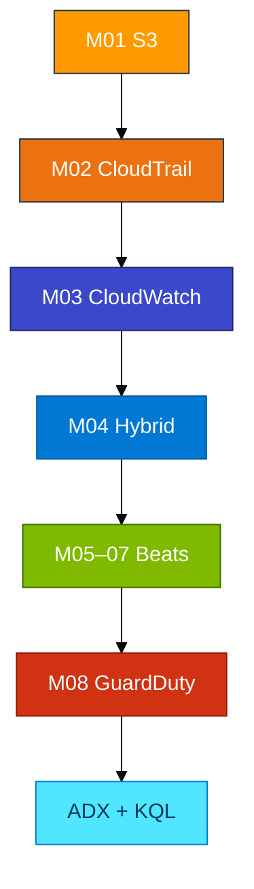

# Course agenda

## Course map

## Module document set

Each module folder: **Primer** → **Concepts** → **Lab** → **Exercises** + `assets/module_XX/explore.kql`.

## Days

| Day | Modules | Start |
|-----|---------|--------|
| 1 | 01 S3 | `00_Day1_How_We_Work.md` |
| 2 | 02 CloudTrail + 03 CloudWatch (or **one module per day**) | `00_Day2_How_We_Work.md` |
| Later | 04 Hybrid (issued) · 05 Logstash + in-depth (issued) · 06–08 as issued | Prerequisite notes in each Primer |

Shared resources: trail bucket **`adx-classroom-cloudtrail`** · GuardDuty export **`adx-classroom-guardduty-export`** · Linux VM for M05–07 (turn-taking).
