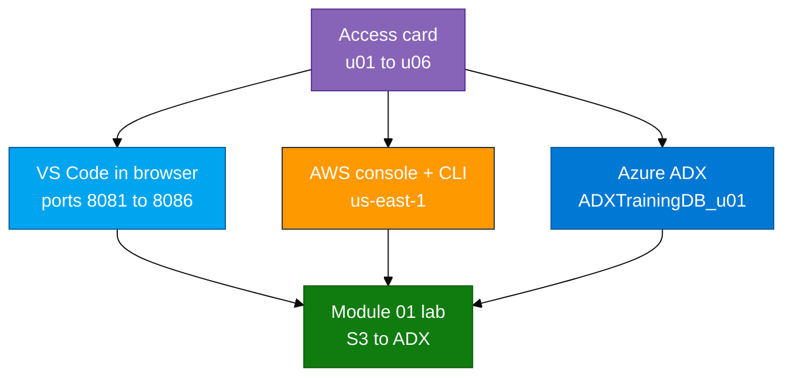

# How we work on Day 1

Your trainer will give you an **access card** (not stored in this repo): AWS IAM user, console password, access keys, VS Code URL, and Linux password.

## Day 1 environment



1. Open **your** lab VS Code URL (on the access card). Ports: u01 `8081` … u06 `8086` on host `54.174.192.103`. Browser login: username = your login (`u01` … `u06`), password = Linux password on the card. Use **your** home folder. Do not open someone else’s.
2. In the VS Code terminal (Linux bash, not PowerShell):

```bash
cd ~/adx-aws-training
ls Module_01_Amazon_S3 assets/module_01 assets/iam
```

The course folder is already there. Do not `git clone` into this directory (it is not empty). If the folder is missing, tell the trainer.

3. AWS console: https://410232017221.signin.aws.amazon.com/console — sign in as **IAM user** `u01` … `u06`, region **us-east-1**.
4. Configure the CLI in **your** terminal (keys from the card):

```bash
aws configure
# AWS Access Key ID / Secret: from the access card (user u01 … u06)
# Default region: us-east-1
# Default output format: json
aws sts get-caller-identity
```

The ARN must end with `user/u01` (or your login). Do not paste the `adx-s3-reader-*` keys here.

5. Follow `Module_01_Amazon_S3/01_S3_to_ADX_Lab.md`. Bucket: `adx-log-ingestion-<your-login>`.
6. Azure / ADX: use the portal and cluster URL on the card. Database: `ADXTrainingDB_<your-login>`. In the portal, confirm subscription **Pay-As-You-Go** if you cannot find resource group `rg-adx-training-aug26`.
7. **S3 bulk ingest (Modules 01–03, 08):** after reader keys are saved to `~/adx-lab-m0N/reader.env`, use `bash assets/ingest_s3_to_adx.sh --module m01 --login <your-login> --run` (see lab Step 4). Without `az login`, paste `~/adx-lab-s3/<module>/ingest_generated.kql` into the ADX Web UI instead.

Do not commit keys, `.env`, or passwords.
