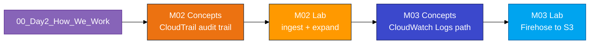
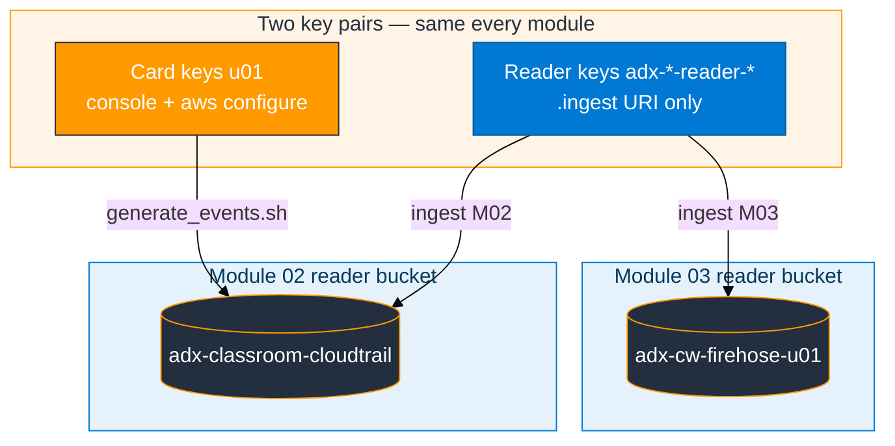

# How we work on Day 2 (Modules 02–03)

Same logins as Day 1 (`u01` … `u06`). Course folder is already at `~/adx-aws-training` — do **not** `git clone` again.

## Day 2 flow



```bash
cd ~/adx-aws-training
ls Module_02_AWS_CloudTrail Module_03_AWS_CloudWatch assets/module_02 assets/module_03
aws sts get-caller-identity
```

ARN must end with `user/u01` (or **your** login). If not, run `aws configure` again with the **card** keys.

## Write these names once (do not invent initials)

| What | Pattern (example `u01`) |
|------|-------------------------|
| ADX database | `ADXTrainingDB_u01` |
| Shared CloudTrail bucket | **`adx-classroom-cloudtrail`** (everyone — do not create or delete) |
| Shared trail name | `adx-classroom-trail` (trainer only) |
| M02 activity bucket (temp) | `adx-ct-activity-u01` |
| M02 reader IAM | `adx-cloudtrail-reader-u01` |
| M03 log group | `/adx-training/app-logs-u01` |
| M03 Firehose | `cw-to-adx-stream-u01` |
| M03 landing bucket | `adx-cw-firehose-u01` |
| M03 reader IAM | `adx-cw-s3-reader-u01` |

## S3 ingest script (nested folders, no manual object keys)

After each module’s reader keys are in `~/adx-lab-m0N/reader.env`:

```bash
bash assets/ingest_s3_to_adx.sh --module m02 --login <your-login> --region us-east-1 --max 5 --run
bash assets/ingest_s3_to_adx.sh --module m03 --login <your-login> --max 10 --run
```

Use `--run` only if `az login` works on your machine; otherwise open `~/adx-lab-s3/m02/ingest_generated.kql` (or `m03/`) in the ADX Web UI. For Module 03, produce logs by **using** the checkout API or Lambda (Lab Step 3) — not a log-generator script.

## Two key pairs (same rule as Module 01)

| Keys | Used for |
|------|----------|
| Access card (`u01` … `u06`) | Console, `aws configure`, scripts that call AWS APIs |
| Reader users (`adx-*-reader-*`) | **Only** the ADX `.ingest` URI. Never `aws configure` |

You will create a **new** reader per module (CloudTrail reader for M02, Firehose-bucket reader for M03). Do not reuse the Module 01 reader policy on the wrong bucket.



## Module order

1. Module 02: `02_CloudTrail_Primer.md` → Concepts → Lab  
2. Module 03: `03_CloudWatch_Primer.md` → Concepts → Lab  

## Day 2 traps (read before you click)

1. **Trail wait is normal** — empty S3 for 5–15 minutes after `generate_events.sh` is expected. Build tables and IAM while waiting.
2. **Reader policy bucket must match the module** — M02 = `adx-classroom-cloudtrail`; M03 = `adx-cw-firehose-<your-login>`; never paste `adx-log-ingestion-*` into the M02/M03 reader.
3. **Reader policy must keep `s3:GetBucketLocation`** — copy the full `assets/iam/s3-reader-policy.json` and replace both `BUCKET_NAME` strings.
4. **M03 order** — log group → S3 → Firehose **Active** → subscription filter → **then** run the checkout API and `curl` it (or invoke Lambda). `put_log_events.sh` is smoke-only. Events before the filter never appear in S3.
5. **Git Bash / VS Code** — before any `aws logs` command: `export MSYS_NO_PATHCONV=1`
6. **Do not delete** the shared trail or `adx-classroom-cloudtrail`. Do not drop `CloudTrailEvents` or `CloudWatchLogs` — later modules need them (your trainer will issue those labs when ready).

## ADX

Portal → cluster **adxtrainaug26** → database **`ADXTrainingDB_<your-login>`** only. Subscription: **Pay-As-You-Go** (if the resource group is missing, switch subscription in the portal top bar).

```kusto
print Database = current_database()
```

Must show your database before any `.create` / `.ingest`.
