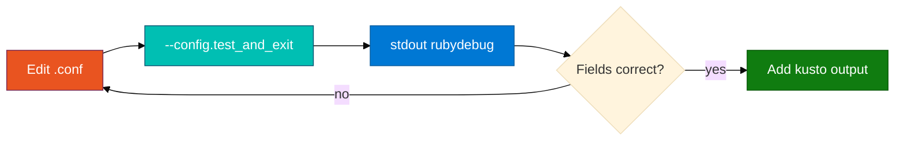

# Session 02 — Debug pipeline with stdout

**Goal:** Build a reliable debug loop: validate config → run with `rubydebug` → only then add kusto output.

---

## 1. The debug loop (production habit)



Never debug an empty ADX table before you have seen correct fields on stdout.

---

## 2. `--config.test_and_exit`

Parses the pipeline and exits. Does **not** connect to ADX or tail files for long.

```bash
sudo /usr/share/logstash/bin/logstash \
  --path.settings /etc/logstash \
  -f /tmp/logstash-lab/grok-stdout-lab.conf \
  --config.test_and_exit
```

**Expect:** `Configuration OK`  
**If not:** read the line/column in the error — usually a missing `}` or bad plugin name.

---

## 3. `stdout { codec => rubydebug }`

Add or keep this output block while learning:

```ruby
output {
  stdout { codec => rubydebug }
}
```

**rubydebug** prints one event per block with all fields and tags. Use it to verify:

- `LogTime` is populated (from `date` filter)
- `Process`, `Hostname`, `Message` look right
- `tags` does **not** include `_grokparsefailure`

Remove or comment out `stdout` when you run the full ADX pipeline for class — two outputs are fine for practice but noisy in shared terminals.

---

## 4. Log level (when Logstash “does nothing”)

Run once with trace on a stuck pipeline:

```bash
sudo /usr/share/logstash/bin/logstash \
  --path.settings /etc/logstash \
  --path.data /tmp/logstash-lab/data-<your-login>-debug \
  -f /tmp/logstash-lab/grok-stdout-lab.conf \
  --log.level trace
```

**Look for:**

- `[logstash.inputs.file]` — file opened / closed
- `[logstash.filters.grok]` — match or failure
- `[logstash.outputs.kusto]` — only when kusto block present

Ctrl+C after you see enough. Trace is verbose — do not leave it on during normal class runs.

---

## 5. Dual output: stdout + kusto (stretch)

When grok is correct on stdout, copy `assets/module_05/adx-pipeline.conf.example` and **temporarily** add:

```ruby
output {
  stdout { codec => rubydebug }
  kusto { ... }
}
```

Run one sudo command. You should see:

1. Event on stdout immediately  
2. Row in ADX after **2–5 minutes** (queued ingest)

If (1) works but (2) does not — problem is Entra grant, ingest URL, or mapping — not grok. See Session 05.

---

## Next

[Session 03 — Filters: mutate and date](03_Filters_Mutate_and_Date.md)
