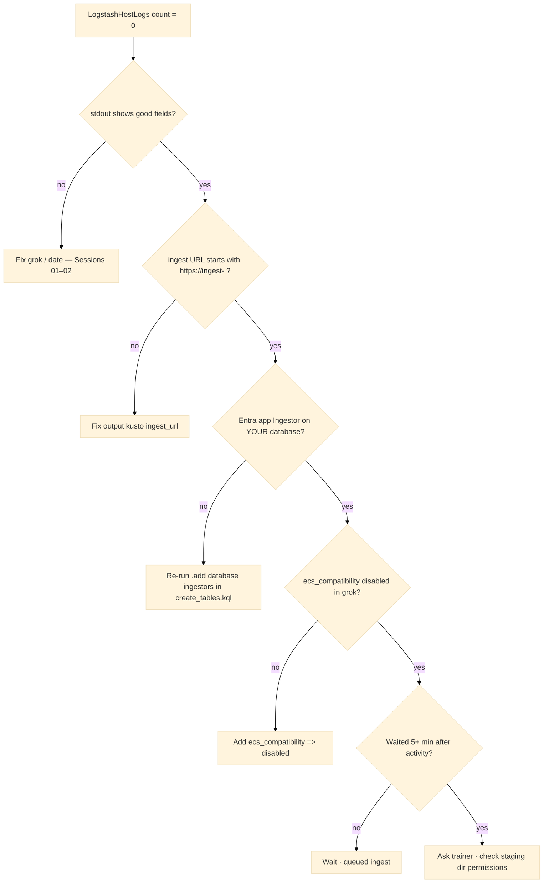

# Session 05 — Operations and troubleshooting

**Goal:** Operate Logstash safely on the **shared lab VM** and diagnose “ADX table empty” without guessing.

---

## 1. Shared VM checklist

Before starting Logstash:

1. Ask: “Is anyone else running Logstash?”  
2. If unsure: `pgrep -af logstash` (confirm with instructor before `pkill`)  
3. Use **your own** `--path.data`: `/tmp/logstash-lab/data-<your-login>`  
4. Use **ingest** URL: `https://ingest-adxtrainaug26.centralindia.kusto.windows.net`  

Stop when done (Ctrl+C) so the next student can bind resources.

---

## 2. sincedb and file replay

| Setting | Effect |
|---------|--------|
| Default sincedb | Remembers file offset across restarts |
| `sincedb_path => "/dev/null"` | Re-read file from `start_position` every run (lab default) |
| `start_position => "beginning"` | Read whole file once |
| `start_position => "end"` | Only **new** lines after startup |

**Class symptom:** “Logstash exited and did nothing” — file was fully read and no new auth activity. **Fix:** generate `sudo true` / failed ssh, or use `"end"` while tailing live secure log.

---

## 3. Queued ingest timeline

After kusto plugin uploads a staging batch:

| Time | What to check |
|------|----------------|
| 0–30 s | Logstash log shows kusto output activity |
| 1–3 min | Staging files appear under `/tmp/kusto/` (may be deleted after upload) |
| 2–5 min | `LogstashHostLogs \| count` increases in ADX |

**Not a bug:** querying at 30 seconds and seeing zero rows.

---

## 4. Empty table decision tree



---

## 5. Staging path permissions

Kusto plugin v2 writes under:

```
path => "/tmp/kusto/%{+YYYY-MM-dd-HH-mm}.txt"
```

If Logstash user cannot write:

```bash
sudo mkdir -p /tmp/kusto
sudo chmod 777 /tmp/kusto
```

Symptom: ERROR in Logstash log about staging path; ADX stays empty.

---

## 6. Verify ADX side (same as Module 05 lab)

```kusto
.show tables
| where TableName == "LogstashHostLogs"

.show database ['ADXTrainingDB_<your-login>'] principals
| where PrincipalType == "App" and Role == "Ingestor"

LogstashHostLogs
| order by LogTime desc
| take 10
```

---

## 7. When you are done for the day

1. Ctrl+C Logstash in your terminal  
2. Do **not** commit `adx-pipeline.conf` with `app_key` inside  
3. Optional: `rm -rf /tmp/logstash-lab/data-<your-login>*` to clear sincedb state for tomorrow  

---

## Back to core lab

If you have not finished the graded path yet, return to:

`Module_05_Logstash/05_Logstash_ADX_Integration_Lab.md`

Then `Module_05_Logstash/05_Exercises.md`.
