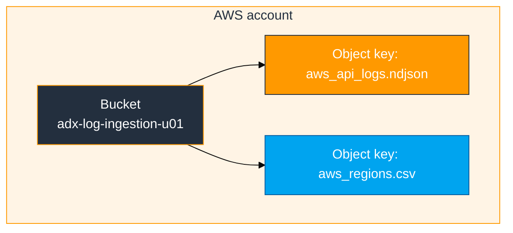
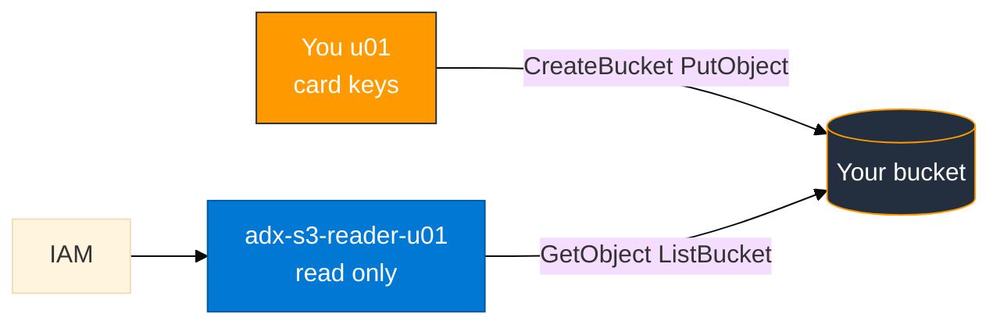

# Module 01 — Amazon S3 primer (AWS basics)

Read this **before** `01_S3_to_ADX_Concepts.md` if you are new to AWS.

## What S3 is

**Amazon Simple Storage Service (S3)** is object storage. You store **files** (objects) in **buckets**. Each object has a **key** (path-like name, for example `aws_api_logs.ndjson`).

S3 is not a database. It does not run queries. ADX pulls objects and queries them in KQL.



## Vocabulary

| Term | Meaning |
|------|---------|
| **Bucket** | Container name (globally unique). Example: `adx-log-ingestion-u01` |
| **Object / key** | One stored file inside a bucket |
| **Region** | Physical location. This course uses **us-east-1** |
| **IAM user** | Programmatic or console identity with permissions |
| **Access key** | ID + secret pair for CLI/API |
| **Policy** | JSON document listing allowed actions on resources |

## IAM in one picture

Your **card login** (`u01` … `u06`) can create buckets and IAM users **scoped to your login name**. A separate **reader** user can only read **one** bucket — that is what ADX uses.



## Hands-on (console)

Do these **before** the lab. Use your card login. Region: **us-east-1**.

1. **Open S3** → note your bucket list (empty or existing lab bucket).
2. **Open one bucket** → **Objects** tab → see keys and sizes.
3. **Permissions** → **Block public access** should be **On** for lab buckets.
4. **Open IAM** → **Users** → find your login `u01` … `u06` and a reader like `adx-s3-reader-u01`.
5. Open the reader → **Permissions** → inline policy → confirm `s3:GetObject` and `s3:ListBucket`.

**Checkpoint:** You can explain bucket vs object vs key in one sentence.

## CLI quick reference

```bash
aws sts get-caller-identity          # who am I?
aws s3 ls                            # list buckets
aws s3 ls s3://adx-log-ingestion-u01/   # list objects in one bucket
aws s3 cp local.txt s3://adx-log-ingestion-u01/local.txt   # upload
```

Expected `get-caller-identity` ARN ends with `user/u01` (your login), not `root`.

## Common mistakes

| Mistake | Result |
|---------|--------|
| Wrong region | Bucket exists but CLI/URI use different region |
| Public bucket | Lab policy requires private — keep block public on |
| Admin keys in `.ingest` URI | Too much privilege — use reader only |
| Reader keys in `aws configure` | Reader cannot create buckets |
