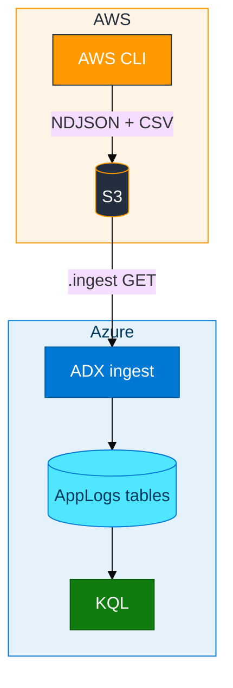

# Module 01 — S3 to ADX

ADX is where you run KQL. S3 is only a landing place for files. In this module you put two files in a private bucket, then you tell ADX to download them and fill tables.

ADX is not an AWS service. It calls S3 over HTTPS with IAM keys you put on the ingest URI. Once that pull works, later modules use the same idea for CloudTrail, CloudWatch (via Firehose), and GuardDuty. Those services already write objects, so you do not need a streaming product on day one.

If a mapping is wrong, you can fix it and ingest the **same** S3 key again. You do not have to recreate the source.

**Example.** A team wants a KQL view of “what is in this AWS account?” They have not built CloudTrail yet. They capture a little live inventory with the CLI, upload NDJSON and CSV, ingest both, and prove JSONPath and CSV column numbers both work. That is this lab. The files are homemade on purpose. Modules 02, 03, and 08 replace them with objects AWS wrote.

## In class

- Database: `ADXTrainingDB_<your-login>` (example `ADXTrainingDB_u01`)
- You create one bucket, one IAM user, and an access key
- Policy template: `assets/iam/s3-reader-policy.json` (list bucket, `GetBucketLocation`, get objects)

Without `GetBucketLocation`, ADX often returns `Download_Forbidden` even when `GetObject` looks correct.

## How data moves



- The CLI writes two files
- S3 stores them
- ADX downloads, parses, and commits extents
- KQL reads the tables (S3 is not the query engine)

## JSON and CSV

- **NDJSON** — one JSON object per line. Good when fields may grow. ADX binds with JSONPath, for example `$.timestamp`
- **CSV** — flat columns. ADX binds by position: 0, 1, 2, … This lab has **no header row**, so the first line is data

**Example JSON line**

```json
{"timestamp":"2026-08-24T12:00:00Z","level":"INFO","message":"s3 BucketName=my-bucket","service":"s3","host":"my-bucket","requestId":"s3-my-bucket","httpStatus":200}
```

That maps to `LogTime`, `LogLevel`, `Message`, `ServiceName`, `Host`, `RequestId`, `HttpStatus` on `AppLogs_JSON`. The CSV file is a flat region list with a numeric flag. You ingest both so you see two mappings on the same cluster.

## Ingest URI

Create tables and named mappings **before** `.ingest`.

```text
https://<bucket>.s3.<region>.amazonaws.com/<key>;AwsCredentials=<access_key_id>,<secret>
```

- Use `AwsCredentials=` and a **comma** between id and secret
- Do not use the old `;<key>;<secret>` form
- Keep the bucket private; ADX does not need it public
- A user that can only read this bucket is easier to rotate after class than an admin key
