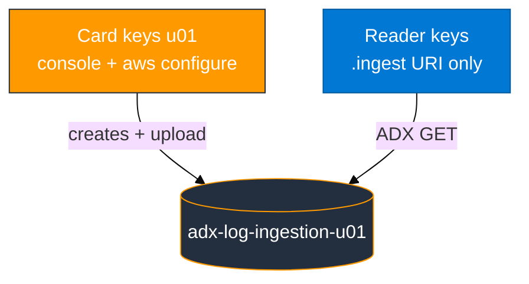
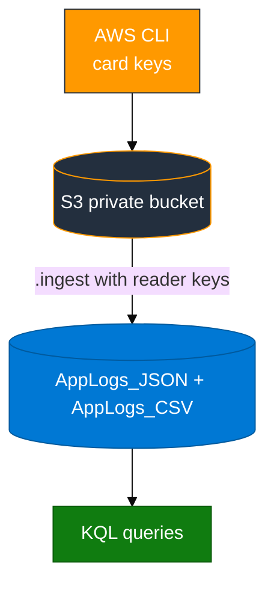

# Module 01 — S3 to ADX

> **Reading order:** `01_S3_Primer.md` → Concepts (this file) → Lab → Exercises.

## What this module is trying to solve

You need log-like data in **Azure Data Explorer (ADX)** so you can query it with **KQL**.

In this first module, the data starts as **files in Amazon S3**. ADX does not magically “see” your AWS console session. Instead, ADX **downloads** an S3 object over HTTPS using a special ingest command (`.ingest`) and IAM access keys placed on the URI.

That same “ADX pulls from S3” pattern appears again later (CloudTrail files, CloudWatch Firehose objects, GuardDuty export objects).

---

## Plain-English data path

1. Your **card user** (`u01`…`u06`) creates a private S3 bucket and uploads files (using `aws configure` + the capture script).
2. You create a second IAM user — the **reader** — that can only read that bucket.
3. In ADX you create tables and **mappings** (rules that say how JSON fields or CSV columns become ADX columns).
4. You run `.ingest` with a URI like:

```text
https://<bucket>.s3.us-east-1.amazonaws.com/<object-key>;AwsCredentials=<READER_ACCESS_KEY_ID>,<READER_SECRET>
```

5. ADX downloads the object and loads rows. Then you query with KQL.

**Important:** Use a **comma** between access key id and secret after `AwsCredentials=`. Do not use the old wrong form with two semicolons.

---

## Why two key pairs?

| Keys | What they are for | What they are NOT for |
|------|-------------------|------------------------|
| Access card (`u01`…`u06`) | AWS console login, `aws configure`, running the capture/upload script | Putting inside the ADX `.ingest` URI |
| Reader (`adx-s3-reader-<login>`) | Only the `.ingest` URI so ADX can download the object | `aws configure` (do not overwrite your card keys) |



---

## How data moves



Create tables and mappings **before** `.ingest`. If a mapping is wrong, fix the mapping and re-ingest the **same** S3 object key.

---

## JSON vs CSV in this lab

| File | What it is | How ADX maps it |
|------|------------|-----------------|
| `aws_api_logs.ndjson` | One JSON object per line (live AWS API facts) | JSONPath fields such as `$.timestamp` |
| `aws_regions.csv` | CSV **without** a header row | Column positions 0, 1, 2, … |

The capture script builds these from live `sts` / `s3` / `ec2` calls. Do **not** ingest `sample_logs.json` / `sample_logs.csv` from the repo as your main data — those are shape hints only.

Reader policy must include `s3:GetBucketLocation` (see `assets/iam/s3-reader-policy.json`). Without it, ingest often fails with Download_Forbidden even if GetObject is present.

S3 basics and console tour: **`01_S3_Primer.md`**.
