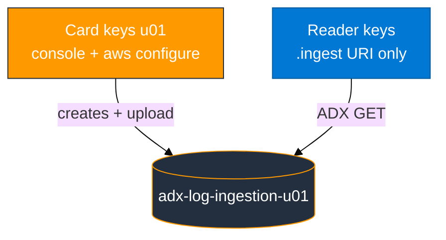
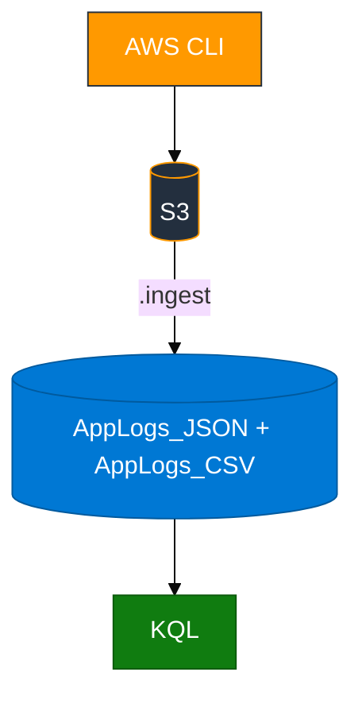

# Module 01 — S3 to ADX

> **Reading order:** `01_S3_Primer.md` → Concepts (this file) → Lab → Exercises.

ADX runs KQL. S3 holds files. ADX pulls objects over HTTPS with IAM keys on the **ingest URI** — same pattern as later modules (CloudTrail, CloudWatch via Firehose, GuardDuty).

Wrong mapping? Fix it and re-ingest the **same** S3 key.

**Module 01 capture uses live AWS API responses** — see `assets/REAL_VS_LAB_DATA.md`.

S3 basics and console tour: **`01_S3_Primer.md`**.

## Two key pairs



## How data moves



Create tables and mappings **before** `.ingest`. Reader policy needs `GetBucketLocation` (see `assets/iam/s3-reader-policy.json`).

## JSON and CSV mappings

| File | Format | ADX binding |
|------|--------|-------------|
| `aws_api_logs.ndjson` | one JSON object per line | JSONPath, e.g. `$.timestamp` |
| `aws_regions.csv` | no header row | column index 0, 1, … |

```text
https://<bucket>.s3.<region>.amazonaws.com/<key>;AwsCredentials=<access_key_id>,<secret>
```

Use `AwsCredentials=` with a **comma** between id and secret.
