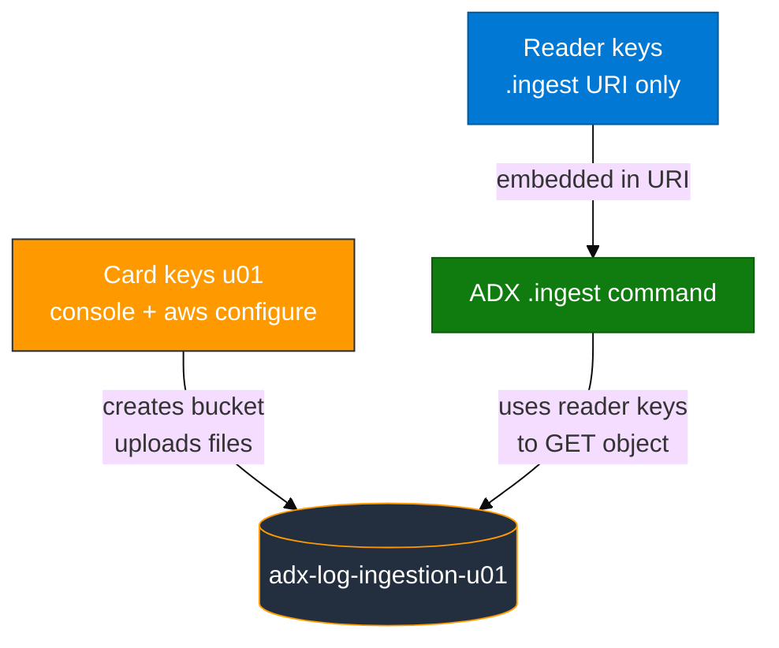
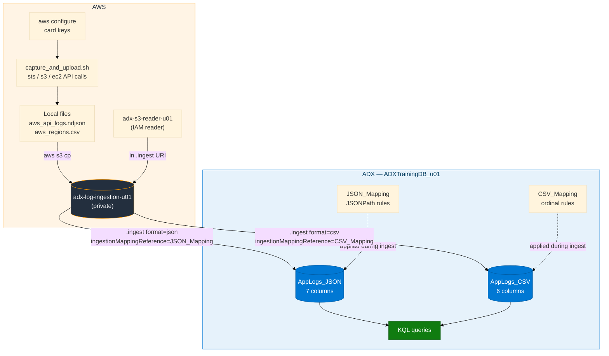

# Module 01 — S3 to ADX Concepts

> **Reading order:** `01_S3_Primer.md` → Concepts (this file) → Lab → Exercises.

---

## 1. What this module is trying to solve

You need log-like data in **Azure Data Explorer (ADX)** so you can query it with **KQL**.

In this first module, the data starts as **files in Amazon S3**. ADX does not magically see your AWS console session. Instead, ADX **downloads** an S3 object over HTTPS using a special control command (`.ingest`) and IAM access keys embedded in the URI.

The same "ADX pulls from S3" pattern reappears in every later module:

| Module | What ADX pulls from S3 |
|--------|------------------------|
| Module 01 | NDJSON + CSV files you captured from live AWS APIs |
| Module 02 | CloudTrail `.json.gz` files the trail wrote automatically |
| Module 03 | CloudWatch Firehose objects that a streaming pipeline wrote |

Understanding Module 01's mechanics makes every later S3 ingest trivial.

---

## 2. Plain-English data path

1. Your **card user** (`u01`…`u06`) creates a private S3 bucket (`adx-log-ingestion-<login>`) and runs `capture_and_upload.sh` using `aws configure`.
2. The script calls live AWS APIs (`sts`, `s3`, `ec2`), writes results locally as two files, and uploads them to the bucket.
3. You create a second IAM user — the **reader** (`adx-s3-reader-<login>`) — whose only permission is `s3:GetObject`, `s3:GetBucketLocation`, and `s3:ListBucket` on that one bucket.
4. In ADX you create two **tables** and their **ingestion mappings** (named rules that map JSON fields or CSV columns to typed ADX columns).
5. You run `.ingest` with an HTTPS URI that includes the reader's keys:

```text
https://<bucket>.s3.us-east-1.amazonaws.com/<object-key>;AwsCredentials=<READER_KEY_ID>,<READER_SECRET>
```

6. ADX downloads the object and loads rows into the table according to the mapping.
7. You query with KQL.

**Important — comma between keys:** Use a comma between the access key ID and secret after `AwsCredentials=`. Do not use semicolons. The wrong form (`AwsCredentials=id;secret` or `AwsCredentials=id;;secret`) is the most common ingest failure in Module 01.

---

## 3. Why two key pairs?

| Keys | What they are for | What they are NOT for |
|------|-------------------|-----------------------|
| Access card (`u01`…`u06`) | AWS console login · `aws configure` · running `capture_and_upload.sh` | Putting inside the ADX `.ingest` URI |
| Reader (`adx-s3-reader-<login>`) | The `.ingest` URI only, so ADX can download the S3 object | Running `aws configure` (do not overwrite your card keys) |



**Why not use the card keys in the URI?** The card user has broad IAM permissions — it can create and delete resources across the account. If card keys were pasted into a query log, support ticket, or commit message, the exposure would be severe. The reader's policy is deliberately minimal: it can only read from your one bucket.

---

## 4. How data moves (full journey)



**Key rule:** Create tables and mappings **before** running `.ingest`. If a mapping does not exist when ingest runs, ADX silently ignores the mapping reference (or stores everything in a catch-all column). Re-ingesting the same S3 object key after fixing the mapping is safe — object keys do not change.

---

## 5. JSON vs CSV in this lab

| File | Format | What it contains | How ADX maps it |
|------|--------|------------------|-----------------|
| `aws_api_logs.ndjson` | NDJSON — one JSON object per line | Live AWS API call facts (`sts`, `s3`, `ec2` responses from `capture_and_upload.sh`) | JSONPath: `$.timestamp` → `LogTime`, `$.level` → `LogLevel`, etc. |
| `aws_regions.csv` | CSV — **no header row** | Region names, endpoints, opt-in status | Ordinal positions: column 0 → `LogTime`, column 1 → `LogLevel`, etc. |

**Sample JSON object shape** (what one line of `aws_api_logs.ndjson` looks like):

```json
{
  "timestamp": "2026-08-28T14:32:11Z",
  "level": "INFO",
  "message": "GetCallerIdentity response",
  "service": "sts",
  "host": "lab-vm-u01",
  "requestId": "abc-123-def",
  "httpStatus": 200
}
```

**Sample CSV row** (what one line of `aws_regions.csv` looks like):

```
2026-08-28T14:32:15Z,INFO,Region us-east-1 available,ec2,lab-vm-u01,0
```

The **format parameter** tells ADX how to parse the file:
- `format="json"` for NDJSON (one JSON object per line)
- `format="csv"` for CSV

Using the wrong format is silent — ADX will not error loudly, but the columns will be empty or misaligned.

---

## 6. What are ingestion mappings and why are they required?

An **ingestion mapping** is a named rule stored in ADX that describes how to translate source file fields into ADX table columns. ADX does not auto-detect field names.

**JSON mapping** (`JSON_Mapping`) example — JSONPath to column:

```text
$.timestamp  →  LogTime   (datetime)
$.level      →  LogLevel  (string)
$.message    →  Message   (string)
$.service    →  ServiceName (string)
```

**CSV mapping** (`CSV_Mapping`) example — column position (ordinal) to column:

```text
Column 0  →  LogTime   (datetime)
Column 1  →  LogLevel  (string)
Column 2  →  Message   (string)
Column 3  →  ServiceName (string)
```

If you ingest without a mapping (or with a wrong mapping reference), every field lands in a `dynamic` catch-all column or is silently dropped. Queries that reference `LogTime` or `ServiceName` return empty results even though rows exist.

**Stored mappings vs inline mappings:** `create_tables.kql` creates **stored** (named) mappings with `.create table ... ingestion json mapping`. The `.ingest` command then references them by name with `ingestionMappingReference="JSON_Mapping"`. This is cleaner than repeating the mapping inline on every `.ingest` call.

---

## 7. Reader policy — what permissions are needed

The minimum IAM policy for the reader user is:

```json
{
  "Effect": "Allow",
  "Action": [
    "s3:GetObject",
    "s3:GetBucketLocation",
    "s3:ListBucket"
  ],
  "Resource": [
    "arn:aws:s3:::adx-log-ingestion-<login>",
    "arn:aws:s3:::adx-log-ingestion-<login>/*"
  ]
}
```

`s3:GetObject` — download the object bytes.
`s3:GetBucketLocation` — ADX calls this to determine the correct S3 endpoint before downloading. Without it, ingest returns `Download_Forbidden` even if `GetObject` is present.
`s3:ListBucket` — used by some ADX versions to verify the object key exists.

The full policy is in `assets/iam/s3-reader-policy.json`. Replace `BUCKET_NAME` with your login-specific bucket name before using it.

---

## 8. The `.ingest` command — anatomy

```kusto
.ingest into table AppLogs_JSON
h@"https://adx-log-ingestion-u01.s3.us-east-1.amazonaws.com/aws_api_logs.ndjson;AwsCredentials=AKIAXXXXXXXX,<READER_SECRET>"
with (format="json", ingestionMappingReference="JSON_Mapping")
```

| Part | What it means |
|------|---------------|
| `.ingest into table AppLogs_JSON` | ADX control command — loads data into a specific table |
| `h@"..."` | HTTPS URI (the `h` prefix marks it as a URI literal) |
| `adx-log-ingestion-u01.s3.us-east-1.amazonaws.com` | Bucket HTTPS hostname including region |
| `aws_api_logs.ndjson` | S3 object key |
| `;AwsCredentials=ID,SECRET` | IAM credentials — comma between ID and secret |
| `format="json"` | Parse as NDJSON |
| `ingestionMappingReference="JSON_Mapping"` | Use the stored mapping named `JSON_Mapping` |

**Common errors:**

| Wrong form | Correct form |
|-----------|--------------|
| `AwsCredentials=id;secret` (semicolons) | `AwsCredentials=id,secret` (comma) |
| `AwsCredentials=id;;secret` | `AwsCredentials=id,secret` |
| `format="ndjson"` | `format="json"` |
| Missing `ingestionMappingReference` | Include it; without it columns will be wrong |

---

## 9. What happens if you re-ingest the same object?

ADX does not deduplicate by default. Running `.ingest` twice with the same URI and mapping adds a second copy of all rows. For the lab this is harmless — you can run `.drop table AppLogs_JSON ifexists` and re-run `create_tables.kql` + `.ingest` to start clean.

---

## 10. What carries forward to the next modules

| Concept | Used again in |
|---------|---------------|
| "ADX pulls from S3 via `.ingest`" | Module 02 (CloudTrail), Module 03 (Firehose) |
| IAM reader separate from card user | Module 02 (different reader, different bucket) |
| `s3:GetBucketLocation` required | Module 02, Module 03 |
| Create tables + mappings before ingest | Every module |
| Reader keys in URI, card keys in `aws configure` | Every module |

S3 console basics and the difference between S3 and EBS: **`01_S3_Primer.md`**.
