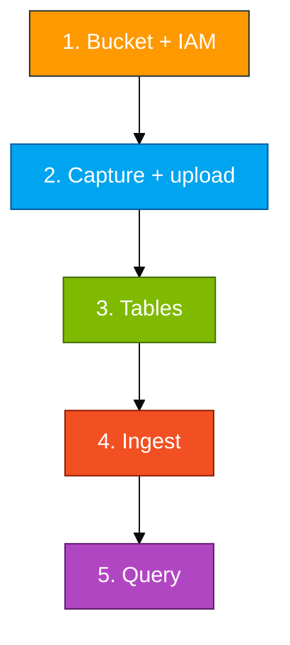

# Module 01 — Lab

You create a private bucket, grant a reader user, capture live AWS facts as NDJSON and CSV, upload, create tables, ingest, then query.

Long scripts live in `assets/module_01/`. Open those files and copy from there.

**Names** (use your login from the access card: `u01` … `u06`. Do not invent initials.)

- Database: `ADXTrainingDB_u01` (example for login `u01`)
- Bucket: `adx-log-ingestion-u01`
- IAM user: `adx-s3-reader-u01`



## Step 1 — Bucket and IAM

ADX must GET objects from a bucket you control. A reader user is safer than pasting an administrator key into the ingest URI. Your IAM login (`u01` … `u06`) can create **only** the bucket and reader named with **your** login. Any other name returns `AccessDenied`.

Region: **us-east-1**. Console: https://410232017221.signin.aws.amazon.com/console

**Bucket**

1. Search **S3** → **Create bucket**
2. Bucket name: `adx-log-ingestion-<your-login>` (example `adx-log-ingestion-u01`)
3. AWS Region: **US East (N. Virginia) us-east-1**
4. Object Ownership: ACLs disabled
5. **Block all public access** = on
6. Create bucket

**Reader IAM user** (keys go in `.ingest` only — not in `aws configure`)

1. Search **IAM** → **Users** → **Create user**
2. User name: `adx-s3-reader-<your-login>` (example `adx-s3-reader-u01`)
3. Do **not** enable console password. Next → create user (attach policies later)
4. Open the user → **Permissions** → **Add permissions** → **Create inline policy** → JSON
5. Paste `assets/iam/s3-reader-policy.json`. Replace every `BUCKET_NAME` with `adx-log-ingestion-<your-login>`
6. Confirm the JSON still contains `s3:GetBucketLocation`. Name the policy `LabS3Read` → Create
7. **Security credentials** → **Create access key** → use case **Command Line Interface (CLI)** → Create
8. Copy Access key ID and secret into a personal note. Do not commit them. Do not run `aws configure` with these keys. `aws configure` uses the keys on your access card (`u01` … `u06`).

## Step 2 — Capture live data and upload

The objects should describe **this** account (`sts`, bucket list, regions), not the sample JSON in the repo (that file is only a shape hint).

In the lab VS Code terminal (Linux bash, not PowerShell), from the repo root. Pass **your login**, not initials:

```bash
cd ~/adx-aws-training
aws sts get-caller-identity
bash assets/module_01/capture_and_upload.sh <your-login>
```

Example for `u01`: `bash assets/module_01/capture_and_upload.sh u01`

What the script does:

- Writes `~/adx-lab-m01/aws_api_logs.ndjson` and `aws_regions.csv`
- Uploads both objects
- Strips `\r` so Windows CLI output does not add an extra CSV field

Check: `aws s3 ls s3://adx-log-ingestion-<your-login>/` lists both keys.

## Step 3 — Tables and mappings

`.ingest` needs a typed table and a named mapping (JSONPath for NDJSON, column numbers for CSV).

1. Azure portal https://portal.azure.com → sign in with the Entra account on your access card
2. Resource group `rg-adx-training-aug26` → cluster `adxtrainaug26` → **Query**
3. In the database list, select `ADXTrainingDB_<your-login>` (example `ADXTrainingDB_u01`)
4. Run:

```kusto
print Database = current_database()
```

5. The `Database` column must equal `ADXTrainingDB_<your-login>`. If it does not, stop and change database.
6. Open `assets/module_01/create_tables.kql`, copy all of it into the query pane, run it.
7. Run `.show tables` — you must see `AppLogs_JSON` and `AppLogs_CSV`.

## Step 4 — Ingest

ADX uses the HTTPS URI plus the IAM keys to download and parse each object.

- Open `assets/module_01/ingest.kql`
- Replace `<bucket>` with `adx-log-ingestion-<your-login>`, `<region>` with `us-east-1`, and both key placeholders with the **reader** Access key ID and secret from Step 1
- Example URI host: `adx-log-ingestion-u01.s3.us-east-1.amazonaws.com`
- Form: `AwsCredentials=<access_key_id>,<secret>` — comma between id and secret. Do not use `;<key>;<secret>`
- Run both `.ingest` commands (one for JSON, one for CSV)

## Step 5 — Query

Run `assets/module_01/validate.kql`. `| count` should be close to `wc -l` on the matching local file (CSV has no header, so lines = rows).

**You're done when**

- Both objects are in your bucket
- `AppLogs_JSON` and `AppLogs_CSV` have rows
- `summarize by ServiceName` shows `sts` / `s3` / `ec2` (or similar)

**If it's empty**

- Wrong URI form (need `AwsCredentials=` and a comma)
- Policy missing `GetBucketLocation`
- Ingested before the mappings existed — `.show ingestion failures` in the same KQL file
