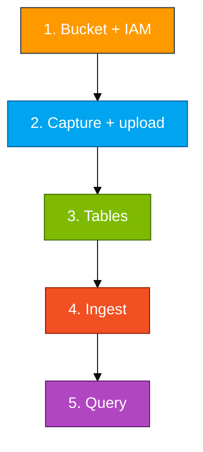
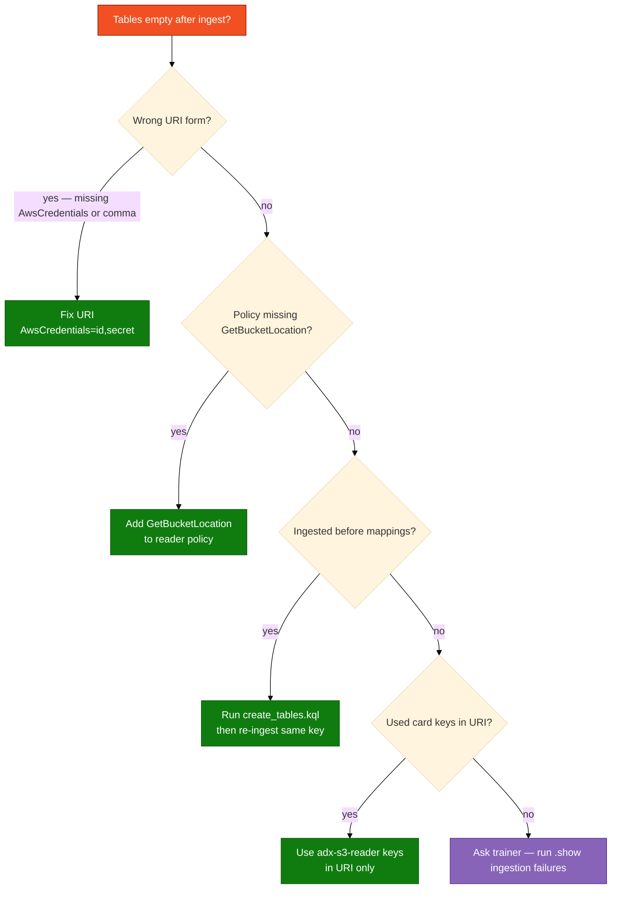

# Module 01 — Lab

You create a private bucket, grant a reader user, capture live AWS facts as NDJSON and CSV, upload, create tables, ingest, then query.

Long scripts live in `assets/module_01/`. Open those files and copy from there.

**Names** (use your login from the access card: `u01` … `u06`. Do not invent initials.)

| Resource | Example for `u01` |
|----------|-------------------|
| Database | `ADXTrainingDB_u01` |
| Bucket | `adx-log-ingestion-u01` |
| IAM reader | `adx-s3-reader-u01` |

**Two key pairs** (same pattern in every module):

| Keys | Where they go |
|------|----------------|
| Access card (`u01` … `u06`) | AWS console login + `aws configure` + capture script |
| `adx-s3-reader-<login>` from Step 1 | `.ingest` URI only — never `aws configure` |



## Step 1 — Bucket and IAM reader

**Goal:** ADX can read objects from your bucket using a dedicated reader user (not your admin/card keys).

**Region:** `us-east-1`. **Console:** https://410232017221.signin.aws.amazon.com/console

Your card login (`u01` … `u06`) can create **only** the bucket and reader named with **your** login. Any other name returns `AccessDenied`.

### Create the bucket

1. Search **S3** → **Create bucket**
2. Bucket name: `adx-log-ingestion-<your-login>` (example `adx-log-ingestion-u01`)
3. AWS Region: **US East (N. Virginia) us-east-1**
4. Object Ownership: ACLs disabled
5. **Block all public access** = on
6. **Create bucket**

### Create the reader IAM user

1. Search **IAM** → **Users** → **Create user**
2. User name: `adx-s3-reader-<your-login>` (example `adx-s3-reader-u01`)
3. Do **not** enable console password → **Create user** (attach policies in the next steps)
4. Open the user → **Permissions** → **Add permissions** → **Create inline policy** → **JSON**
5. Paste `assets/iam/s3-reader-policy.json`. Replace every `BUCKET_NAME` with `adx-log-ingestion-<your-login>`
6. Confirm the JSON still contains `s3:GetBucketLocation` → name the policy `LabS3Read` → **Create**
7. **Security credentials** → **Create access key** → use case **Command Line Interface (CLI)** → **Create**
8. Copy Access key ID and secret into a personal note. Do not commit them. Do not run `aws configure` with these keys.

**Checkpoint:** IAM user `adx-s3-reader-<your-login>` exists with inline policy scoped to your bucket only.

## Step 2 — Capture live data and upload

**Goal:** Two objects in S3 that describe **this** account (`sts`, bucket list, regions), not the sample JSON in the repo (that file is only a shape hint).

In the lab VS Code terminal (Linux bash, not PowerShell), from the repo root. Pass **your login**, not initials:

```bash
cd ~/adx-aws-training
aws sts get-caller-identity
bash assets/module_01/capture_and_upload.sh <your-login>
```

Example for `u01`: `bash assets/module_01/capture_and_upload.sh u01`

The script writes `~/adx-lab-m01/aws_api_logs.ndjson` and `aws_regions.csv`, uploads both, and strips `\r` so Windows CLI output does not add an extra CSV field.

**Checkpoint:**

```bash
aws s3 ls s3://adx-log-ingestion-<your-login>/
```

You should see `aws_api_logs.ndjson` and `aws_regions.csv`.

## Step 3 — Tables and mappings

**Goal:** Typed tables plus named ingestion mappings so `.ingest` knows how to parse NDJSON and CSV.

1. Azure portal https://portal.azure.com → sign in with the Entra account on your access card
2. In the portal top bar, confirm you are in the subscription your trainer assigned (often **Pay-As-You-Go**). If you cannot find `rg-adx-training-aug26`, switch subscription first.
3. Resource group `rg-adx-training-aug26` → cluster `adxtrainaug26` → **Query**
4. In the database list, select `ADXTrainingDB_<your-login>` (example `ADXTrainingDB_u01`)
5. Run this **query** first (not mixed with `.create` commands):

```kusto
print Database = current_database()
```

6. The `Database` column must equal `ADXTrainingDB_<your-login>`. If it does not, stop and change database.
7. Open `assets/module_01/create_tables.kql`, copy all of it into the query pane, **Run**. The Web UI runs each `.create` statement in the file.
8. Run `.show tables` — you must see `AppLogs_JSON` and `AppLogs_CSV`.

**If `.create` fails with "already exists":** you already ran this step; continue to ingest.

## Step 4 — Ingest from S3

**Goal:** ADX downloads each object using the HTTPS URI and the **reader** keys.

1. Open `assets/module_01/ingest.kql`
2. Replace `<bucket>` with `adx-log-ingestion-<your-login>`, `<region>` with `us-east-1`, and both key placeholders with the **reader** Access key ID and secret from Step 1
3. Example URI host: `adx-log-ingestion-u01.s3.us-east-1.amazonaws.com`
4. Form: `AwsCredentials=<access_key_id>,<secret>` — comma between id and secret. Do not use `;<key>;<secret>`
5. Run the **JSON** `.ingest` line, then run the **CSV** `.ingest` line separately (two runs, not one block, if the UI reports a syntax error on the second line)

**Or use the unified script** (after capture + `~/adx-lab-m01/reader.env`):

```bash
bash assets/ingest_s3_to_adx.sh --module m01 --login <your-login> --run
```

Paste `~/adx-lab-s3/m01/ingest_generated.kql` if `--run` is unavailable (no `az login`).

**Checkpoint:** No red errors in the ingest result panel; `HasErrors` is false if shown.

## Step 5 — Query

Run `assets/module_01/validate.kql`.

**You're done when**

- Both objects are in your bucket
- `AppLogs_JSON` and `AppLogs_CSV` have rows
- `summarize by ServiceName` shows `sts` / `s3` / `ec2` (or similar)

**If it's empty**


