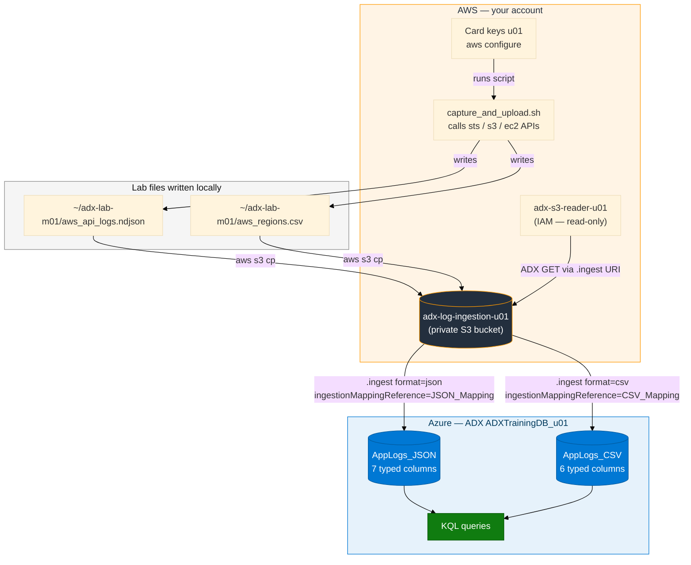
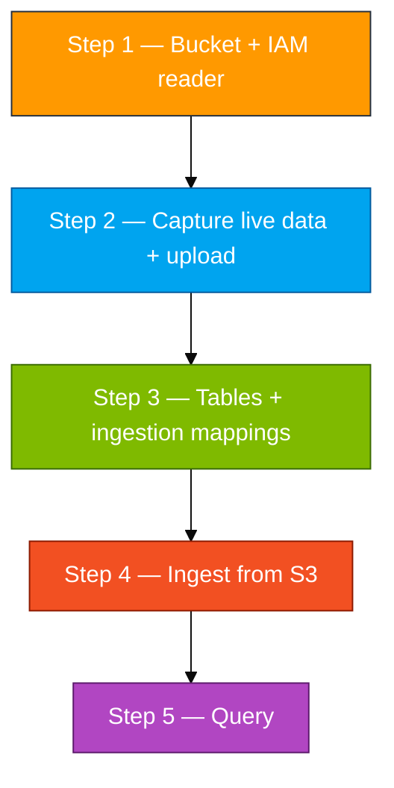
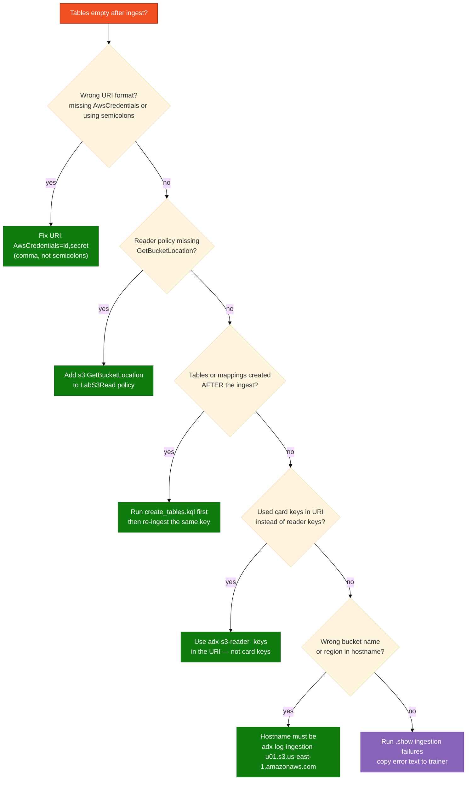

# Module 01 — Lab (S3 to ADX)

**Reading order:** `01_S3_Primer.md` → `01_S3_to_ADX_Concepts.md` → **this Lab** → `01_Exercises.md`.

**Database:** `ADXTrainingDB_<your-login>` (example: `ADXTrainingDB_u01`).

**KQL files:** `assets/module_01/`.

---

## 1. What this lab is about (plain English)

You need real log-like data inside **Azure Data Explorer (ADX)** so you can run **KQL** queries on it. This module is the shortest path between AWS and ADX: put files in S3, then pull them into ADX.

Here is the end-to-end story:

1. You create a **private S3 bucket** named after your login.
2. A capture script uses your **card keys** (`aws configure`) to call live AWS APIs and write the results to two files: one NDJSON file and one CSV file.
3. Those two files are uploaded to your private bucket.
4. You create a second IAM user — the **reader** — whose only permission is to read that one bucket.
5. In ADX you create two typed tables with **ingestion mappings** (rules that tell ADX how to parse JSON fields or CSV columns into typed columns).
6. You run `.ingest` commands that point ADX at the HTTPS S3 URIs. ADX downloads the files and loads the rows.
7. You query the rows with KQL.

**What this lab is NOT doing:** this is not a streaming pipeline. ADX pulls files on demand using the `.ingest` command you run. Later modules (CloudWatch Firehose → S3, Logstash → ADX) cover continuous ingestion patterns.

**Why two files?** NDJSON and CSV require different ingestion formats and different mapping styles. Seeing both in Module 01 prevents surprises in every later module.

---

## 2. How data travels (source → destination)



---

## 3. Names and two key pairs

**Resource names** (use your login from the access card: `u01` … `u06`. Do not invent initials.)

| Resource | Pattern | Example for `u01` |
|----------|---------|-------------------|
| ADX database | `ADXTrainingDB_<login>` | `ADXTrainingDB_u01` |
| S3 bucket | `adx-log-ingestion-<login>` | `adx-log-ingestion-u01` |
| IAM reader user | `adx-s3-reader-<login>` | `adx-s3-reader-u01` |
| NDJSON file | `aws_api_logs.ndjson` | same — no login in filename |
| CSV file | `aws_regions.csv` | same — no login in filename |

**Two key pairs — critical rule:**

| Keys | Where they go | What they are NOT for |
|------|---------------|-----------------------|
| Access card (`u01`…`u06`) | AWS console login · `aws configure` · running `capture_and_upload.sh` | Never paste into the ADX `.ingest` URI |
| Reader (`adx-s3-reader-<login>`) | The `.ingest` URI only — so ADX can download the S3 object | Never run `aws configure` with these |

Mixing them is the most common error in Module 01. The card keys have broad console permissions; putting them in the ADX URI is a security risk and unnecessary — the reader's policy is deliberately minimal.

---

## 4. Lab steps overview



**AWS console:** https://410232017221.signin.aws.amazon.com/console

**AWS region for all resources:** `us-east-1`

---

## Step 1 — Create the bucket and IAM reader

### Goal

A private S3 bucket that only your account can reach, plus a dedicated IAM user whose only permission is to read objects from that bucket. ADX uses the reader keys — not your card keys — when it downloads files.

### Why a separate reader?

The principle of least privilege: the reader can only `s3:GetObject` and `s3:GetBucketLocation` on your one bucket. If those credentials were ever exposed in a query log or paste, the blast radius is zero — the reader cannot delete, list other buckets, call IAM, or do anything else.

### Do this exactly

#### Create the bucket

1. Sign in to the AWS console with your **card** user (`u01` … `u06`).
2. Search **S3** → **Create bucket**.
3. **Bucket name:** `adx-log-ingestion-<your-login>` (example: `adx-log-ingestion-u01`).
4. **AWS Region:** US East (N. Virginia) `us-east-1`.
5. **Object Ownership:** ACLs disabled (default).
6. **Block all public access:** on (default).
7. Leave versioning off, encryption default.
8. **Create bucket**.

> Your card user can only create buckets and IAM users whose names contain **your** login. Any other name returns `AccessDenied` — this is intentional.

#### Create the IAM reader user

1. Search **IAM** → **Users** → **Create user**.
2. **User name:** `adx-s3-reader-<your-login>` (example: `adx-s3-reader-u01`).
3. **Do not** check "Provide user access to the AWS Management Console" → **Next** → **Next** → **Create user**.
4. Click the user you just created → **Permissions** tab → **Add permissions** → **Create inline policy** → **JSON** tab.
5. Open `assets/iam/s3-reader-policy.json` from the repo, paste it into the JSON editor.
6. Replace **every occurrence** of `BUCKET_NAME` with `adx-log-ingestion-<your-login>`. There are two: one for the bucket ARN, one for the objects ARN.
7. Verify the policy still contains `s3:GetBucketLocation` alongside `s3:GetObject` and `s3:ListBucket` — without `GetBucketLocation`, ADX often fails with `Download_Forbidden`.
8. **Policy name:** `LabS3Read` → **Create policy**.
9. Back in the user, go to **Security credentials** → **Create access key** → use case **Command Line Interface (CLI)** → check the confirmation box → **Create access key**.
10. Copy **Access key ID** and **Secret access key** into a personal text note. Do not commit them to git. Do not run `aws configure` with these keys.

### Checkpoint

```bash
# From the lab VS Code terminal — use your card keys via aws configure
aws iam get-user --user-name adx-s3-reader-<your-login>
aws iam list-user-policies --user-name adx-s3-reader-<your-login>
```

Both should succeed. The second command should show `LabS3Read`.

### If something is wrong

| Symptom | Fix |
|---------|-----|
| `AccessDenied` creating the bucket | Your bucket name does not include your login — rename it |
| `AccessDenied` creating the IAM user | User name does not match your login pattern — fix it |
| Policy missing `s3:GetBucketLocation` | Edit the inline policy and add that action before the next step |
| Lost the reader access key | Delete the existing key from Security credentials, create a new one |

---

## Step 2 — Capture live AWS data and upload to S3

### Goal

Two files (`aws_api_logs.ndjson` and `aws_regions.csv`) in your bucket that contain **real live data from this account**, not the sample files in the repo. The sample files (`assets/module_01/sample_logs.json` / `sample_logs.csv`) are shape hints only — do not ingest them as your main lab data.

### Why capture live data?

Module 01 is teaching the full pipeline. Using live `sts`, `s3`, and `ec2` API calls means the data in ADX reflects your actual account. When you later run `summarize by ServiceName`, the results are meaningful (you called those APIs) rather than fake fixture data.

### What the script does

`assets/module_01/capture_and_upload.sh` runs four AWS API calls with your card keys:

1. `aws sts get-caller-identity` → identity JSON
2. `aws s3 ls` → bucket list JSON
3. `aws ec2 describe-regions --filters "Name=opt-in-status,Values=opted-in,opt-in-not-required"` → regions JSON
4. Writes `~/adx-lab-m01/aws_api_logs.ndjson` (one JSON object per line) and `~/adx-lab-m01/aws_regions.csv` (region name, endpoint, opt-in status).
5. Strips `\r` so Windows CLI output does not add an invisible extra CSV field.
6. Uploads both files to `s3://adx-log-ingestion-<your-login>/`.

### Do this exactly

Open the **lab VS Code terminal** (Linux bash — not PowerShell). Run from the repo root:

```bash
cd ~/adx-aws-training
# Confirm your card keys are active
aws sts get-caller-identity
```

Expected: JSON showing your card user ARN (`arn:aws:iam::410232017221:user/u01` etc.).

```bash
export MSYS_NO_PATHCONV=1
bash assets/module_01/capture_and_upload.sh <your-login>
```

**Example for `u01`:**

```bash
bash assets/module_01/capture_and_upload.sh u01
```

The script prints each step as it runs. Typical output ends with:

```
Uploading to s3://adx-log-ingestion-u01/ ...
upload: .../aws_api_logs.ndjson to s3://adx-log-ingestion-u01/aws_api_logs.ndjson
upload: .../aws_regions.csv to s3://adx-log-ingestion-u01/aws_regions.csv
Done.
```

### Checkpoint

```bash
aws s3 ls s3://adx-log-ingestion-<your-login>/
```

Expected output — two objects:

```
<date> <time>   <size> aws_api_logs.ndjson
<date> <time>   <size> aws_regions.csv
```

**Example for `u01`:**

```bash
aws s3 ls s3://adx-log-ingestion-u01/
```

### If something is wrong

| Symptom | Fix |
|---------|-----|
| `aws sts get-caller-identity` fails | `aws configure` has wrong keys or no keys — re-run `aws configure` with card keys |
| Script exits with `AccessDenied` on upload | Bucket name in the script call does not match your login, or bucket in wrong region |
| S3 list shows 0 objects | The script may have failed mid-way — re-run it; uploads are idempotent |
| Script not found | Run from the repo root (`cd ~/adx-aws-training`); confirm path with `ls assets/module_01/` |
| Extra `.csv` field with carriage return | `MSYS_NO_PATHCONV=1` missing — set it, re-run script, or manually run `sed -i 's/\r//' ~/adx-lab-m01/aws_regions.csv` |

---

## Step 3 — Create tables and ingestion mappings in ADX

### Goal

Two typed tables in **your** ADX database, each with a named ingestion mapping so `.ingest` knows how to parse the files.

### Why mappings matter

ADX does not auto-detect JSON field names or CSV column positions. A **mapping** is a named rule stored in ADX that says: "field `$.timestamp` in the JSON → column `LogTime` of type `datetime`". If a mapping is wrong or missing, ingest silently stores everything in a `dynamic` column and your queries break. Creating the mapping correctly **before** the first ingest saves rework.

### What `create_tables.kql` creates

| Table | Format | Columns |
|-------|--------|---------|
| `AppLogs_JSON` | NDJSON (one JSON object per line) | `LogTime`, `LogLevel`, `Message`, `ServiceName`, `Host`, `RequestId`, `HttpStatus` |
| `AppLogs_CSV` | CSV (no header row) | `LogTime`, `LogLevel`, `Message`, `ServiceName`, `Host`, `MetricValue` |

The JSON mapping uses **JSONPath** (e.g., `$.timestamp`). The CSV mapping uses **ordinal positions** (column 0, 1, 2…).

### Do this exactly

1. Open a browser to [https://portal.azure.com](https://portal.azure.com). Sign in with the **Entra account** from your access card (not your AWS credentials).
2. In the top bar, confirm you are in the subscription your trainer assigned (often **Pay-As-You-Go**). If you cannot find `rg-adx-training-aug26`, switch subscription using the directory/subscription filter.
3. Resource group `rg-adx-training-aug26` → cluster `adxtrainaug26` → **Query**.
4. In the database dropdown, select **`ADXTrainingDB_<your-login>`** (example: `ADXTrainingDB_u01`).
5. In the query pane, run this check first — **alone** (not mixed with `.create` commands):

```kusto
print Database = current_database()
```

6. The `Database` column must read exactly `ADXTrainingDB_<your-login>`. If it says `ADXTrainingDB_u02` when you are `u01`, stop and fix the dropdown. You must never run commands in a classmate's database.

7. Open `assets/module_01/create_tables.kql`, copy all of it, paste into the ADX query pane, and **Run**. The Web UI executes each `.create` statement in sequence.

8. After it completes:

```kusto
.show tables
| where TableName in ("AppLogs_JSON", "AppLogs_CSV")
```

Both tables must appear.

9. Also verify mappings:

```kusto
.show table AppLogs_JSON ingestion mappings
.show table AppLogs_CSV ingestion mappings
```

Each should return one row showing `JSON_Mapping` and `CSV_Mapping` respectively.

### Checkpoint

- `AppLogs_JSON` and `AppLogs_CSV` both visible in `.show tables`
- `JSON_Mapping` exists on `AppLogs_JSON`
- `CSV_Mapping` exists on `AppLogs_CSV`
- `current_database()` returns **your** database

### If something is wrong

| Symptom | Fix |
|---------|-----|
| `.create` fails with "already exists" | You already ran this step — check mappings exist, then continue to Step 4 |
| Wrong database in `current_database()` | Fix the dropdown; never continue in a classmate's DB |
| Mapping not found after create | `create_tables.kql` may have been only partially pasted — re-run the full file |
| `.create` returns syntax error | You mixed a query and a control command in one run — run each `.create` statement separately |

---

## Step 4 — Ingest from S3

### Goal

ADX downloads each S3 object using HTTPS and the **reader** keys you created in Step 1. After this step, both tables have rows.

### Why the URI format matters

The `.ingest` command needs an HTTPS URI of the form:

```text
https://<bucket>.s3.<region>.amazonaws.com/<object-key>;AwsCredentials=<ACCESS_KEY_ID>,<SECRET>
```

Critical points:
- Use a **comma** between access key ID and secret — not semicolons.
- Use the **reader** keys (`adx-s3-reader-<login>`), never your card keys.
- The bucket hostname must include the region: `.s3.us-east-1.amazonaws.com`.

### Do this exactly

#### Option A — Edit and run `ingest.kql` manually (recommended for the first time)

1. Open `assets/module_01/ingest.kql`.
2. Make two substitutions:
   - Replace `<bucket>` with `adx-log-ingestion-<your-login>` (example: `adx-log-ingestion-u01`)
   - Replace `<region>` with `us-east-1`
   - Replace both `<access_key_id>` and `<secret>` with your **reader** keys from Step 1
3. The resulting NDJSON `.ingest` should look like:

```kusto
.ingest into table AppLogs_JSON
h@"https://adx-log-ingestion-u01.s3.us-east-1.amazonaws.com/aws_api_logs.ndjson;AwsCredentials=<READER_ACCESS_KEY_ID>,<READER_SECRET>"
with (format="json", ingestionMappingReference="JSON_Mapping")
```

4. Run the **JSON** `.ingest` line first (select it, run it).
5. Then run the **CSV** `.ingest` line separately.

> If the ADX Web UI reports a syntax error when you run both lines together, it is a UI limitation — run each line on its own.

#### Option B — Use the unified script (after saving reader keys)

First save the reader keys to an env file:

```bash
mkdir -p ~/adx-lab-m01
cat > ~/adx-lab-m01/reader.env <<'EOF'
READER_ACCESS_KEY_ID=PASTE_READER_ACCESS_KEY_ID
READER_SECRET_ACCESS_KEY=PASTE_READER_SECRET
EOF
chmod 600 ~/adx-lab-m01/reader.env
```

Then run:

```bash
bash assets/ingest_s3_to_adx.sh --module m01 --login <your-login> --run
```

**Example for `u01`:**

```bash
bash assets/ingest_s3_to_adx.sh --module m01 --login u01 --run
```

If `--run` is unavailable (no `az login`), open the generated file in the ADX Web UI:

```bash
cat ~/adx-lab-s3/m01/ingest_generated.kql
```

Paste its contents into the ADX query pane and run.

### Checkpoint

In ADX:

```kusto
// Must return no red errors and HasErrors = false in the result panel
.show ingestion failures
| where Table in ("AppLogs_JSON", "AppLogs_CSV")
| take 10
```

Then verify rows landed:

```kusto
AppLogs_JSON | count
AppLogs_CSV | count
```

Both counts must be greater than 0.

### If something is wrong



---

## Step 5 — Query

### Goal

Confirm the data makes sense and practice the first KQL patterns.

### Do this exactly

Run `assets/module_01/validate.kql`:

```kusto
// How many JSON rows landed?
AppLogs_JSON | count

// Sample rows
AppLogs_JSON | take 5

// How many CSV rows?
AppLogs_CSV | count

// Which AWS services appeared in the NDJSON?
AppLogs_JSON | summarize Events = count() by ServiceName

// Ingestion failures (should be empty)
.show ingestion failures
| where Table in ("AppLogs_JSON", "AppLogs_CSV")
| take 10
```

Then open `assets/module_01/explore.kql` for additional queries.

### You're done when

- Both objects are in your bucket (`aws s3 ls` shows them)
- `AppLogs_JSON` and `AppLogs_CSV` both have rows greater than 0
- `summarize by ServiceName` shows recognizable AWS services (`sts`, `s3`, `ec2`, or similar)
- You can explain the difference between the card keys and the reader keys
- You can explain why `GetBucketLocation` is required in the reader policy

### Keep these tables

`AppLogs_JSON` and `AppLogs_CSV` are not used in later modules by name, but Module 01 establishes the pattern every later module reuses. Leave them in your database for reference.

---

## Quick failure guide

| Problem | Likely cause | Fix |
|---------|--------------|-----|
| Empty tables after `.ingest` | Wrong key format or wrong keys | Check URI — comma between id and secret, reader keys not card keys |
| `Download_Forbidden` | Missing `GetBucketLocation` in reader policy | Add it to `LabS3Read` |
| `HasErrors: true` in ingest result | Mapping mismatch or format mismatch | Check `format=json` for NDJSON, `format=csv` for CSV |
| Only one row in `AppLogs_JSON` | Used `format=json` instead of `format=json` with the mapping — or the NDJSON file has extra structure | Re-check mapping ordinal vs JSONPath |
| Card keys in `.ingest` URI | Confusion about two key pairs | Never put card keys in the URI — reader keys only |
| Wrong ADX database | Dropdown was on a classmate's DB | Fix dropdown, run `print Database` to confirm |
| File not found on S3 | Step 2 script did not upload | Re-run `capture_and_upload.sh`, check for errors |
