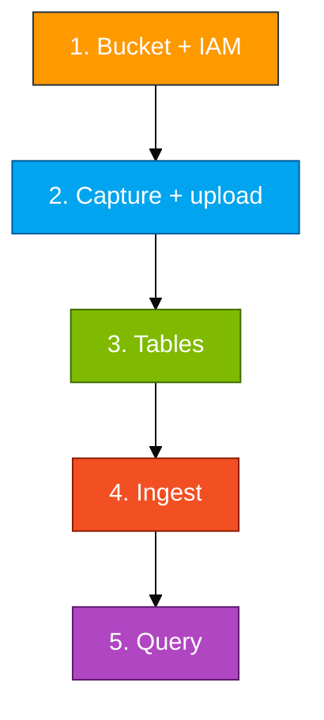

# Module 01 — Lab

You create a private bucket, grant a reader user, capture live AWS facts as NDJSON and CSV, upload, create tables, ingest, then query.

Long scripts live in `assets/module_01/`. Open those files and copy from there.

**Names** (example initials `ag`):

- Database: `ADXTrainingDB_ag`
- Bucket: `adx-log-ingestion-ag`
- IAM user: `adx-s3-reader-ag`



## Step 1 — Bucket and IAM

ADX must GET objects from a bucket you control. A reader user is safer than pasting an administrator key into the ingest URI.

- Create the bucket in the lab region with **Block public access** on
- Create the IAM user
- Attach an **inline** policy from `assets/iam/s3-reader-policy.json`; replace every `BUCKET_NAME` with your bucket name
- Create an access key for CLI / ADX (not console login). Do not commit the secret

## Step 2 — Capture live data and upload

The objects should describe **this** account (`sts`, bucket list, regions), not the sample JSON in the repo (that file is only a shape hint).

Use Git Bash or WSL, not PowerShell, from the repo root:

```bash
bash assets/module_01/capture_and_upload.sh <your-initials>
```

What the script does:

- Writes `~/adx-lab-m01/aws_api_logs.ndjson` and `aws_regions.csv`
- Uploads both objects
- Strips `\r` so Windows CLI output does not add an extra CSV field

Check: `aws s3 ls s3://adx-log-ingestion-<your-initials>/` lists both keys.

## Step 3 — Tables and mappings

`.ingest` needs a typed table and a named mapping (JSONPath for NDJSON, column numbers for CSV).

- In ADX Web UI, select your database
- Run `print Database = current_database()` so you are not writing into someone else’s database
- Run `assets/module_01/create_tables.kql`
- Check: `.show tables` lists `AppLogs_JSON` and `AppLogs_CSV`

## Step 4 — Ingest

ADX uses the HTTPS URI plus the IAM keys to download and parse each object.

- Open `assets/module_01/ingest.kql`
- Replace `<bucket>`, `<region>`, and both key placeholders
- Example host: `adx-log-ingestion-ag.s3.us-east-1.amazonaws.com`
- Run both `.ingest` commands

## Step 5 — Query

Run `assets/module_01/validate.kql`. `| count` should be close to `wc -l` on the matching local file (CSV has no header, so lines = rows).

**You're done when**

- Both objects are in your bucket
- `AppLogs_JSON` and `AppLogs_CSV` have rows
- `summarize by ServiceName` shows `sts` / `s3` / `ec2` (or similar)

**If it's empty**

- Wrong URI form (need `AwsCredentials=` and a comma)
- Policy missing `GetBucketLocation`
- Ingested before the mappings existed — `.show ingestion failures` in the same KQL file
