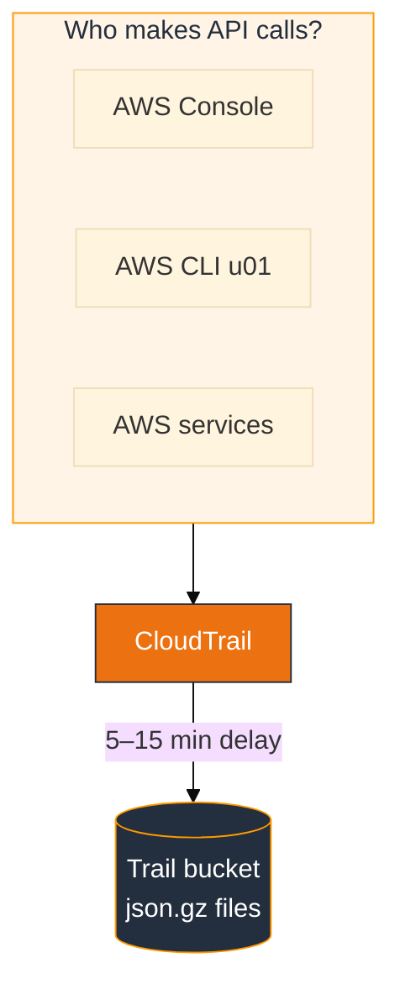
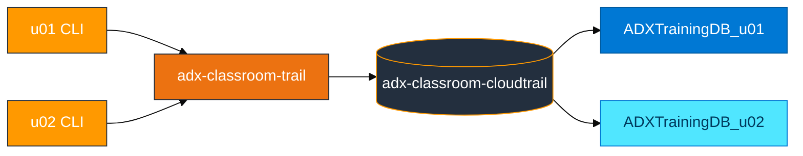

# Module 02 — CloudTrail primer (AWS basics)

Read this **before** `02_CloudTrail_to_ADX_Concepts.md`.

## What CloudTrail is

**AWS CloudTrail** records **API activity** in your account: who called which AWS API, when, from which IP, and whether it failed. It is an **audit trail**, not application log text.

## CloudTrail vs CloudWatch Logs

| | CloudTrail | CloudWatch Logs |
|---|------------|-----------------|
| **Records** | AWS API calls | Application / OS log lines |
| **Example** | `CreateBucket`, `RunInstances` | `"ERROR connection refused"` |
| **This course** | Module 02 | Module 03 |

## Vocabulary

| Term | Meaning |
|------|---------|
| **Trail** | Configuration that delivers events to S3 (and optionally CloudWatch Logs) |
| **Management events** | Control-plane APIs (create/delete/describe resources) |
| **Data events** | Object-level S3/GetObject etc. (optional, extra cost — not required for lab) |
| **Records** | Array of events inside each `.json.gz` file |

## Classroom model

One **shared trail** and bucket (`adx-classroom-cloudtrail`) for everyone. You generate **your own** API activity with your card keys, then filter in KQL by your IAM ARN.

## Hands-on (console)

1. **CloudTrail** → **Trails** → open `adx-classroom-trail` (read only — do not delete).
2. Note **S3 bucket** name and **Management events** enabled.
3. **S3** → `adx-classroom-cloudtrail` → browse `AWSLogs/<account-id>/CloudTrail/us-east-1/`.
4. Download one `.json.gz`, gunzip locally (optional) — see `"Records": [ ... ]`.

**Checkpoint:** You can point to where new files appear after you run CLI commands.

## Real activity (no script required)

CloudTrail is **always on** for the classroom trail. Anything you do in the console or CLI creates **real** events under your IAM user — same as production.

1. Use the AWS console normally (list S3 buckets, open IAM users, etc.), **or** run `aws s3 ls`, `aws sts get-caller-identity`.
2. Wait **5–15 minutes** for a new `.json.gz` under `AWSLogs/<your-account-id>/CloudTrail/us-east-1/`.
3. In ADX after expand: `CloudTrailEvents | where UserArn contains "<your-login>"`.

Why we still ship `generate_events.sh`: it creates **distinct** create/delete events so beginners can confirm expand worked, while tables and IAM are being built. You can instead use normal console/CLI activity and wait 5–15 minutes for trail delivery.

## Sample event fields

After expand in ADX you query these most often:

- `EventTime`, `EventName`, `EventSource`, `AwsRegion`
- `UserIdentity.arn` or projected `UserArn`
- `SourceIP`, `ErrorCode`

## Common mistakes

| Mistake | Result |
|---------|--------|
| Expect instant S3 files | Normal wait is **5–15 minutes** |
| Reader policy on wrong bucket | Ingest fails or empty — must be trail bucket |
| Query `CloudTrailRaw` only | One row per file — need **expand** |
| Use `format=json` | Pretty-printed file needs **multijson** |
