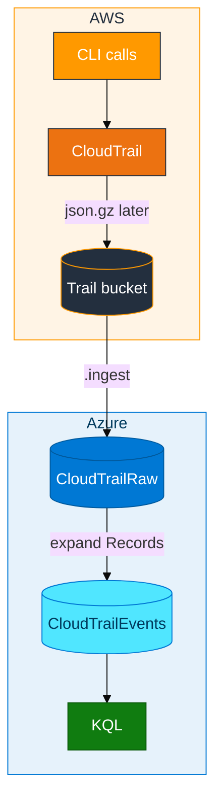
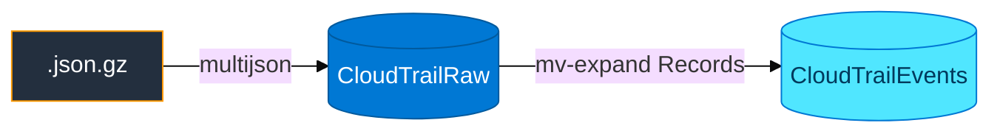

# Module 02 — CloudTrail to ADX

> **Reading order:** `02_CloudTrail_Primer.md` → Concepts (this file) → Lab → Exercises.

Module 01 used a file **you** uploaded. This module uses gzipped JSON **AWS** wrote — top-level `Records` array, delivery often **5–15 minutes**.

- Ingest format: **`multijson`** (pretty-printed file, not single-line `json`)
- **`CloudTrailRaw`**: one row per file → **`CloudTrailEvents`**: one row per API call after expand

AWS primer (what CloudTrail is, shared trail): **`02_CloudTrail_Primer.md`**.

## How data moves

Empty S3 after two minutes is normal — build tables and IAM while waiting.

## One file → many rows

After expand, query: `eventTime`, `eventName`, `eventSource`, `awsRegion`, `userIdentity.arn`, `errorCode`. Leave `CloudTrailEvents` for Module 04.

## Real activity vs lab script

CloudTrail records **every** API call in your account continuously. Delivery to S3 is **not** instant (typically **5–15 minutes**). The lab script `generate_events.sh` only **schedules recognizable API calls** — it is not fake JSON. For console-only real activity and bulk ingest without manual keys, see **`assets/REAL_VS_LAB_DATA.md`** and Step 5 in the lab (`ingest_s3_prefix.sh`).

## In class

- Shared bucket **`adx-classroom-cloudtrail`** — reader policy on that bucket only
- Filter by your ARN in KQL (`UserArn contains "<login>"`)
