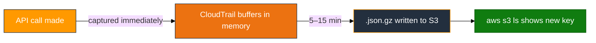
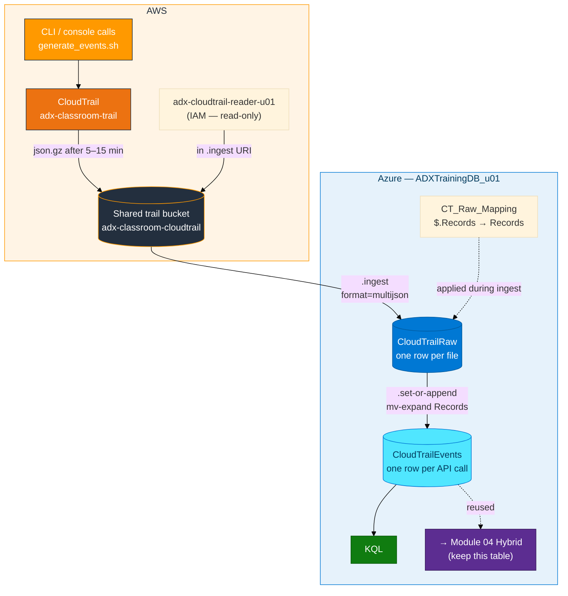
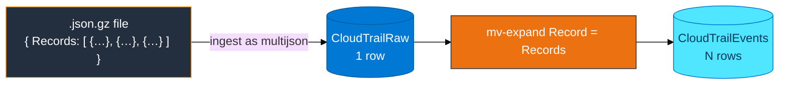

# Module 02 — CloudTrail to ADX Concepts

> **Reading order:** `02_CloudTrail_Primer.md` → Concepts (this file) → Lab → Exercises.

---

## 1. What changed since Module 01

In Module 01, **you** created the files and uploaded them to S3 yourself using `capture_and_upload.sh`.

In Module 02, **AWS CloudTrail** writes the files for you. CloudTrail is an AWS service that watches every API call made in the account and writes those calls to a file in S3 automatically.

Your job at the end is still the same: **`.ingest` that S3 object into ADX, then query it**. The new work in Module 02 is:

1. Understanding the CloudTrail **file format** (a JSON wrapper with a `Records` array inside).
2. Dealing with the **delivery delay** (5–15 minutes between API call and S3 object).
3. Running an extra **expand step** (`mv-expand`) so each API call becomes its own row instead of staying buried in the array.

---

## 2. What is CloudTrail?

AWS CloudTrail is a continuous audit log for your AWS account. Every API call — whether made from the console, CLI, SDK, or another AWS service — is captured as a structured event. Those events are written to files and delivered to an S3 bucket.

**What the shared trail records:**

| Who calls an API | Example calls | How you find them later |
|-----------------|---------------|-------------------------|
| Your card user (`u01`) | `s3:CreateBucket`, `iam:CreateUser`, `sts:GetCallerIdentity` | `UserArn contains "u01"` |
| AWS services acting for you | Auto-scaling events, Lambda invocations | `UserIdentityType == "AssumedRole"` or `"Service"` |
| Other students | Their API calls land in the same shared trail file | Filter by your login — the bucket is shared |

**The shared setup in this lab:**

- **Trail name:** `adx-classroom-trail` — created by the trainer, do not touch
- **Trail bucket:** `adx-classroom-cloudtrail` — shared across all students, do not delete
- You read from this bucket using your own IAM reader (`adx-cloudtrail-reader-<login>`)

---

## 3. Plain-English data path

1. You run `generate_events.sh` (or any real console/CLI work) — this produces API calls.
2. The shared trail (`adx-classroom-trail`) records those calls.
3. Minutes later (5–15 min), a `.json.gz` object appears under `s3://adx-classroom-cloudtrail/AWSLogs/<account>/CloudTrail/<region>/<year>/<month>/<day>/`.
4. You create ADX tables and a **reader** IAM user scoped to `adx-classroom-cloudtrail`.
5. You find the object key, paste it into an `.ingest` command, and ingest into `CloudTrailRaw`.
6. You **expand** the `Records` array so each API call becomes a row in `CloudTrailEvents`.
7. You query `CloudTrailEvents` with KQL.

**Delivery timing:**



Empty S3 after two minutes is **normal**. Build your tables and IAM reader during the wait.

---

## 4. How data moves (full journey)



---

## 5. Why the file needs expanding

A CloudTrail object is one JSON document, not one record per line. It looks like:

```json
{
  "Records": [
    {
      "eventTime": "2026-08-28T14:32:10Z",
      "eventName": "CreateBucket",
      "eventSource": "s3.amazonaws.com",
      "awsRegion": "us-east-1",
      "userIdentity": { "type": "IAMUser", "arn": "arn:aws:iam::410232017221:user/u01", ... },
      "requestParameters": { "bucketName": "adx-ct-activity-u01" }
    },
    {
      "eventTime": "2026-08-28T14:32:14Z",
      "eventName": "CreateUser",
      "eventSource": "iam.amazonaws.com",
      ...
    }
  ]
}
```

So:

| After ingest | What you see |
|-------------|--------------|
| `CloudTrailRaw` | 1 row — the whole `Records` array is one `dynamic` column |
| `CloudTrailEvents` after expand | N rows — one row per entry in `Records` |



After expand, useful columns in `CloudTrailEvents`:

| Column | Example value | What it tells you |
|--------|---------------|-------------------|
| `EventTime` | `2026-08-28T14:32:10Z` | When the API call happened |
| `EventName` | `CreateBucket` | Which API operation |
| `EventSource` | `s3.amazonaws.com` | Which AWS service |
| `AwsRegion` | `us-east-1` | Region of the call |
| `UserArn` | `arn:aws:iam::410232017221:user/u01` | Who made the call |
| `ErrorCode` | `AccessDenied` or empty | Empty means success |
| `ReadOnly` | `true` / `false` | Describe calls vs mutating calls |

---

## 6. Why `multijson` and not `json`

| Format | What it expects | Use for |
|--------|-----------------|---------|
| `format="json"` | One JSON document per line (NDJSON) | `aws_api_logs.ndjson` from Module 01 |
| `format="multijson"` | One or more JSON documents in a file, possibly pretty-printed across multiple lines | CloudTrail `.json.gz` wrapper files |

Using `format="json"` on a CloudTrail file usually results in either an error or one garbled row with everything in one field, because the file is one large multi-line JSON document — not one object per line.

---

## 7. The two-table design — why `CloudTrailRaw` first?

You could try to ingest directly into a flat table with one column per CloudTrail field. That would require an inline mapping for all 30+ CloudTrail fields. The two-table approach is simpler and more flexible:

1. Ingest the raw file into `CloudTrailRaw` with a trivial mapping (`$.Records` → one dynamic column). This is fast and always works.
2. Use `.set-or-append` + `mv-expand` + `project` to build `CloudTrailEvents` from the raw rows. You control which fields to extract and what to name them.
3. If you want more fields later, change the `project` and re-run the expand — the raw rows are still there.

**`CloudTrailRaw` schema:**

```kusto
.create table CloudTrailRaw (
    Records: dynamic
)
```

**`CloudTrailEvents` schema (14 columns):**

```kusto
.create table CloudTrailEvents (
    EventTime: datetime,
    EventName: string,
    EventSource: string,
    AwsRegion: string,
    SourceIP: string,
    UserAgent: string,
    UserIdentityType: string,
    UserArn: string,
    AccountId: string,
    ReadOnly: bool,
    ErrorCode: string,
    RequestParameters: dynamic,
    ResponseElements: dynamic,
    RawRecord: dynamic
)
```

---

## 8. The reader IAM user for the shared trail bucket

The reader for Module 02 is different from Module 01:

| Property | Module 01 | Module 02 |
|----------|-----------|-----------|
| User name | `adx-s3-reader-<login>` | `adx-cloudtrail-reader-<login>` |
| Bucket in policy | `adx-log-ingestion-<login>` | `adx-classroom-cloudtrail` |
| Who created the bucket | You (Module 01) | The trainer (shared, do not touch) |

The same `assets/iam/s3-reader-policy.json` template is reused — just replace `BUCKET_NAME` with `adx-classroom-cloudtrail` this time.

---

## 9. Real activity vs the lab script

CloudTrail records **real** API calls. The script `generate_events.sh` does not inject fake CloudTrail JSON files into S3. It performs real API calls (creates and deletes a temp S3 bucket and a temp IAM user) so your activity is distinguishable in the shared trail.

Because the trail bucket is **shared**, each file contains events from all students. Filter in KQL with your login:

```kusto
CloudTrailEvents
| where UserArn contains "u01"
| project EventTime, EventName, EventSource, ErrorCode
| sort by EventTime desc
```

---

## 10. What carries forward to the next modules

| Concept | Used again in |
|---------|---------------|
| `format=multijson` for wrapper JSON | Module 02 only (CloudTrail files) |
| `mv-expand` to explode arrays | Module 04 Hybrid (expand on-prem log arrays) |
| `CloudTrailEvents` table | Module 04 Hybrid — source for `RawAWSLogs` |
| IAM reader scoped to a specific bucket | Module 03 (Firehose bucket) |
| Delivery delay (AWS writes, you wait) | Module 03 (Firehose delivery also has a buffer) |
| Two-table raw + clean design | Module 04 (`RawAWSLogs` + `UnifiedHybridLogs`) |

**Keep `CloudTrailEvents`** after this module. Module 04 Hybrid Logs needs it as the AWS-side source for the `RawAWSLogs` table. Do not drop it.

---

## 11. In class — shared resources

- **Shared bucket `adx-classroom-cloudtrail`** — your reader policy must reference this bucket exactly. Pointing at `adx-log-ingestion-*` (Module 01's bucket) is the most common setup mistake.
- **Card keys list objects** — use `aws s3 ls` with your card keys to browse the trail. Reader keys go only in the `.ingest` URI.
- **Never delete the shared trail or shared bucket** — it would break the lab for all students.
- **Filter by your login** — after expand, always add `| where UserArn contains "u01"` (your login) to see only your events.

AWS primer (what CloudTrail is, trail vs event history, shared trail setup): **`02_CloudTrail_Primer.md`**.
