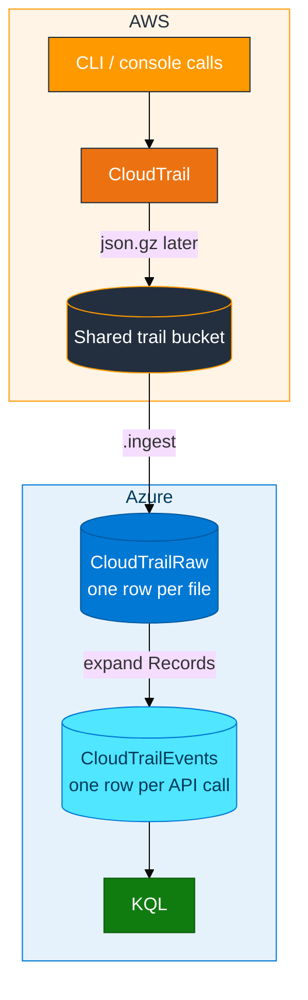
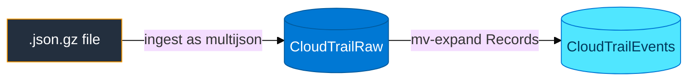

# Module 02 — CloudTrail to ADX

> **Reading order:** `02_CloudTrail_Primer.md` → Concepts (this file) → Lab → Exercises.

## What changed since Module 01

In Module 01, **you** created a file and uploaded it to S3.

In Module 02, **AWS CloudTrail** writes the file for you. CloudTrail watches API activity in the account (for example: create bucket, create IAM user, list regions). After a delay, it drops a compressed JSON file (`.json.gz`) into a shared S3 bucket.

Your job is still the same idea as Module 01 at the end: **ADX `.ingest` that S3 object**, then query it. The hard new part is understanding the **file shape** and the **wait**.

AWS primer (what CloudTrail is, shared trail): **`02_CloudTrail_Primer.md`**.

---

## Plain-English data path

1. You run recognizable API calls (`generate_events.sh` or normal console/CLI work).
2. The shared trail (`adx-classroom-trail`) records those calls.
3. Minutes later, a `.json.gz` object appears under `s3://adx-classroom-cloudtrail/...`.
4. You create ADX tables, create a **reader** IAM user for the **shared trail bucket**, and `.ingest` one object.
5. You **expand** the file so each API call becomes its own row.

Delivery is often **5–15 minutes**. Empty S3 after two minutes is normal — build tables and IAM while waiting.

---

## How data moves



---

## Why the file needs “expand”

A CloudTrail object is usually one JSON document that looks like:

```text
{ "Records": [ {api call 1}, {api call 2}, {api call 3}, ... ] }
```

So:

| Table | Meaning |
|-------|---------|
| `CloudTrailRaw` | Roughly **one row per file** (the wrapper is still intact) |
| `CloudTrailEvents` | **One row per API call** after you expand the `Records` array |

**`multijson`** is the ingest format that fits this wrapper style in the lab. Using plain `json` incorrectly often leaves you with one useless row and empty analytics fields.



After expand, useful fields include: `eventTime`, `eventName`, `eventSource`, `awsRegion`, user ARN, `errorCode`.

**Keep `CloudTrailEvents`** for Module 04 Hybrid.

---

## Real activity vs the lab script

CloudTrail records **real** API calls. The script `generate_events.sh` does not invent fake CloudTrail JSON. It only **performs recognizable API calls** so your activity is easier to find later.

Because the trail bucket is **shared**, filter in KQL with your login, for example `UserArn contains "u01"`.

## In class

- Shared bucket **`adx-classroom-cloudtrail`** — reader policy on that bucket only (not your Module 01 bucket)
- Card keys list objects; reader keys go in the `.ingest` URI only
- Never delete the shared trail or shared bucket
