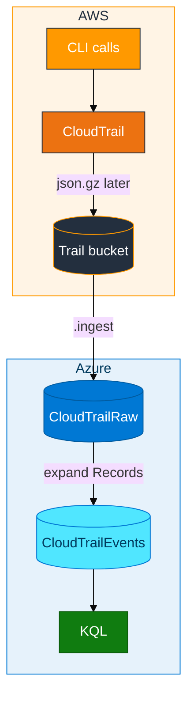

# Module 02 — CloudTrail to ADX

CloudTrail is AWS’s record of API activity: who called which operation, from which IP, in which region, and whether it failed. The files are not a flat CSV. Each object is gzipped JSON with a top-level `Records` array.

Module 01 used a file **you** uploaded. This module uses a file **AWS** wrote.

- Delivery is slow (often 5–15 minutes). That wait is trail delivery, not ADX
- The JSON is pretty-printed across many lines, so ingest format is `multijson`, not single-line `json`
- After ingest you still have **one row per file**. Audit questions need **one row per API call**, so you expand `Records` into `CloudTrailEvents`

**Example.** You create and delete a temp bucket. You expect `CreateBucket` and `DeleteBucket` in KQL. If you only queried `CloudTrailRaw`, you would see one giant array and could not `summarize by EventName`.

## In class

- The trail and destination bucket are **shared**. Do not create or delete that trail (one trail for the room)
- You need IAM read on the **trail** bucket (`assets/iam/s3-reader-policy.json` with that bucket name)
- Work in `ADXTrainingDB_<your-login>` (example `ADXTrainingDB_u01`)
- Leave `CloudTrailEvents` for Module 04

## How data moves



Use the wait for tables and IAM. An empty prefix after two minutes does not mean ingest is broken.

## Object shape

```text
{ "Records": [ { "eventTime": "...", "eventName": "CreateBucket", ... }, ... ] }
```

- Mapping stores `$.Records` as `dynamic`
- After expand, useful fields: `eventTime`, `eventName`, `eventSource`, `awsRegion`, `userIdentity.arn`, `errorCode`
- Two tables on purpose: raw = file as delivered; events = what you query
