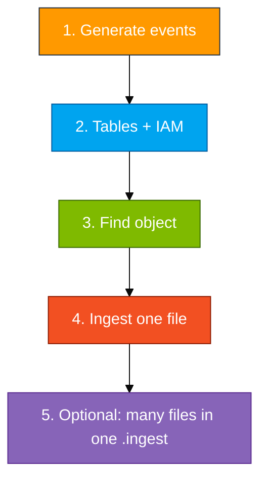
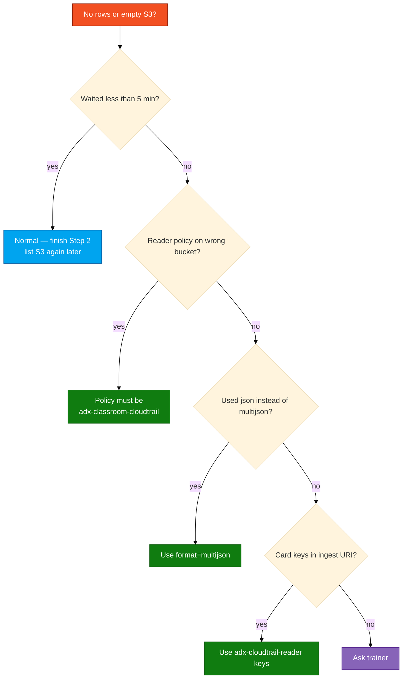

# Module 02 — Lab

Generate a few API calls, wait for a `.json.gz` in the **shared** trail bucket, create tables and a reader, ingest the wrapper, expand `Records`, keep `CloudTrailEvents` for Module 04.

Scripts and KQL: `assets/module_02/`.

Prefer real activity? Skip the script and use the console or CLI normally (`aws s3 ls`, create a test bucket, etc.). You still wait for S3 delivery — that delay is normal in production too.

**Names** (use your login from the access card: `u01` … `u06`. Do not invent initials.)

| Resource | Example for `u01` |
|----------|-------------------|
| Database | `ADXTrainingDB_u01` |
| Shared trail bucket | **`adx-classroom-cloudtrail`** (trainer — do not create or delete) |
| IAM reader | `adx-cloudtrail-reader-u01` |

> A new `.json.gz` often takes **5–15 minutes** after your API calls. Use that wait for Step 2. Empty S3 after two minutes is normal.

**Two key pairs:**

| Keys | Where they go |
|------|----------------|
| Access card (`u01` … `u06`) | AWS console + `aws configure` + `generate_events.sh` |
| `adx-cloudtrail-reader-*` from Step 2 | `.ingest` URI only — never `aws configure` |



## Step 1 — Generate events

**Goal:** Known API activity in the shared trail so you can recognize your calls after expand.

```bash
bash assets/module_02/generate_events.sh us-east-1 <your-login>
```

**Example for `u01`:** `bash assets/module_02/generate_events.sh us-east-1 u01`

The script (using your card keys via `aws configure`):

- Creates and deletes a temp bucket `adx-ct-activity-<your-login>`
- Creates and deletes a temp IAM user `ct-lab-user-<your-login>`
- Runs a few describe/list calls

All actions are logged to the **shared** CloudTrail trail. A new object can take **5–15 minutes**. Start Step 2 while you wait.

**Prefer real activity instead?** Skip the script and use the console or CLI normally (`aws s3 ls`, create a test bucket, etc.). You still wait for S3 delivery — that delay is normal in production too.

**Checkpoint:** Script finishes without `AccessDenied`. You do **not** need an S3 object yet.

## Step 2 — Tables and IAM reader

**Goal:** `CloudTrailRaw` holds the file wrapper; `CloudTrailEvents` will hold one row per API call after expand.

In ADX (`ADXTrainingDB_<your-login>`), copy **all** of `assets/module_02/create_tables.kql` and run once. The Web UI runs each `.create` line.

If tables already exist from rehearsal:

```kusto
.drop table CloudTrailRaw ifexists
.drop table CloudTrailEvents ifexists
```

Then run `create_tables.kql` again.

### IAM reader for the **trail** bucket

Create IAM user **`adx-cloudtrail-reader-<your-login>`** (same console path as Module 01 reader):

1. IAM → **Users** → **Create user** → name `adx-cloudtrail-reader-u01` (your login)
2. No console access, no managed policies
3. Inline policy from `assets/iam/s3-reader-policy.json` — replace **both** `BUCKET_NAME` with **`adx-classroom-cloudtrail`** (the shared trail bucket, **not** your Module 01 bucket)
4. Create access keys → copy to a notepad for the ingest URI only
5. Save keys for the prefix ingest script (not in git):

```bash
mkdir -p ~/adx-lab-m02
cat > ~/adx-lab-m02/reader.env <<'EOF'
READER_ACCESS_KEY_ID=PASTE_READER_ACCESS_KEY_ID
READER_SECRET_ACCESS_KEY=PASTE_READER_SECRET
EOF
chmod 600 ~/adx-lab-m02/reader.env
```

**Checkpoint:** Reader policy ARN references `adx-classroom-cloudtrail`, not `adx-log-ingestion-*`.

## Step 3 — Find an object

**Goal:** Full S3 object key (including `AWSLogs/...`) for `.ingest`.

```bash
REGION=us-east-1
ACCOUNT=$(aws sts get-caller-identity --query Account --output text)
aws s3 ls "s3://adx-classroom-cloudtrail/AWSLogs/${ACCOUNT}/CloudTrail/${REGION}/" --recursive | sort | tail -n 20
```

Copy a key that ends in `.json.gz`.

**Example:** `AWSLogs/410232017221/CloudTrail/us-east-1/2026/08/28/410232017221_CloudTrail_us-east-1_....json.gz`

Tip: after expand, filter `UserArn contains "u01"` — the trail bucket is shared with the class.

**If the list is empty:** wait and re-run the `aws s3 ls` command. Trail delivery is slow.

## Step 4 — Ingest one file and expand

**Goal:** One `.json.gz` → one raw row → many event rows.

- `multijson` loads the pretty-printed wrapper
- `mv-expand` turns each element of `Records` into a row

1. Open `assets/module_02/ingest_and_expand.kql`
2. Replace bucket (`adx-classroom-cloudtrail`), region, **full object key**, and **reader** keys
3. Run the **`.ingest`** block first
4. Run `CloudTrailRaw | take 1` to confirm one raw row
5. Run the **`.set-or-append CloudTrailEvents`** block (the `mv-expand` query)
6. Run `assets/module_02/validate.kql`. Optional: `assets/module_02/explore.kql`

Leave `CloudTrailEvents` for Module 04.

**You're done with the core lab when**

- `CloudTrailRaw` has a row
- `CloudTrailEvents` has many rows (one per API call, not one per file)
- You can `summarize by EventSource`

## Step 5 — Optional: ingest many files without naming each key

**Goal:** Ingest several trail objects in **one** `.ingest` without copying individual S3 keys.

ADX on this cluster does **not** support `s3://bucket/prefix/*` wildcards. Use the unified script:

```bash
bash assets/ingest_s3_to_adx.sh --module m02 --login <your-login> --region us-east-1 --max 5 --run
```

**Example:** `bash assets/ingest_s3_to_adx.sh --module m02 --login u01 --max 5 --run`

- `--run` lists nested keys under your `AWSLogs/<account>/CloudTrail/...` prefix, builds multi-URI `.ingest`, and ingests via ADX (requires `az login` on the host)
- Without `--run`, open `~/adx-lab-s3/m02/ingest_generated.kql` in the ADX Web UI

Use `--max 1` for newest file only. Legacy wrapper: `assets/module_02/ingest_s3_prefix.sh` (same as above).

**Output:**

- `~/adx-lab-s3/m02/ingest_generated.kql` — includes expand to `CloudTrailEvents`
- `~/adx-lab-s3/m02/ingest_keys.txt` — object keys included

**Checkpoint:** `CloudTrailRaw | count` matches file count; `CloudTrailEvents` has many rows after expand.

Manual alternative: `assets/module_02/ingest_many_files.kql` — paste three keys yourself.

**If it's empty**


