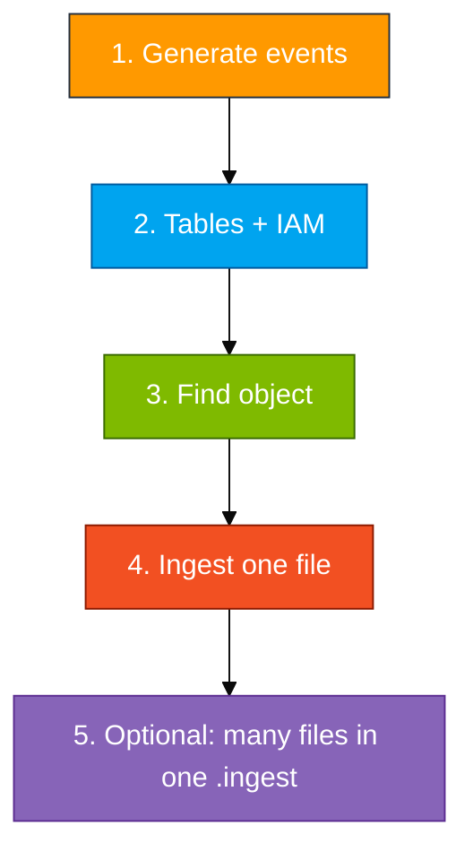

# Module 02 — Lab

Generate a few API calls, wait for a `.json.gz` in the **shared** trail bucket, create tables and a reader, ingest the wrapper, expand `Records`, keep `CloudTrailEvents` for Module 04.

Scripts and KQL: `assets/module_02/`.

**Names** (use your login from the access card: `u01` … `u06`. Do not invent initials.)

- Database: `ADXTrainingDB_u01` (example for login `u01`)
- Shared trail bucket: **`adx-classroom-cloudtrail`** (trainer gives this — do not create or delete it)
- IAM reader: `adx-cloudtrail-reader-u01` (example for login `u01`)

> A new `.json.gz` often takes **5–15 minutes**. Use that time for tables and IAM. Empty S3 after two minutes is normal.

**Two key pairs (same pattern as Module 01):**

| Keys | Where they go |
|------|----------------|
| Access card (`u01` … `u06`) | AWS console login + `aws configure` + `generate_events.sh` |
| `adx-cloudtrail-reader-*` created in Step 2 | `.ingest` URI only. Never `aws configure` |



## Step 1 — Generate events

You want known events so you can recognize them after expand.

```bash
bash assets/module_02/generate_events.sh us-east-1 <your-login>
```

**Example for `u01`:** `bash assets/module_02/generate_events.sh us-east-1 u01`

The script (using your card keys via `aws configure`):

- Creates and deletes a temp bucket `adx-ct-activity-<your-login>`
- Creates and deletes a temp IAM user `ct-lab-user-<your-login>`
- Runs a few describe calls

All of those actions are logged to the **shared** CloudTrail trail. A new object can take **5–15 minutes**. Use that time for Step 2.

## Step 2 — Tables and IAM

- `CloudTrailRaw` + mapping `CT_Raw_Mapping` receive the file
- `CloudTrailEvents` receives one row per API call after expand

Copy **all** of `assets/module_02/create_tables.kql` into the ADX query pane and run **once** (Web UI runs multiple commands). If a table already exists from rehearsal:

```kusto
.drop table CloudTrailRaw ifexists
.drop table CloudTrailEvents ifexists
```

Then run `create_tables.kql` again.

Create IAM user **`adx-cloudtrail-reader-<your-login>`** (console path same as Module 01 reader):

1. IAM → Users → Create user → name `adx-cloudtrail-reader-u01` (your login)
2. No console access, no managed policies
3. Inline policy from `assets/iam/s3-reader-policy.json` — replace **both** `BUCKET_NAME` with **`adx-classroom-cloudtrail`** (the shared trail bucket, **not** your Module 01 bucket `adx-log-ingestion-<your-login>`)
4. Create access keys → copy to a notepad for the ingest URI only

## Step 3 — Find an object

`.ingest` needs the full key, including `AWSLogs/...`.

```bash
REGION=us-east-1
ACCOUNT=$(aws sts get-caller-identity --query Account --output text)
aws s3 ls "s3://adx-classroom-cloudtrail/AWSLogs/${ACCOUNT}/CloudTrail/${REGION}/" --recursive | sort | tail -n 20
```

Copy a key that ends in `.json.gz`.

**Example:** `AWSLogs/410232017221/CloudTrail/us-east-1/2026/08/27/410232017221_CloudTrail_us-east-1_....json.gz`

Tip: filter for your login in KQL after expand (`UserArn contains "u01"`) — the trail bucket is shared with the class.

## Step 4 — Ingest one file and expand

Do this first so you see the contract: one `.json.gz` → one raw row → many event rows.

- `multijson` loads the pretty-printed wrapper
- `mv-expand` turns each element of `Records` into a row

Open `assets/module_02/ingest_and_expand.kql`, replace bucket (`adx-classroom-cloudtrail`), region, object key, and **reader** IAM keys, and run it. Then run `assets/module_02/validate.kql`. Leave `CloudTrailEvents` in place for Module 04.

**You're done with the core lab when**

- `CloudTrailRaw` has a row
- `CloudTrailEvents` has many rows (one per API call, not one per file)
- You can `summarize by EventSource`

**If it's empty**

- Still waiting on the trail — list S3 again (5–15 min is normal)
- Reader policy is on the Module 01 bucket instead of **`adx-classroom-cloudtrail`**
- Used `json` instead of `multijson`
- Pasted card keys instead of `adx-cloudtrail-reader-*` keys in the URI

## Step 5 — Optional: ingest many files in one ADX command

Step 4 loads **one** object. To load **several** (or many) `.json.gz` files with KQL only, list the keys (Step 3), then put **multiple URIs** in a single `.ingest`:

```kusto
.ingest into table CloudTrailRaw (
  h@"https://adx-classroom-cloudtrail.s3.us-east-1.amazonaws.com/<key-1>;AwsCredentials=<reader_id>,<reader_secret>",
  h@"https://adx-classroom-cloudtrail.s3.us-east-1.amazonaws.com/<key-2>;AwsCredentials=<reader_id>,<reader_secret>",
  h@"https://adx-classroom-cloudtrail.s3.us-east-1.amazonaws.com/<key-3>;AwsCredentials=<reader_id>,<reader_secret>"
)
with (format="multijson", ingestionMappingReference="CT_Raw_Mapping")
```

Then run the same expand block from `assets/module_02/ingest_and_expand.kql` (the `.set-or-append CloudTrailEvents` section).

A filled template is in `assets/module_02/ingest_many_files.kql`.

**Notes**

| Topic | Detail |
|--------|--------|
| Why not an external table? | On this ADX cluster, **external tables over Amazon S3 are not supported**. Use multi-URI `.ingest` (this step) or an Amazon S3 **data connection** for continuous ingest |
| How many URIs? | Practical for a handful or a short list you paste. For hundreds of objects, prefer a data connection or a small script that issues `.ingest` |
| Re-run | Ingesting the same keys again **duplicates** rows. Prefer new keys, or clear tables if rehearsing |
| Continuous forever | ADX Amazon S3 **data connection** (Event Grid) — not this lab’s one-shot `.ingest` |

If your class used a **personal** trail bucket instead of the shared one, use that bucket name in every URI and in the reader policy.
