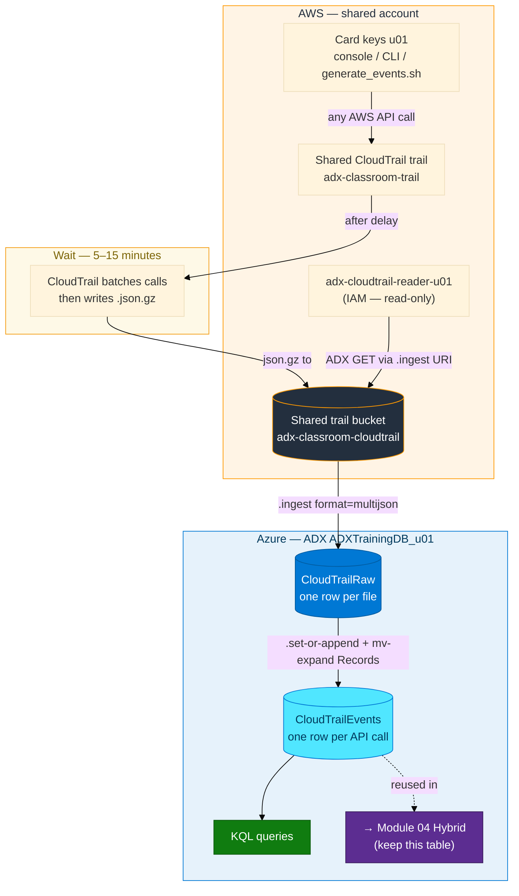
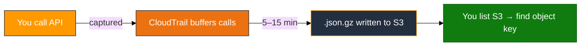
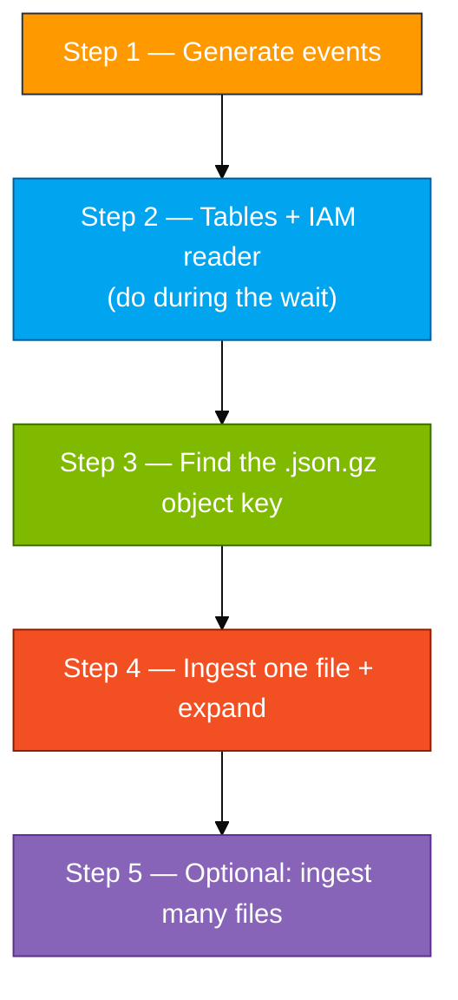
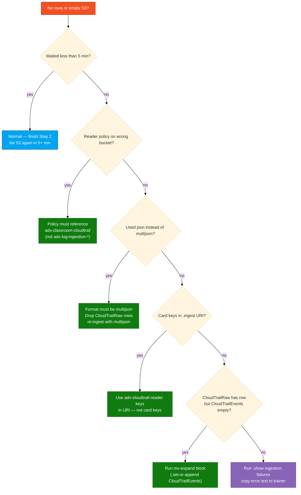

# Module 02 — Lab (CloudTrail to ADX)

**Reading order:** `02_CloudTrail_Primer.md` → `02_CloudTrail_to_ADX_Concepts.md` → **this Lab** → `02_Exercises.md`.

**Database:** `ADXTrainingDB_<your-login>` (example: `ADXTrainingDB_u01`).

**KQL files:** `assets/module_02/`.

---

## 1. What this lab is about (plain English)

In Module 01 you wrote a file yourself and uploaded it to S3. In Module 02 **AWS writes the file for you**.

Every API call in the AWS account is recorded by a **CloudTrail trail**. The trail is shared — the trainer set it up and pointed it at a shared S3 bucket called `adx-classroom-cloudtrail`. You cannot create or delete this trail; you only consume its output.

When you do any AWS action — create a bucket, list regions, call `sts:GetCallerIdentity` — CloudTrail captures it and, after a 5–15 minute delay, drops a `.json.gz` file into the shared bucket under your account ID prefix.

Your job in this lab:

1. Generate **recognizable** API activity so you can find your calls later.
2. While waiting for the file to appear, create tables and an IAM reader for the **shared trail bucket**.
3. Find the `.json.gz` object key, ingest it into ADX, and **expand** it so each API call becomes its own row.
4. Query to confirm your activity is there.

**The key new concept:** a CloudTrail file is a JSON wrapper — one file, one JSON document, with a `Records` array inside. ADX ingests the wrapper as one raw row, then you use `mv-expand` to turn the array into many rows — one row per API call.

**Keep `CloudTrailEvents`:** Module 04 (Hybrid Logs) reuses it. Do not drop it after this lab.

---

## 2. How data travels (source → destination)



---

## 3. Names and two key pairs

**Resource names** (use your login from the access card: `u01` … `u06`. Do not invent initials.)

| Resource | Pattern | Example for `u01` |
|----------|---------|-------------------|
| ADX database | `ADXTrainingDB_<login>` | `ADXTrainingDB_u01` |
| Shared trail name | `adx-classroom-trail` | same — do not create or delete |
| Shared trail bucket | `adx-classroom-cloudtrail` | same — do not create or delete |
| IAM reader user | `adx-cloudtrail-reader-<login>` | `adx-cloudtrail-reader-u01` |
| Temp bucket from the script | `adx-ct-activity-<login>` | `adx-ct-activity-u01` (created and deleted by script) |
| Temp IAM user from the script | `ct-lab-user-<login>` | `ct-lab-user-u01` (created and deleted by script) |

**Two key pairs — critical rule:**

| Keys | Where they go | What they are NOT for |
|------|---------------|-----------------------|
| Access card (`u01`…`u06`) | AWS console login · `aws configure` · running `generate_events.sh` | Never paste into the ADX `.ingest` URI |
| Reader (`adx-cloudtrail-reader-<login>`) | The `.ingest` URI only — so ADX can download from `adx-classroom-cloudtrail` | Never run `aws configure` with these |

> The reader's policy must point at **`adx-classroom-cloudtrail`** — the shared trail bucket — not at `adx-log-ingestion-*` from Module 01. This is a common mistake.

---

## 4. How long does CloudTrail delivery take?

CloudTrail does not write a file the instant you make an API call. It batches calls and writes files roughly every **5–15 minutes** (sometimes longer for low-activity periods).

**This is normal production behavior.** Do not panic when S3 is empty two minutes after running the script. Use the wait time productively to complete Step 2 (tables and IAM).



**Recommended sequence:**

1. Run Step 1 (generate events) → starts the clock.
2. Do Step 2 (tables + IAM) during the wait.
3. Do Step 3 (find the object) once delivery has happened.

---

## 5. Lab steps overview



**AWS console:** https://410232017221.signin.aws.amazon.com/console

**AWS region:** `us-east-1`

---

## Step 1 — Generate events

### Goal

Produce identifiable API activity in the shared CloudTrail trail so you can find your calls after expand.

### Why generate recognizable activity?

The trail bucket is **shared** — every student in the class writes to the same bucket. After expand you filter with `UserArn contains "u01"` (your login) to see only your events. If you made no API calls, your filter returns nothing.

The script creates and immediately deletes resources so it leaves no lasting impact. It is not injecting fake CloudTrail JSON; it is performing real API calls that CloudTrail records naturally.

### What the script does

`assets/module_02/generate_events.sh` performs these actions with your card keys (via `aws configure`):

1. Creates temp bucket `adx-ct-activity-<login>` in `us-east-1`
2. Uploads a tiny object, then deletes the bucket
3. Creates temp IAM user `ct-lab-user-<login>`, adds a tag, then deletes the user
4. Runs `aws sts get-caller-identity`, `aws s3 ls`, and a few describe calls

All produce CloudTrail events that end up in the shared trail.

### Do this exactly

In the lab VS Code terminal (Linux bash, not PowerShell), from the repo root:

```bash
cd ~/adx-aws-training
# Confirm your card keys are active
aws sts get-caller-identity
```

Expected: JSON with your ARN (`arn:aws:iam::410232017221:user/u01` etc.).

```bash
export MSYS_NO_PATHCONV=1
bash assets/module_02/generate_events.sh us-east-1 <your-login>
```

**Example for `u01`:**

```bash
bash assets/module_02/generate_events.sh us-east-1 u01
```

The script prints each AWS CLI call as it runs. It finishes in under a minute. After the last line, the 5–15 minute CloudTrail clock starts.

**Prefer real activity instead?** Skip the script and do any real console or CLI work — create and delete a test bucket, run `aws ec2 describe-instances`, and so on. The only requirement is that you make enough calls to produce a non-empty `.json.gz` file.

### Checkpoint

Script finishes without `AccessDenied` errors. You do **not** need to find an S3 object yet — that happens in Step 3.

### If something is wrong

| Symptom | Fix |
|---------|-----|
| `AccessDenied` on bucket create | Card keys not configured — run `aws configure` with your `u01`/`u0x` keys |
| Script fails on IAM user create | Your login is being used in a name that doesn't match the allowed pattern — check that you passed the right login |
| Script not found | Run from the repo root: `cd ~/adx-aws-training` |
| Script takes very long | Normal — the `sleep` between creates is intentional; let it finish |

---

## Step 2 — Create tables and the IAM reader

### Goal

`CloudTrailRaw` holds the file wrapper (one row per `.json.gz` file). `CloudTrailEvents` will hold one row per API call after expand. A dedicated IAM reader can read from the **shared trail bucket** `adx-classroom-cloudtrail`.

Do this step while waiting for the 5–15 minute CloudTrail delivery — do not sit idle.

### Why two tables?

CloudTrail writes a single JSON document structured as:

```json
{ "Records": [ {api_call_1}, {api_call_2}, ... ] }
```

ADX ingests this as **one raw row** (the entire `Records` array in a `dynamic` column). Then a separate `.set-or-append` command uses `mv-expand` to explode each element into its own row in `CloudTrailEvents`.

If you tried to skip `CloudTrailRaw` and ingest directly to a flat table, the `Records` wrapper would confuse the parser. The two-table pattern is the standard CloudTrail ingest approach.

### 2a. Create tables in ADX

1. In [https://portal.azure.com](https://portal.azure.com), go to cluster `adxtrainaug26` → **Query**.
2. Database dropdown → `ADXTrainingDB_<your-login>`.
3. Confirm the database:

```kusto
print Database = current_database()
```

Must return `ADXTrainingDB_<your-login>`. If not, fix the dropdown.

4. Copy all of `assets/module_02/create_tables.kql` into the query pane and **Run**.

This creates:
- `CloudTrailRaw` — one column `Records: dynamic`
- `CloudTrailRaw` ingestion mapping `CT_Raw_Mapping` — maps `$.Records` to the `Records` column
- `CloudTrailEvents` — 14 typed columns: `EventTime`, `EventName`, `EventSource`, `AwsRegion`, `SourceIP`, `UserAgent`, `UserIdentityType`, `UserArn`, `AccountId`, `ReadOnly`, `ErrorCode`, `RequestParameters`, `ResponseElements`, `RawRecord`

If tables already exist from a rehearsal run:

```kusto
.drop table CloudTrailRaw ifexists
.drop table CloudTrailEvents ifexists
```

Then re-run `create_tables.kql`.

5. Verify:

```kusto
.show tables
| where TableName in ("CloudTrailRaw", "CloudTrailEvents")
```

### 2b. Create the IAM reader for the shared trail bucket

The reader must access **`adx-classroom-cloudtrail`** — not your Module 01 bucket.

1. AWS console → **IAM** → **Users** → **Create user**.
2. **User name:** `adx-cloudtrail-reader-<your-login>` (example: `adx-cloudtrail-reader-u01`).
3. No console access, no managed policies → **Create user**.
4. Click the new user → **Permissions** → **Add permissions** → **Create inline policy** → **JSON** tab.
5. Open `assets/iam/s3-reader-policy.json`, paste it into the JSON editor.
6. Replace **every occurrence** of `BUCKET_NAME` with **`adx-classroom-cloudtrail`** (not your Module 01 bucket name).
7. Verify the policy contains `s3:GetBucketLocation` — without it ADX often fails with `Download_Forbidden`.
8. **Policy name:** `LabS3Read` → **Create policy**.
9. Back in the user → **Security credentials** → **Create access key** → use case **Command Line Interface (CLI)** → **Create access key**.
10. Copy Access key ID and Secret access key to a personal text note.

Save the keys to an env file for the prefix ingest script:

```bash
mkdir -p ~/adx-lab-m02
cat > ~/adx-lab-m02/reader.env <<'EOF'
READER_ACCESS_KEY_ID=PASTE_READER_ACCESS_KEY_ID
READER_SECRET_ACCESS_KEY=PASTE_READER_SECRET
EOF
chmod 600 ~/adx-lab-m02/reader.env
```

### Checkpoint

```kusto
.show tables
| where TableName in ("CloudTrailRaw", "CloudTrailEvents")
```

Both tables appear.

```bash
aws iam get-user --user-name adx-cloudtrail-reader-<your-login>
aws iam list-user-policies --user-name adx-cloudtrail-reader-<your-login>
```

Reader exists with `LabS3Read`.

### If something is wrong

| Symptom | Fix |
|---------|-----|
| Tables already exist | Drop them with `ifexists`, re-run `create_tables.kql` |
| Reader policy still shows `BUCKET_NAME` | Edit the inline policy — replace both occurrences with `adx-classroom-cloudtrail` |
| Policy points at `adx-log-ingestion-*` | Wrong bucket — this reader must access the shared trail bucket, not your Module 01 bucket |
| Wrong ADX database | Fix dropdown, run `print Database` |

---

## Step 3 — Find the `.json.gz` object key

### Goal

Get the full S3 object key (including the `AWSLogs/...` prefix path) so you can build the `.ingest` URI.

### Why you need the full key

ADX's `.ingest` command takes an HTTPS URI with the object key as a path component:

```text
https://adx-classroom-cloudtrail.s3.us-east-1.amazonaws.com/AWSLogs/410232017221/CloudTrail/us-east-1/2026/08/28/<filename>.json.gz
```

You cannot use a wildcard in the URI (the cluster does not support `s3://bucket/prefix/*` for single-URI ingest). You must name the key exactly.

### Do this exactly

From the lab terminal (card keys active):

```bash
REGION=us-east-1
ACCOUNT=$(aws sts get-caller-identity --query Account --output text)
echo "Account: $ACCOUNT"
aws s3 ls "s3://adx-classroom-cloudtrail/AWSLogs/${ACCOUNT}/CloudTrail/${REGION}/" --recursive | sort | tail -n 20
```

**Example for `u01` (account 410232017221):**

```bash
REGION=us-east-1
ACCOUNT=410232017221
aws s3 ls "s3://adx-classroom-cloudtrail/AWSLogs/${ACCOUNT}/CloudTrail/${REGION}/" --recursive | sort | tail -n 20
```

You should see lines like:

```
2026-08-28 14:37:22   3456  AWSLogs/410232017221/CloudTrail/us-east-1/2026/08/28/410232017221_CloudTrail_us-east-1_20260828T1435Z_aBcDeFgH.json.gz
```

Copy the **full key** (starting with `AWSLogs/…`).

**If the list is empty:** CloudTrail delivery has not happened yet — wait and re-run the same command. Check two minutes later, then five, then ten. The wait is normal.

### How to identify your file

After expand you filter `UserArn contains "u01"` to find your calls. But for ingest, you can use **any** recent file — the trail is shared, so any file from your time window will contain a mix of student events. You find yours after expand with the filter.

If you want to be sure a file contains your events, pick a file whose timestamp is **after** your `generate_events.sh` run.

### Checkpoint

You have a string that looks like:

```
AWSLogs/410232017221/CloudTrail/us-east-1/2026/08/28/410232017221_CloudTrail_us-east-1_20260828T1435Z_XXXXXXXX.json.gz
```

### If something is wrong

| Symptom | Fix |
|---------|-----|
| `aws s3 ls` returns empty | Wait longer — check again in 5 minutes |
| `AccessDenied` on `aws s3 ls` | Card keys are wrong or not configured — `aws configure` with card keys |
| `ACCOUNT` variable is empty | Run `aws sts get-caller-identity` first — if it fails, fix `aws configure` |
| No file with today's date | Check yesterday's date path; trail may have buffered events across midnight |

---

## Step 4 — Ingest one file and expand

### Goal

One `.json.gz` → one raw row in `CloudTrailRaw` → many rows in `CloudTrailEvents` (one row per API call).

### Why `multijson` and not `json`?

A CloudTrail file is structured as:

```json
{ "Records": [ {...}, {...}, {...} ] }
```

`format=json` expects one JSON document per line (NDJSON) — it would read the whole file as one line. `format=multijson` handles pretty-printed multi-line JSON documents separated by `}` / `{` boundaries, which matches the CloudTrail wrapper. Using plain `json` leaves you with one unusable raw row and empty analytics fields.

### What happens to the data

```text
adx-classroom-cloudtrail / AWSLogs/.../filename.json.gz
        │
        │  .ingest format=multijson
        ▼
CloudTrailRaw   (one row — Records column is a dynamic array)
        │
        │  .set-or-append + mv-expand Record = Records
        ▼
CloudTrailEvents   (one row per API call — 14 typed columns)
```

### Do this exactly

1. Open `assets/module_02/ingest_and_expand.kql`.
2. Make these substitutions:
   - `<bucket>` → `adx-classroom-cloudtrail`
   - `<region>` → `us-east-1`
   - `<object-key>` → the full key you found in Step 3 (example: `AWSLogs/410232017221/CloudTrail/us-east-1/2026/08/28/410232017221_CloudTrail_us-east-1_20260828T1435Z_XXXXXXXX.json.gz`)
   - Both key placeholders → your **reader** (`adx-cloudtrail-reader-<login>`) Access key ID and Secret

The `.ingest` line for `u01` looks like:

```kusto
.ingest into table CloudTrailRaw
h@"https://adx-classroom-cloudtrail.s3.us-east-1.amazonaws.com/AWSLogs/410232017221/CloudTrail/us-east-1/2026/08/28/410232017221_CloudTrail_us-east-1_20260828T1435Z_XXXXXXXX.json.gz;AwsCredentials=<READER_ACCESS_KEY_ID>,<READER_SECRET>"
with (format="multijson", ingestionMappingReference="CT_Raw_Mapping")
```

3. Run **only** the `.ingest` block first.
4. Verify the raw row landed:

```kusto
CloudTrailRaw | take 1
```

You should see one row with a `Records` column that is a large dynamic array.

5. Now run the `.set-or-append` block (the `mv-expand` query):

```kusto
.set-or-append CloudTrailEvents <|
CloudTrailRaw
| mv-expand Record = Records
| project
    EventTime = todatetime(Record.eventTime),
    EventName = tostring(Record.eventName),
    EventSource = tostring(Record.eventSource),
    AwsRegion = tostring(Record.awsRegion),
    SourceIP = tostring(Record.sourceIPAddress),
    UserAgent = tostring(Record.userAgent),
    UserIdentityType = tostring(Record.userIdentity.type),
    UserArn = tostring(Record.userIdentity.arn),
    AccountId = tostring(Record.userIdentity.accountId),
    ReadOnly = tobool(Record.readOnly),
    ErrorCode = tostring(Record.errorCode),
    RequestParameters = Record.requestParameters,
    ResponseElements = Record.responseElements,
    RawRecord = Record
```

6. Run `assets/module_02/validate.kql`:

```kusto
CloudTrailEvents | count
CloudTrailEvents | take 10
CloudTrailEvents | summarize EventCount = count() by EventSource
```

7. Find your own events:

```kusto
CloudTrailEvents
| where UserArn contains "<your-login>"
| project EventTime, EventName, EventSource, ErrorCode
| sort by EventTime desc
```

**Example for `u01`:**

```kusto
CloudTrailEvents
| where UserArn contains "u01"
| project EventTime, EventName, EventSource, ErrorCode
| sort by EventTime desc
```

### Checkpoint

- `CloudTrailRaw | count` ≥ 1
- `CloudTrailEvents | count` > 0 (many rows — one per API call, not one per file)
- `summarize by EventSource` shows services like `s3.amazonaws.com`, `iam.amazonaws.com`, `sts.amazonaws.com`
- Your `UserArn contains "u01"` filter returns events from your script run

### If something is wrong



---

## Step 5 — Optional: ingest many files without naming each key

### Goal

Ingest several trail objects in **one** operation without copying individual S3 keys — useful when you want a fuller event history in `CloudTrailEvents`.

### Why this is optional

The core lab skill (understand the multijson format, do the expand) is complete after Step 4. Step 5 is a productivity shortcut for getting more data.

### Why ADX on this cluster does not support wildcards

ADX `.ingest` on this shared cluster does not allow `s3://bucket/prefix/*` wildcard URIs. The unified script works around this by listing objects under your prefix and generating a multi-URI `.ingest` command.

### Do this exactly

#### Option A — Unified script (recommended)

```bash
bash assets/ingest_s3_to_adx.sh --module m02 --login <your-login> --region us-east-1 --max 5 --run
```

**Example for `u01`:**

```bash
bash assets/ingest_s3_to_adx.sh --module m02 --login u01 --region us-east-1 --max 5 --run
```

- `--max 5` ingests the 5 most recent files under your account prefix.
- `--run` requires `az login` on the host. Without it, open the generated file instead:

```bash
cat ~/adx-lab-s3/m02/ingest_generated.kql
```

Paste the contents into the ADX query pane and run.

Use `--max 1` if you only want the newest file.

Generated outputs:
- `~/adx-lab-s3/m02/ingest_generated.kql` — the multi-URI `.ingest` plus the expand to `CloudTrailEvents`
- `~/adx-lab-s3/m02/ingest_keys.txt` — the S3 object keys included

#### Option B — Manual: paste three keys yourself

Open `assets/module_02/ingest_many_files.kql`, replace the three placeholder keys with real object keys from Step 3's `aws s3 ls` output, and run.

#### Legacy wrapper

`assets/module_02/ingest_s3_prefix.sh` — the same functionality as the unified script; both produce the same output.

### Checkpoint

```kusto
CloudTrailRaw | count       // matches the number of files you ingested
CloudTrailEvents | count    // many rows — proportional to how many API calls were in those files
```

### If something is wrong

| Symptom | Fix |
|---------|-----|
| Script says `az login required` | Either run `az login` or use the generated `.kql` file in the ADX Web UI |
| Generated KQL is empty | `aws s3 ls` found no objects — wait for delivery, then re-run the script |
| `CloudTrailEvents` has duplicate rows | You ran `.set-or-append` multiple times on the same raw rows; for the lab this is acceptable; to reset: `.drop table CloudTrailEvents ifexists` → re-run `create_tables.kql` → re-run Step 4 |

---

## You're done with the core lab when

- `CloudTrailRaw | count` ≥ 1
- `CloudTrailEvents | count` > 0 (many rows, not one)
- `CloudTrailEvents | summarize by EventSource` shows recognizable AWS services
- `UserArn contains "u01"` (your login) returns your events
- You can explain: trail → S3 → raw row → `mv-expand` → one row per API call
- You have **not** dropped `CloudTrailEvents` — Module 04 needs it

---

## Quick failure guide

| Problem | Likely cause | Fix |
|---------|--------------|-----|
| S3 empty after Step 1 | Trail delivery not yet complete | Wait 5–15 min, re-run `aws s3 ls` |
| `AccessDenied` on `aws s3 ls` | Card keys wrong | `aws configure` with your card keys |
| `Download_Forbidden` in ingest | Reader policy on wrong bucket or missing `GetBucketLocation` | Fix policy to reference `adx-classroom-cloudtrail` and include `GetBucketLocation` |
| `CloudTrailRaw` has 1 row but `CloudTrailEvents` is empty | Skipped the `mv-expand` step | Run the `.set-or-append CloudTrailEvents` block from `ingest_and_expand.kql` |
| Only 1 row in `CloudTrailEvents` | Used `format=json` instead of `multijson` | Drop raw rows, re-ingest with `format=multijson` |
| No events for my user | Your `generate_events.sh` ran before the ingested file's time range | Ingest a more recent file (Step 3 → re-list S3) |
| Wrong ADX database | Dropdown on classmate's DB | Fix dropdown, `print Database` to confirm |
| Card keys in `.ingest` URI | Common confusion | Reader keys in URI; card keys only for `aws configure` and CLI |
