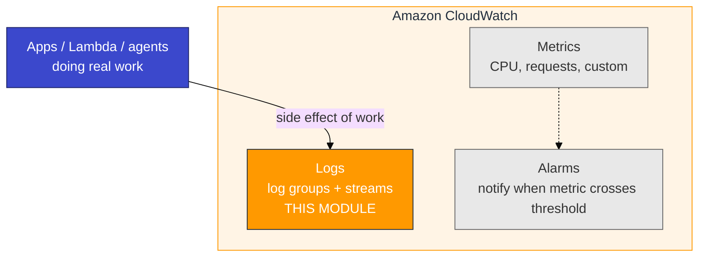
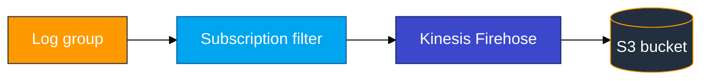

# Module 03 — CloudWatch primer (AWS basics)

Read this **before** `03_CloudWatch_to_ADX_Concepts.md`.

## What CloudWatch is (in one sentence)

**Amazon CloudWatch** is the built-in AWS observability service. Every AWS compute resource — Lambda functions, EC2 instances, ECS containers, API Gateways — sends its logs and metrics to CloudWatch automatically (or with minimal configuration). You do not install a log agent or manage log files on a host to get started; the runtime does it for you.

This module uses the **Logs** side of CloudWatch. You will read about Metrics and Alarms because they appear in the console, but you will not configure them in this lab.

## CloudWatch family — three main pieces



This module exports **Logs** via **subscription filter + Firehose → S3**, then ADX `.ingest`.

## Where log lines come from (real projects)

In production, nobody runs a “generate CloudWatch logs” script. Log groups fill because **services are handling traffic**:

| Source | What you do | What CloudWatch sees |
|--------|-------------|----------------------|
| **HTTP / microservice** | Start the API; `curl` or browser hits endpoints | JSON lines from the app logger |
| **AWS Lambda** | Deploy function; **Test** / invoke | Automatic `/aws/lambda/<name>` streams |
| **CloudWatch agent** | Host runs; agent ships files | `/var/log/...` (Modules 05–06) |
| **Ops one-off** | Console **Create log event** | Rare debug / incident marker |

**Class tip:** Build the Firehose pipeline once, then **use a service** (Lab Step 3 Path A or B). A smoke script is only for plumbing checks.

## Logs vocabulary

The AWS console and the CLI use these terms constantly. Learn them now so step instructions make sense at a glance.

| Term | Plain meaning |
|------|---------------|
| **Log group** | A named container for related log streams. Name starts with `/`, example `/adx-training/app-logs-u01`. You create one per application or service. |
| **Log stream** | A sequence of events within a log group — typically one per host instance or Lambda function. Example: `Instance_01_u01`. |
| **Log event** | One line in a stream: a Unix timestamp plus a message string. The message is usually JSON in modern applications. |
| **Retention** | How long CloudWatch keeps log events before deleting them automatically. Lab default: 1 day (saves cost). |
| **Subscription filter** | A rule attached to a log group that forwards matching new events to an external destination (Firehose, Lambda, or another account). The tap — events before the filter existed are not sent retroactively. In this course the destination is the Firehose stream `cw-to-adx-stream-<login>`, not the S3 bucket name. |
| **Firehose** | Amazon Data Firehose — a managed delivery stream that accepts events from CloudWatch subscriptions and writes batched objects to S3 (or other targets). Handles buffering, retries, and decompression. Give it its own name (`cw-to-adx-stream-<login>`); do not name it after the destination bucket. |

## Log group → S3 path (overview)



**Critical order:** create subscription filter **before** the traffic you need in S3. Old events are not shipped retroactively. The first tiny object in S3 after creating the filter is often a `CONTROL_MESSAGE` health check — real app events show up as `DATA_MESSAGE` only after you use the API or Lambda.

## Hands-on (console)

1. **CloudWatch** → **Log groups** → open your group (app group or `/aws/lambda/...`).
2. Open a **log stream** → confirm lines from **API/Lambda use**, not only a smoke script.
3. **Subscription filters** → destination must be Firehose stream `cw-to-adx-stream-<login>` (not the bucket name).
4. **Firehose** → **Active** + **Decompress CloudWatch Logs** on.
5. **S3** → `adx-cw-firehose-<login>` → recent object → confirm `DATA_MESSAGE`, not only `CONTROL_MESSAGE`.

### Optional: CloudWatch Logs Insights

```sql
fields @timestamp, @message
| filter @message like /ERROR|order\.created/
| sort @timestamp desc
| limit 20
```

**Checkpoint:** You can explain who wrote the line (checkout API request vs Lambda invoke).

## Firehose settings (lab)

| Setting | Lab value | Why |
|---------|-----------|-----|
| Decompress CloudWatch Logs | **On** | Readable JSON envelope |
| S3 compression | **UNCOMPRESSED** | Simpler first ingest |
| Buffer | ~1 MiB / 60 s | Wait after traffic before listing S3 |

## Git Bash trap

```bash
export MSYS_NO_PATHCONV=1
```

## Common mistakes

| Mistake | Result |
|---------|--------|
| Traffic before subscription filter | Empty S3 — use the API/Lambda again after the filter exists |
| Only run a smoke `put_log_events` script | Plumbing works; you missed the real-service learning goal |
| Decompress off | S3 objects ADX cannot map cleanly |
| Wrong reader bucket | Ingest fails |
| Skip `MSYS_NO_PATHCONV` | Wrong log group path on Windows |
