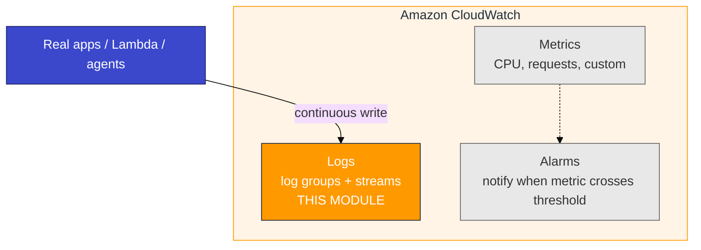
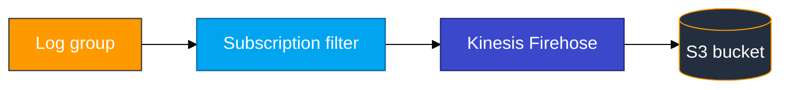

# Module 03 — CloudWatch primer (AWS basics)

Read this **before** `03_CloudWatch_to_ADX_Concepts.md`.

## CloudWatch family

**Amazon CloudWatch** is AWS observability. Three main pieces:



This module uses **Logs** exported to S3 via **subscription filter + Firehose**, then ADX `.ingest`.

## Where log lines come from (real projects)

In production, CloudWatch Log groups fill because **work is happening**, not because someone ran a one-off script:

| Source | Typical log group / stream | What you learn in this lab |
|--------|----------------------------|----------------------------|
| **Application / microservice** | Custom group, e.g. `/aws/app/checkout` | JSON lines with `level`, `event`, `orderId`, `latencyMs` — same idea as `app_traffic_simulator.sh` |
| **Lambda** | `/aws/lambda/<function-name>` (automatic) | Every invoke appends streams; filter can point Firehose here |
| **CloudWatch agent** | Often `/var/log/...` mapped groups | Host syslog, nginx — Module 05–06 style |
| **Support / ops** | Same app group | Console **Create log event** for a rare debug line |

**Class tip:** Build the export pipeline once, then **prefer realistic application-shaped traffic** so ADX queries feel like an ops dashboard. Use `put_log_events.sh` only to smoke-test that S3 received *something*.

Detail and commands for generating traffic: **Lab Step 3** (Paths A–C).

## Logs vocabulary

| Term | Meaning |
|------|---------|
| **Log group** | Container, name starts with `/`, example `/adx-training/app-logs-u01` |
| **Log stream** | Sequence of events within a group, often one instance |
| **Log event** | One line: timestamp + message |
| **Retention** | How long CloudWatch keeps logs (lab: 1 day) |
| **Subscription filter** | Forward matching log events to a destination |
| **Firehose** | Managed delivery stream to S3 (and other targets) |

## Log group → S3 path (overview)



**Critical order:** create subscription filter **before** sending log events you need in S3. Old events are not shipped retroactively.

## Hands-on (console)

After your lab resources exist (or follow along on trainer demo):

1. **CloudWatch** → **Log groups** → open `/adx-training/app-logs-<login>`.
2. Open a **log stream** → see event **message** and **timestamp** (look for `order.created`, `auth.login.failed`, etc. after the app simulator).
3. **Subscription filters** tab → confirm filter points to your Firehose.
4. **Kinesis** → **Data Firehose** → open stream → verify **Active** and **Decompress CloudWatch Logs** enabled.
5. **S3** → your `adx-cw-firehose-<login>` bucket → find a recent object.

### Optional: CloudWatch Logs Insights

In the log group → **Logs Insights**:

```sql
fields @timestamp, @message
| filter @message like /ERROR|order\.created/
| sort @timestamp desc
| limit 20
```

Run query. Same lines will eventually appear in S3/Firehose (after buffer flush).

**Checkpoint:** You can draw log group → stream → event without looking at notes — and explain **who** wrote the line (app vs probe script).

## Firehose settings (lab)

| Setting | Lab value | Why |
|---------|-----------|-----|
| Decompress CloudWatch Logs | **On** | ADX needs readable JSON envelope |
| S3 compression | **UNCOMPRESSED** | Simpler first ingest |
| Buffer | ~1 MiB / 60 s | Wait after traffic before listing S3 |

## Git Bash trap

Log group names start with `/`. Git Bash rewrites paths unless you run:

```bash
export MSYS_NO_PATHCONV=1
```

## Common mistakes

| Mistake | Result |
|---------|--------|
| Put events before subscription filter | Empty S3 — send traffic again after filter exists |
| Only run the 3-line probe script | Pipeline works, but ADX practice feels “fake” — also run the app simulator |
| Decompress off | Objects in S3 but ADX mapping sees garbage |
| Wrong reader bucket | Ingest fails — reader must match Firehose bucket |
| Skip `MSYS_NO_PATHCONV` | `aws logs` targets wrong path on Windows |
