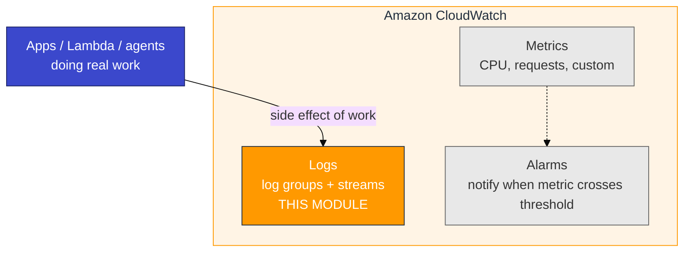
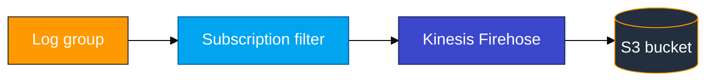

# Module 03 — CloudWatch primer (AWS basics)

Read this **before** `03_CloudWatch_to_ADX_Concepts.md`.

## CloudWatch family

**Amazon CloudWatch** is AWS observability. Three main pieces:



This module exports **Logs** via **subscription filter + Firehose → S3**, then ADX `.ingest`.

## Where log lines come from (real projects)

In production, nobody runs a “generate CloudWatch logs” script. Log groups fill because **services are handling traffic**:

| Source | What you do | What CloudWatch sees |
|--------|-------------|----------------------|
| **HTTP / microservice** | Start the API; `curl` or browser hits endpoints | JSON lines from the app logger |
| **AWS Lambda** | Deploy function; **Test** / invoke | Automatic `/aws/lambda/<name>` streams |
| **CloudWatch agent** | Host runs; agent ships files | `/var/log/...` (Modules 05–06) |
| **Ops one-off** | Console **Create log event** | Rare debug / incident marker |

**Class tip:** Build the Firehose pipeline once, then **use a service** (Lab Step 3 Path A or B). A smoke script is only for plumbing checks.

## Logs vocabulary

| Term | Meaning |
|------|---------|
| **Log group** | Container, name starts with `/`, example `/adx-training/app-logs-u01` |
| **Log stream** | Sequence of events within a group, often one instance |
| **Log event** | One line: timestamp + message |
| **Retention** | How long CloudWatch keeps logs (lab: 1 day) |
| **Subscription filter** | Forward matching log events to a destination |
| **Firehose** | Managed delivery stream to S3 (and other targets) |

## Log group → S3 path (overview)



**Critical order:** create subscription filter **before** the traffic you need in S3. Old events are not shipped retroactively.

## Hands-on (console)

1. **CloudWatch** → **Log groups** → open your group (app group or `/aws/lambda/...`).
2. Open a **log stream** → confirm lines from **API/Lambda use**, not only a smoke script.
3. **Subscription filters** → Firehose destination.
4. **Firehose** → **Active** + **Decompress CloudWatch Logs** on.
5. **S3** → `adx-cw-firehose-<login>` → recent object.

### Optional: CloudWatch Logs Insights

```sql
fields @timestamp, @message
| filter @message like /ERROR|order\.created/
| sort @timestamp desc
| limit 20
```

**Checkpoint:** You can explain who wrote the line (checkout API request vs Lambda invoke).

## Firehose settings (lab)

| Setting | Lab value | Why |
|---------|-----------|-----|
| Decompress CloudWatch Logs | **On** | Readable JSON envelope |
| S3 compression | **UNCOMPRESSED** | Simpler first ingest |
| Buffer | ~1 MiB / 60 s | Wait after traffic before listing S3 |

## Git Bash trap

```bash
export MSYS_NO_PATHCONV=1
```

## Common mistakes

| Mistake | Result |
|---------|--------|
| Traffic before subscription filter | Empty S3 — use the API/Lambda again after the filter exists |
| Only run a smoke `put_log_events` script | Plumbing works; you missed the real-service learning goal |
| Decompress off | S3 objects ADX cannot map cleanly |
| Wrong reader bucket | Ingest fails |
| Skip `MSYS_NO_PATHCONV` | Wrong log group path on Windows |
