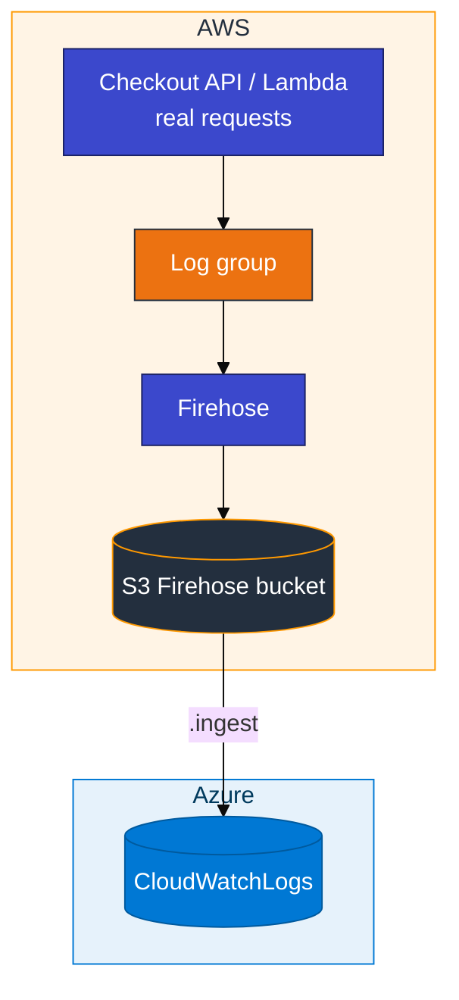
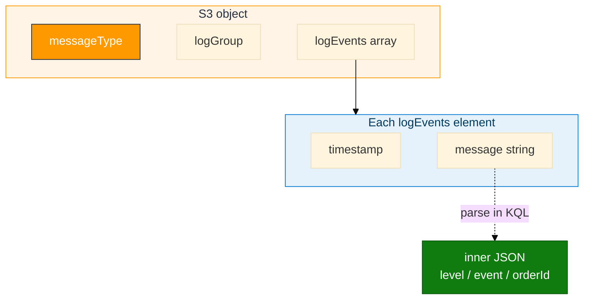

# Module 03 — CloudWatch to ADX

> **Reading order:** `03_CloudWatch_Primer.md` → Concepts (this file) → Lab → Exercises.

## What this module is trying to solve

Module 02 moved **CloudTrail management events** into ADX.  
Module 03 moves **CloudWatch Logs** (application / service log lines) into ADX.

ADX still does **not** call the CloudWatch API directly. The classroom path is:

**Log group → subscription filter → Firehose → S3 → ADX `.ingest`**

---

## The most important teaching rule

In real projects, CloudWatch fills because **something actually ran** — an API handled a request, a Lambda was invoked, a host wrote logs.

So in this lab you must **use a service**:

- **Path A (preferred):** start the small checkout API, then call it with `curl`
- **Path B:** create a Lambda and use the **Test** button to invoke it

A script whose only job is to invent log lines (`put_log_events.sh`) is **smoke / plumbing only**. It is not the learning goal.

---

## Plain-English pipeline

1. Create a **log group** and stream (where log events land).
2. Create an S3 bucket for Firehose output.
3. Create a **Firehose** stream that writes to that bucket.
   - Turn **on** “decompress CloudWatch Logs”
   - Keep destination compression **UNCOMPRESSED** for the first pass
4. Attach a **subscription filter** from the log group to Firehose.
5. **Only then** run the checkout API / invoke Lambda so new events flow.
6. Wait about **60–90 seconds**, list S3, then `.ingest` into ADX.

Events written **before** the subscription filter exists are **not** shipped later. Order matters.

Build-order details: **`03_CloudWatch_Primer.md`**. Produce data: **Lab Step 3 Path A or B**.

---

## How data moves

---

## What the S3 object looks like (the “envelope”)

Firehose does not store your application JSON alone. It stores a **CloudWatch Logs subscription envelope**. Inside that envelope is a `logEvents` array. Each element has a `message` field. Your application JSON is often **inside** that `message` string.

Practical tips:

- Prefer rows where `messageType == "DATA_MESSAGE"`
- Parse `message` in KQL when you need application fields (`order.created`, auth events, …)
- Keep table `CloudWatchLogs` for Module 04 Hybrid

---

## In class

- Database `ADXTrainingDB_<your-login>`
- Reader IAM on **your** Firehose bucket `adx-cw-firehose-<login>` (not the CloudTrail bucket, not Module 01 bucket)
- Git Bash: `export MSYS_NO_PATHCONV=1` before `aws logs` commands
- Card keys run the API / AWS console; reader keys go only in the `.ingest` URI
