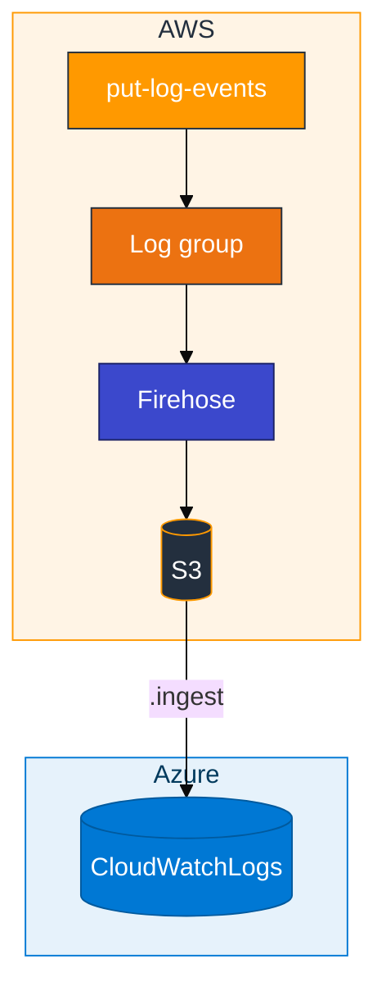
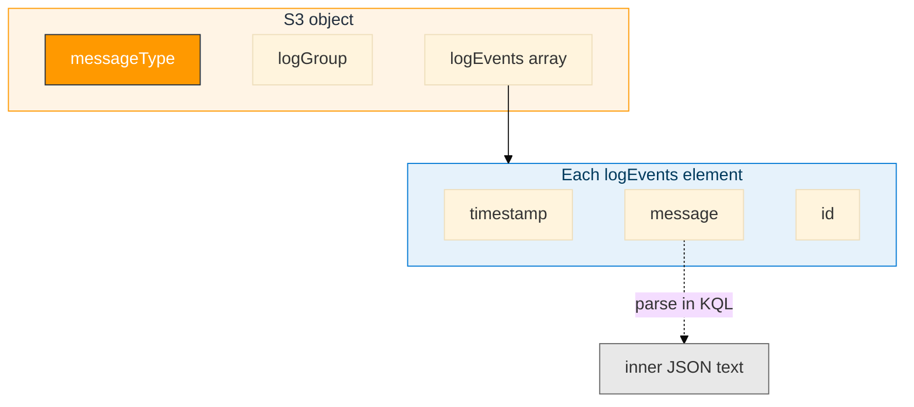

# Module 03 — CloudWatch to ADX

> **Reading order:** `03_CloudWatch_Primer.md` → Concepts (this file) → Lab → Exercises.

CloudWatch **Logs** reach ADX through subscription filter → Firehose → S3 → `.ingest`. ADX never calls the CloudWatch API.

You build one log group, one Firehose stream, and one bucket per student. Firehose writes an **envelope** object — ingest that envelope, not only the inner `message` string.

## How data moves

Build order and Firehose toggles: **`03_CloudWatch_Primer.md`**.

**Real vs scripted log lines:** **`assets/REAL_VS_LAB_DATA.md`** (production apps vs `put_log_events.sh`).

## Envelope shape (mapping target)

- Filter ingest/query to `messageType == "DATA_MESSAGE"`
- Mapping binds envelope fields; parse `message` in KQL if needed
- Leave table `CloudWatchLogs` for Module 04

## In class

- Database `ADXTrainingDB_<your-login>`; reader IAM on **your** Firehose bucket
- Git Bash: `export MSYS_NO_PATHCONV=1` before `aws logs`
