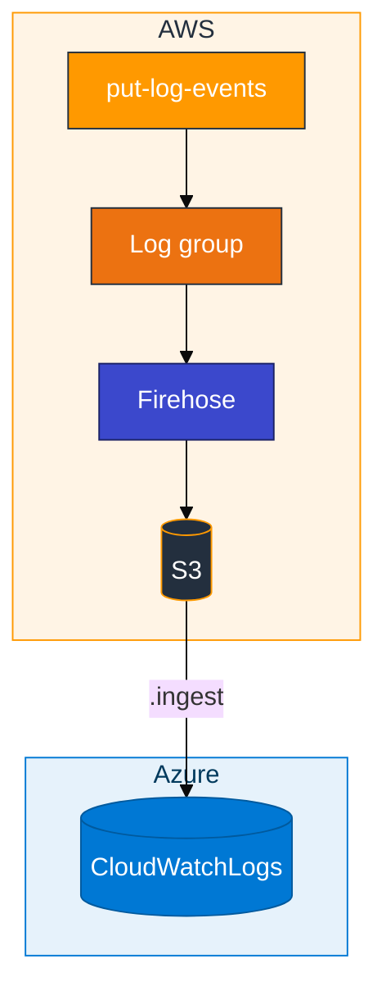

# Module 03 — CloudWatch to ADX

Application lines often live in **CloudWatch Logs**. This course does not call the CloudWatch API from ADX. The path is the one many accounts already use:

1. Subscription filter on the log group
2. Kinesis Data Firehose as the destination
3. Objects in S3
4. Same ADX `.ingest` pull as Modules 01–02

You build this path yourself (one log group, one Firehose, one bucket per student). CloudTrail was shared; here you see every console toggle that can break mapping.

**Example.** You write a few JSON messages into `/adx-training/app-logs-u01`. Security wants them in KQL a minute or two later. Firehose writes an **envelope** object. You ingest that envelope, not only the inner `message` string.

## Firehose settings

CloudWatch subscription records are gzipped and base64-encoded. Firehose can decompress them so ADX can map `$.messageType` and `$.logEvents`.

- **Decompress source records from Amazon CloudWatch Logs:** on. If this is off, S3 files exist but counts look like zero
- **Destination compression:** **UNCOMPRESSED** for the first pass (`multijson` is simpler)
- **Buffer:** about 1 MiB or 60 seconds — wait after `put-log-events` before listing S3

## In class

- Your own log group, Firehose stream, and S3 bucket
- IAM read on **that** bucket
- Database `ADXTrainingDB_<your-login>` (example `ADXTrainingDB_u01`)
- Leave table `CloudWatchLogs` for Module 04 (it reads `logEvents`; it does not call CloudWatch again)

Do not send log events until the subscription filter exists. Lines would stay in the log group and never appear in S3.

On Git Bash, run `export MSYS_NO_PATHCONV=1` before `aws logs`. Names start with `/` and Git Bash otherwise rewrites them as Windows paths.

## How data moves

Each object is an envelope:

- `messageType` — you want `DATA_MESSAGE` (not only control messages)
- `logGroup`, `logStream`
- `logEvents` — `{ timestamp, message, id }`

The mapping targets that envelope, not the JSON you stuffed inside `message`.
