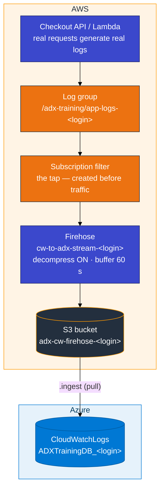
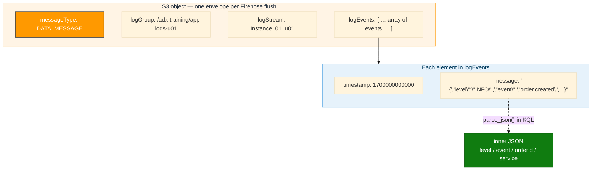

# Module 03 — CloudWatch to ADX: Concepts

> **Reading order:** `03_CloudWatch_Primer.md` → **this file** → `03_CloudWatch_to_ADX_Lab.md` → `03_Exercises.md`.

---

## What this module is trying to solve

Module 02 moved **CloudTrail management events** into ADX — one row per AWS API call. That data tells you who called what service and when, but it says nothing about what your application was doing at the time.

Module 03 moves **CloudWatch Logs** (application and service log lines) into ADX. These are the lines your code writes: "order placed", "login failed", "payment declined." Together with CloudTrail, they let you ask questions across both a control-plane view (IAM, API calls) and an application view (business events, errors).

ADX does **not** call the CloudWatch API directly. The path the classroom uses is:

**Log group → subscription filter → Firehose → S3 → ADX `.ingest`**

---

## The most important teaching rule

In real projects, CloudWatch fills because **something actually ran** — an API handled a request, a Lambda was invoked, an agent shipped a file. Nobody runs a "push fake log lines" script in production.

In this lab you must therefore **use a service**:

- **Path A (preferred):** start the small checkout API and call it with `curl` on `/v1/orders` and `/v1/login`
- **Path B:** create a Lambda and use the **Test** button to invoke it several times

A script whose only job is to invent log lines (`put_log_events.sh`) is labeled **smoke / plumbing only**. It confirms that the subscription filter and Firehose are connected, but the resulting ADX data is synthetic and does not teach the production pattern.

---

## Why each component in the pipeline exists

### Why CloudWatch Logs?

When you run a Python/Node/Java service on EC2, in a container, or as a Lambda, the AWS SDK and the Lambda runtime forward stdout/stderr to CloudWatch automatically (or with minimal configuration). CloudWatch becomes the single collection point for all your services across all regions and accounts. You don't need to SSH into hosts to read log files.

### Why a subscription filter?

CloudWatch stores log events in log groups. A **subscription filter** is the mechanism that says "forward matching events from this log group to an external destination in real time." Without it, CloudWatch just holds the events and offers a query UI. The filter is what turns CloudWatch into a live stream source.

The destination is a **Firehose delivery stream**. Students sometimes pick the S3 bucket name by mistake because both names contain their login — the filter dropdown must show `cw-to-adx-stream-<login>`. The IAM role CloudWatch assumes for that filter needs `firehose:PutRecordBatch` (not only `PutRecord`); otherwise CloudWatch can still show events while S3 never receives application batches.

One important constraint: **events written before the filter existed are not shipped retroactively**. The filter starts forwarding from the moment it is created. This is why the lab builds the entire pipeline (including the filter) before sending any traffic.

### Why Firehose?

CloudWatch subscriptions can push to Firehose or Lambda. Firehose is the right choice here because:

- It handles **batching and buffering** (you configure a size and time threshold)
- It automatically **retries** on transient S3 errors
- It can **decompress** the gzip envelope that CloudWatch wraps around log batches before landing JSON in S3
- It requires no code — you configure it in the console

The key Firehose setting for this lab is **"Decompress source records from Amazon CloudWatch Logs."** CloudWatch sends log events as gzip-compressed JSON envelopes. If you leave decompression off, S3 gets binary objects that ADX cannot map to your table schema.

### Why S3 as the intermediate store?

ADX uses a **pull** model for external data: you call `.ingest` and give ADX the URI of a file plus credentials. There is no standing persistent connection between ADX and CloudWatch. S3 acts as the durable intermediate store — Firehose deposits files there, ADX reads them on demand. This also decouples ingestion timing (Firehose buffer flush) from ADX ingest timing (when you decide to run the command).

---

## Plain-English pipeline (end to end)

1. Create a **log group** `/adx-training/app-logs-<login>` and a stream inside it. This is the address the checkout API writes to.
2. Create an **S3 bucket** `adx-cw-firehose-<login>` — the landing zone for Firehose objects. This name is for storage only.
3. Create a **Firehose** stream `cw-to-adx-stream-<login>` pointing at that bucket.
   - The stream name is **not** the same as the bucket name. Keep both patterns exactly as written here.
   - Turn **on** "Decompress CloudWatch Logs" — mandatory, not optional.
   - Keep the final S3 object compression **UNCOMPRESSED** for the first ingest pass.
   - Buffer: ~1 MiB or 60 seconds — whichever comes first.
4. Attach a **subscription filter** `ADX-Export-Filter-<login>` from the log group to Firehose.
   - Destination = the Firehose stream (`cw-to-adx-stream-<login>`), never the S3 bucket name.
   - Let the console create a fresh IAM role for CloudWatch → Firehose. That role must allow `firehose:PutRecord` and `firehose:PutRecordBatch`. Batch put is what carries real log events; the first tiny S3 object after filter creation is often only a `CONTROL_MESSAGE` health check.
5. **Only then** run the checkout API with `ADX_LOGIN` set to **your** login and call it with `curl` (or invoke Lambda), so new events flow through the filter into Firehose and reach S3.
6. Wait about **60–90 seconds** (Firehose buffer), list S3, peek an object for `DATA_MESSAGE`, then `.ingest` into ADX.

Events written **before** step 4 are not shipped. Order matters. An S3 object that only contains `CONTROL_MESSAGE` is not proof that order traffic made it through.

---

## How data moves



---

## What the S3 object looks like (the envelope)

Firehose does not store your application JSON alone. CloudWatch wraps each batch of log events in an **envelope** before forwarding to Firehose. After Firehose decompresses that envelope, each object in S3 contains JSON shaped like this:



A concrete S3 object looks like this (abbreviated):

```json
{
  "messageType": "DATA_MESSAGE",
  "owner": "123456789012",
  "logGroup": "/adx-training/app-logs-u01",
  "logStream": "Instance_01_u01",
  "subscriptionFilters": ["ADX-Export-Filter-u01"],
  "logEvents": [
    {
      "id": "37538531141492563880698282808588769549538278696833212416",
      "timestamp": 1700000000000,
      "message": "{\"level\":\"INFO\",\"service\":\"checkout-api\",\"event\":\"order.created\",\"orderId\":\"ord-1\"}"
    },
    {
      "id": "37538531141492563880698282808588769549538278696833212417",
      "timestamp": 1700000001000,
      "message": "{\"level\":\"ERROR\",\"service\":\"checkout-api\",\"event\":\"payment.declined\",\"orderId\":\"ord-2\"}"
    }
  ]
}
```

**Practical KQL tips:**

- Filter first: `| where messageType == "DATA_MESSAGE"` — Firehose also writes heartbeat records (`CONTROL_MESSAGE`) that have no application events. The first object after you create a subscription filter is often only that health check.
- The `logEvents` column in ADX is a dynamic array. Use `mv-expand` to get one row per event.
- The `message` field inside each event is a JSON **string** (not an object). Use `parse_json(tostring(logEvents.message))` to reach the application fields.
- Keep table `CloudWatchLogs` for Module 04 Hybrid — do not drop it after this module.

---

## The two key pairs

This module introduces a second set of credentials alongside your access card. Do not mix them.

| Keys | What they are for | Where they go |
|------|------------------|---------------|
| **Access card** (`u01` … `u06`) | Your AWS identity — console login, CLI, running the checkout API | Console sign-in · `aws configure` · environment variables for the API server |
| **`adx-cw-s3-reader-<login>`** | A minimal IAM user with read-only access to your Firehose bucket | The `.ingest` URI only — never in `aws configure`, never in the API startup |

The IAM reader exists so ADX can pull objects from S3. It has the smallest possible permission set (read-only on your specific bucket) so a leaked key cannot do damage beyond reading log data. Keep its keys in a temporary notepad during the lab; discard them after Module 04.

---

## Git Bash trap on Windows

```bash
export MSYS_NO_PATHCONV=1
```

Git Bash rewrites strings starting with `/` as Windows file paths before passing them to the CLI. So `/adx-training/app-logs-u01` becomes something like `C:/Program Files/Git/adx-training/app-logs-u01`. CloudWatch cannot find that. Set `MSYS_NO_PATHCONV=1` once per session before any `aws logs` or similar command that includes a path. This only affects Git Bash — it is not needed in PowerShell or WSL.

---

## In class

- Database: `ADXTrainingDB_<your-login>`
- Firehose **stream**: `cw-to-adx-stream-<login>` — this is what the subscription filter selects
- Firehose **bucket**: `adx-cw-firehose-<login>` — where objects land; not the CloudTrail bucket from Module 02, not the Module 01 bucket
- Reader IAM is scoped to **your** bucket only
- Git Bash: `export MSYS_NO_PATHCONV=1` before `aws logs` commands
- Card keys run the API and the AWS console; reader keys go only in the `.ingest` URI
- `ADX_LOGIN` must match your access card so the API writes to **your** log group
- Leave `CloudWatchLogs` — Module 04 uses it as an AWS source table
