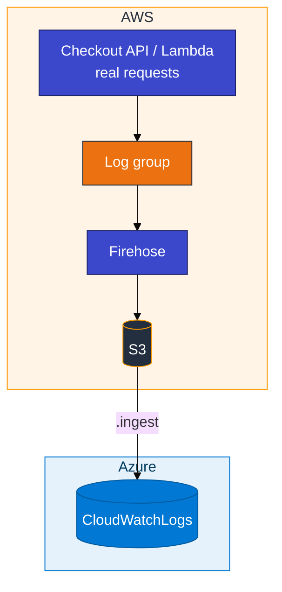
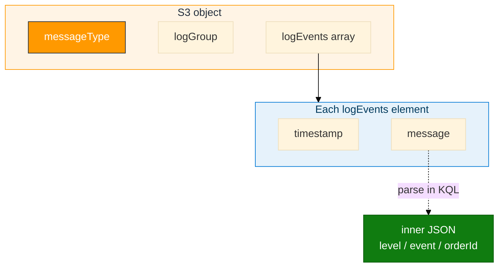

# Module 03 — CloudWatch to ADX

> **Reading order:** `03_CloudWatch_Primer.md` → Concepts (this file) → Lab → Exercises.

CloudWatch **Logs** reach ADX through subscription filter → Firehose → S3 → `.ingest`. ADX never calls the CloudWatch API.

**Rule:** In real projects, CloudWatch fills because **applications and AWS services run**. Lab Step 3 uses a **checkout API you call with curl** or a **Lambda you invoke** — not a batch script whose only purpose is to invent log lines.

## How data moves

Build order: **`03_CloudWatch_Primer.md`**. Produce data: **Lab Step 3 Path A or B**.

## Envelope shape (mapping target)

- Filter to `messageType == "DATA_MESSAGE"`
- Parse `message` in KQL for app fields
- Leave `CloudWatchLogs` for Module 04

## In class

- Database `ADXTrainingDB_<your-login>`; reader on **your** Firehose bucket
- Git Bash: `export MSYS_NO_PATHCONV=1` before `aws logs`
- After Step 1: **start API + curl** or **invoke Lambda**, confirm CloudWatch, wait for Firehose, ingest
