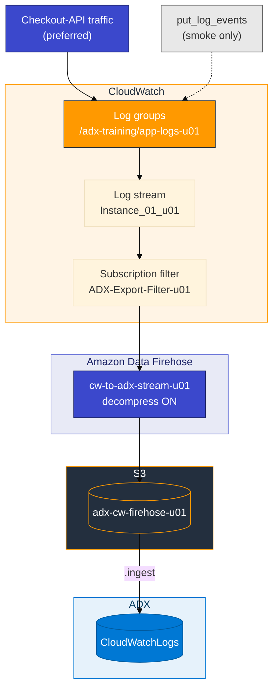
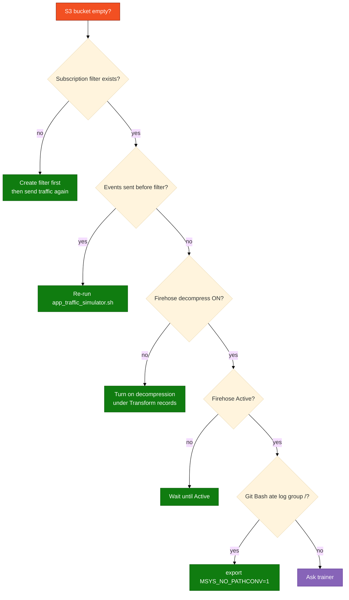

# Module 03 — Lab

Build log group → Firehose → S3 in the console, create the ADX table, **send real-shaped application logs**, wait for an object, ingest the envelope.

Scripts and KQL: `assets/module_03/`. Real vs probe data: `assets/REAL_VS_LAB_DATA.md`.

**Names** (use your login from the access card: `u01` … `u06`. Do not invent initials.)

| Resource | Example for `u01` |
|----------|-------------------|
| Database | `ADXTrainingDB_u01` |
| Log group | `/adx-training/app-logs-u01` |
| Stream | `Instance_01_u01` |
| Bucket | `adx-cw-firehose-u01` |
| Firehose | `cw-to-adx-stream-u01` |
| Subscription filter | `ADX-Export-Filter-u01` |
| IAM reader | `adx-cw-s3-reader-u01` |

Before you start:

- Git Bash: `export MSYS_NO_PATHCONV=1` before any `aws logs` command
- Do **not** send traffic until the subscription filter exists
- On Windows the scripts use `python` if `python3` is the Store stub

**Two key pairs:**

| Keys | Where they go |
|------|----------------|
| Access card (`u01` … `u06`) | Console + `aws configure` + Firehose / CloudWatch setup |
| `adx-cw-s3-reader-*` from Step 2 | `.ingest` URI only — never `aws configure` |

## AWS console path



## Step 1 — AWS console (order matters)

**Goal:** CloudWatch log events flow to S3 through Firehose so ADX can pull one object.

**Correct order:** log group + stream → S3 bucket → Firehose (Active) → subscription filter → **then** generate traffic.

Events written **before** the subscription filter exists are **not** shipped retroactively.

### 1a — Log group and stream

1. **CloudWatch** → **Log groups** → **Create log group**
2. Name: `/adx-training/app-logs-<your-login>` (leading `/` is required)
3. Retention: **1 day** → **Create**
4. Open the log group → **Create log stream** → name `Instance_01_<your-login>` → **Create**

**Checkpoint:** Log group and stream appear in the console.

### 1b — S3 bucket

1. **S3** → **Create bucket**
2. Name: `adx-cw-firehose-<your-login>`
3. Region: **us-east-1**
4. **Block all public access** = on → **Create bucket**

### 1c — Firehose delivery stream

1. Search **Firehose** (console may also list this under **Amazon Data Firehose** or **Kinesis**)
2. **Create Firehose stream** (or **Create delivery stream**)
3. **Source:** **Direct PUT**
4. **Destination:** **Amazon S3** → bucket `adx-cw-firehose-<your-login>`
5. **Buffer hints:** **1 MiB** and **60 seconds**
6. **S3 compression:** **UNCOMPRESSED**
7. **Transform records** (important — matches current AWS docs):
   - Do **not** enable **Transform source records with AWS Lambda** / **Enable data transformation**
   - Under **Decompress source records from Amazon CloudWatch Logs**, choose **Turn on decompression**
8. Create a new IAM role when prompted (Firehose → S3 write)
9. **Create** → wait until stream status is **Active**

CloudWatch sends gzip-compressed batches to Firehose. Decompression must be on so S3 objects are readable JSON envelopes.

### 1d — Subscription filter

**Recommended path** (matches AWS console today):

1. **CloudWatch** → your log group `/adx-training/app-logs-<your-login>`
2. **Actions** → **Subscription filters** → **Create Amazon Data Firehose subscription filter**
3. Select your stream `cw-to-adx-stream-<your-login>`
4. Filter pattern: leave blank (match all) for the lab
5. Create a new IAM role (CloudWatch Logs → Firehose) → name example `ADX-Export-Filter-<your-login>` → **Create**

**Alternate path:** Log group → **Subscription filters** tab → **Create** → destination **Firehose** → same stream name.

**Checkpoint:** Subscription filter listed on the log group; Firehose stream status **Active**.

## Step 2 — ADX table and IAM reader

**Goal:** Table and mapping match the **CloudWatch envelope** (`messageType`, `logEvents`, …), not the inner JSON in `message`.

1. In `ADXTrainingDB_<your-login>`, run `assets/module_03/create_tables.kql`
2. IAM user **`adx-cw-s3-reader-<your-login>`** with `assets/iam/s3-reader-policy.json` where `BUCKET_NAME` is **`adx-cw-firehose-<your-login>`** (your Firehose bucket, not Module 01 or the trail bucket)
3. Create access keys → notepad for ingest URI only

**Checkpoint:** `.show tables` includes `CloudWatchLogs`.

## Step 3 — Generate logs (real project first)

**Goal:** Fill your log stream the way a real service would — structured JSON for checkout / auth / inventory — then confirm CloudWatch **and** S3 before ADX.

Do this **only after** Step 1d (subscription filter exists).

### Path A — Preferred: application-shaped traffic

Simulates a small **checkout API** writing lines via `PutLogEvents` (same API apps use when they log straight to CloudWatch):

```bash
export MSYS_NO_PATHCONV=1
bash assets/module_03/app_traffic_simulator.sh us-east-1 <your-login>
```

**Example:** `bash assets/module_03/app_traffic_simulator.sh us-east-1 u01`

Optional third argument = number of traffic batches (default `2`):  
`bash assets/module_03/app_traffic_simulator.sh us-east-1 u01 3`

**What you should see in CloudWatch (console):**

1. **CloudWatch** → **Log groups** → `/adx-training/app-logs-<your-login>` → stream `Instance_01_<your-login>`
2. Messages containing events such as `order.created`, `auth.login.failed`, `inventory.reserve.failed`, `http.request`, with fields like `service`, `host`, `traceId`, `latencyMs`

**Tips (real-world habits):**

| Tip | Why |
|-----|-----|
| Prefer **one JSON object per log line** | Matches production logging libraries and ADX `parse_json` |
| Check the **stream in the console first** | If CloudWatch is empty, Firehose/S3/ADX cannot help |
| Wait **60–90 seconds** after traffic | Firehose buffer (1 MiB / 60 s in this lab) |
| Re-run the simulator to add more “hours” of traffic | Continuous apps keep writing; one batch is a snapshot |
| Console **Create log event** | Paste a JSON line for a one-off ERROR without any script |

### Path B — Quick pipeline smoke only

Three short probe lines (your account id + ARN). Use when you only need to prove S3 got an object:

```bash
export MSYS_NO_PATHCONV=1
bash assets/module_03/put_log_events.sh us-east-1 <your-login>
```

Do **not** stop here for the full learning goal — also run Path A (or console Create log event with JSON) so queries in ADX look like ops data.

### Path C — Manual console / CLI (no simulator)

1. Log group → stream → **Create log event** → paste e.g.  
   `{"level":"ERROR","service":"checkout-api","event":"payment.declined","orderId":"ord-manual-1"}`
2. Or see CLI one-liners in `assets/REAL_VS_LAB_DATA.md` (Module 03).

### Confirm S3

Wait **60–90 seconds**, then:

```bash
aws s3 ls s3://adx-cw-firehose-<your-login>/ --recursive
```

You should see a new object under a path like `2026/08/28/01/cw-to-adx-stream-u01-...`.

**If the bucket is empty:** confirm subscription filter exists and Firehose **decompress for CloudWatch Logs** is on before sending traffic again.

## Step 4 — Ingest and check

**Goal:** All Firehose objects in nested folders ingested into `CloudWatchLogs`.

1. Run `assets/module_03/create_tables.kql` if not done in Step 2
2. Ingest without copying each nested key:

```bash
bash assets/ingest_s3_to_adx.sh --module m03 --login <your-login> --region us-east-1 --max 10 --run
```

Or open `assets/module_03/ingest.kql` for a single object, or paste `~/adx-lab-s3/m03/ingest_generated.kql` in the Web UI.
3. Run `assets/module_03/validate.kql`
4. Filter to `messageType == "DATA_MESSAGE"`
5. Expand `logEvents` and parse inner JSON — look for `order.created` / `ERROR` from the simulator
6. Leave `CloudWatchLogs` for Module 04

**You're done when**

- CloudWatch stream shows application-shaped JSON (not only three probe lines)
- An object showed up in `adx-cw-firehose-<your-login>`
- `CloudWatchLogs` has a `DATA_MESSAGE` row and `logEvents` is not empty

**If S3 is empty**


