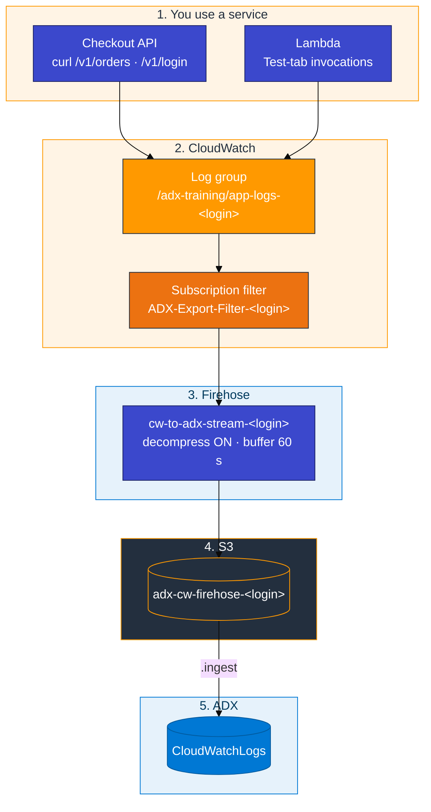
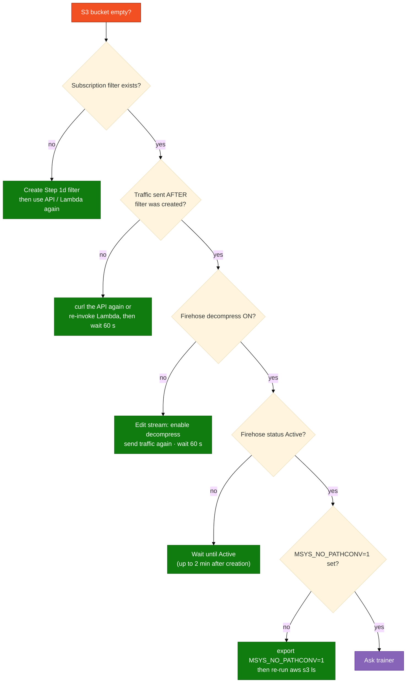

# Module 03 — Lab: CloudWatch Logs to ADX

**Reading order:** `03_CloudWatch_Primer.md` → `03_CloudWatch_to_ADX_Concepts.md` → **this Lab** → `03_Exercises.md`.

**KQL and scripts:** `assets/module_03/`. Checkout API code: `assets/module_03/checkout_api/`.

---

## 1. What this lab is about (plain English)

In Module 02 you moved **CloudTrail management-event records** into ADX — one row per AWS API call. That data answers "who called what API and when."

This module moves **application log lines** into ADX. These are the lines your code writes: an order was placed, a login failed, a request took too long. In a real company those lines appear because services are handling real traffic. In this lab you simulate exactly that — you start a small checkout API, hit it with HTTP requests, and watch the lines flow all the way through to ADX.

The full path every log line follows:

> **Checkout API (curl) or Lambda invoke** → **CloudWatch log group** → **subscription filter** → **Firehose** → **S3 object** → ADX **`.ingest`** → `CloudWatchLogs` table

You build the AWS pipeline first (Steps 1–2), produce realistic traffic (Step 3), then ingest into ADX (Step 4). Leave `CloudWatchLogs` in place — Module 04 Hybrid uses it.

---

## 2. How data travels

### 2.1 Full journey



### 2.2 Why the build order matters

The most common mistake is sending traffic before the subscription filter exists. CloudWatch does **not** retroactively ship events. If you hit the API first and add the filter later, those events never reach S3.

| What you build | Why it must come first |
|----------------|------------------------|
| Log group + stream | The address where the app writes lines |
| S3 bucket | Firehose needs a destination before you create the stream |
| Firehose stream | Must be **Active** before a subscription filter can attach to it |
| Subscription filter | This is the tap — once on, every new event flows through |
| Traffic (Path A or B) | Now new log events are captured and arrive in S3 after ~60 s |

### 2.3 What S3 receives (the CloudWatch envelope)

Firehose does not write your application JSON by itself. CloudWatch wraps each batch of log events in an **envelope** before sending to Firehose. After Firehose decompresses it (you must turn decompress **on**), each S3 object contains newline-delimited JSON shaped like this:

```json
{
  "messageType": "DATA_MESSAGE",
  "owner": "123456789012",
  "logGroup": "/adx-training/app-logs-u01",
  "logStream": "Instance_01_u01",
  "subscriptionFilters": ["ADX-Export-Filter-u01"],
  "logEvents": [
    {
      "id": "...",
      "timestamp": 1700000000000,
      "message": "{\"level\":\"INFO\",\"event\":\"order.created\",\"orderId\":\"ord-1\"}"
    },
    {
      "id": "...",
      "timestamp": 1700000001000,
      "message": "{\"level\":\"ERROR\",\"event\":\"payment.declined\",\"orderId\":\"ord-2\"}"
    }
  ]
}
```

Your application JSON lives **inside** `logEvents[*].message` as a string. In KQL you use `mv-expand` on `logEvents` then `parse_json()` on the `message` field to reach `level`, `event`, `orderId`, etc.

Firehose also sends periodic heartbeat records where `messageType == "CONTROL_MESSAGE"`. Those are normal — filter them out with `| where messageType == "DATA_MESSAGE"`.

---

## 3. Names (use your login from the access card)

Your login is one of `u01` … `u06`. Copy it exactly from your access card — do not invent initials.

| Resource | Pattern | Example for `u01` |
|----------|---------|-------------------|
| Database | `ADXTrainingDB_<login>` | `ADXTrainingDB_u01` |
| Log group | `/adx-training/app-logs-<login>` | `/adx-training/app-logs-u01` |
| Log stream | `Instance_01_<login>` | `Instance_01_u01` |
| S3 bucket | `adx-cw-firehose-<login>` | `adx-cw-firehose-u01` |
| Firehose stream | `cw-to-adx-stream-<login>` | `cw-to-adx-stream-u01` |
| Subscription filter | `ADX-Export-Filter-<login>` | `ADX-Export-Filter-u01` |
| IAM reader | `adx-cw-s3-reader-<login>` | `adx-cw-s3-reader-u01` |

**Two separate key pairs — never mix them:**

| Keys | Where they go |
|------|---------------|
| Access card (`u01` … `u06`) | Console sign-in · `aws configure` · running the checkout API |
| `adx-cw-s3-reader-*` (created in Step 2) | `.ingest` URI only — never in `aws configure` |

---

## 4. Before every terminal command

**Git Bash on Windows — always set this first:**

```bash
export MSYS_NO_PATHCONV=1
```

Set this before any AWS CLI command that includes a path like `/adx-training/...`. Without it, Git Bash rewrites the leading `/` and CloudWatch cannot find the log group. It is safe to set it once at the top of a session.

---

## Step 1 — Build the AWS pipeline (console)

**Correct order inside this step:** 1a log group → 1b S3 bucket → 1c Firehose → 1d subscription filter. Do not jump ahead.

---

### 1a — Log group and stream

**Goal:** Create the CloudWatch address where the checkout API will write log events.

**Why:** CloudWatch needs a named log group before any service or SDK can write to it. The stream is one sub-sequence inside that group — think of the log group as a folder and the stream as a file inside it.

**Do this exactly:**

1. Console → **CloudWatch** → left nav **Log groups** → **Create log group**
2. Name: `/adx-training/app-logs-<your-login>` — the leading `/` is required
3. Retention period: **1 day** → **Create**
4. Click into the newly created log group → **Create log stream**
5. Stream name: `Instance_01_<your-login>` → **Create**

**Checkpoint:** Both the log group and the stream appear in the console. The stream shows 0 events — that is correct; no traffic has been sent yet.

**If wrong:**

| Symptom | Fix |
|---------|-----|
| Log group not found later | Check that the name starts with `/adx-training/` and not `adx-training/` (missing leading slash) |
| Stream not visible | Click into the log group, not just the log groups list |
| Name typo | Delete and recreate — names cannot be renamed |

---

### 1b — S3 bucket

**Goal:** Give Firehose a destination bucket to deposit objects into.

**Why:** Firehose requires a destination before you can create the delivery stream. S3 is the storage layer that ADX will pull from later.

**Do this exactly:**

1. Console → **S3** → **Create bucket**
2. Bucket name: `adx-cw-firehose-<your-login>`
3. AWS Region: **us-east-1**
4. **Block all public access** = on (this is the default — do not uncheck it)
5. All other settings default → **Create bucket**

**Checkpoint:** Bucket appears in the S3 console. Contents are empty.

**If wrong:**

| Symptom | Fix |
|---------|-----|
| "Bucket name already exists" | S3 bucket names are globally unique. Check with your trainer if there is a conflict with your login |
| Bucket created in wrong region | Delete and recreate in us-east-1; Firehose and the lab scripts assume this region |

---

### 1c — Firehose delivery stream

**Goal:** Create the managed delivery pipe that receives CloudWatch subscription events, decompresses them, and writes objects to S3.

**Why:** CloudWatch log subscriptions can only push to Firehose (or Lambda). Firehose handles batching, buffering, retries, and — critically in this lab — **decompression**. CloudWatch sends log data as gzip; if you leave decompression off, the S3 objects are binary and ADX cannot map them to your table schema.

**Do this exactly:**

1. Console → search bar → **Firehose** (also listed as **Amazon Data Firehose** or under **Kinesis**)
2. **Create Firehose stream**
3. **Source:** **Direct PUT**
4. **Destination:** **Amazon S3**
5. **S3 bucket:** choose `adx-cw-firehose-<your-login>`
6. **Firehose stream name:** `cw-to-adx-stream-<your-login>`
7. **Buffer hints:** Size **1 MiB**, Interval **60 seconds**
8. **S3 compression and encryption:** compression = **UNCOMPRESSED** (keep the final S3 object uncompressed for easy ingest)
9. **Source record transformation / decompression:**
   - Do **not** enable Lambda transform
   - Find the option **"Decompress source records from Amazon CloudWatch Logs"** — it may appear as a toggle or dropdown depending on the console version
   - Set it to **Turn on decompression** / **Enabled**
10. IAM role: when prompted, let AWS create a new role automatically
11. **Create Firehose stream** → on the list page wait until status changes to **Active** (30–90 seconds)

**Checkpoint:** Stream `cw-to-adx-stream-<your-login>` shows **Active** status in the Firehose list.

**If wrong:**

| Symptom | Fix |
|---------|-----|
| Cannot find "Decompress" setting | Scroll — on most console versions it appears below the S3 bucket picker, sometimes under "Source record transformation" |
| Stream stuck "Creating" for more than 5 minutes | Refresh the browser; if still creating after another minute, ask the trainer |
| Stream is Active but decompress was not set | Click into the stream → **Edit** → enable decompression — do this before creating the subscription filter |
| Destination bucket is a different login | Delete and recreate with the correct bucket name |

---

### 1d — Subscription filter

**Goal:** Connect the log group to Firehose so every new log event flows through the pipeline.

**Why:** Without the subscription filter, CloudWatch holds log events in the group but never forwards them anywhere. The filter is the tap. Once created, any new event written to the log group is forwarded to Firehose within seconds and lands in S3 after the buffer interval (~60 s).

**Events written before this filter was created are never shipped. This is the point of no return — create the filter now, before any traffic.**

**Do this exactly:**

1. Console → **CloudWatch** → **Log groups** → click `/adx-training/app-logs-<your-login>`
2. Top-right **Actions** → **Subscription filters** → **Create Amazon Data Firehose subscription filter**
3. **Amazon Data Firehose stream:** select `cw-to-adx-stream-<your-login>` from the dropdown
4. **Filter pattern:** leave completely blank (forward all events)
5. **IAM role:** choose **Create a new role** or an existing role with CloudWatch → Firehose permission
6. **Subscription filter name:** `ADX-Export-Filter-<your-login>`
7. **Start streaming** / **Create** button

**Checkpoint:** The subscription filter `ADX-Export-Filter-<your-login>` appears in the log group's Subscription filters tab.

**If wrong:**

| Symptom | Fix |
|---------|-----|
| Firehose dropdown is empty | The Firehose stream may still be in "Creating" state — wait for Active, then return to this step |
| IAM permission error during creation | Use the "Create a new role" option instead of selecting an existing one |
| Filter created but points to wrong stream | Delete the filter and recreate pointing to the correct stream name |
| Filter exists on wrong log group | You may have opened the wrong group — check the breadcrumb at the top of the page |

---

## Step 2 — ADX table and IAM reader

**Goal:** Create the `CloudWatchLogs` table in your ADX database (schema matches the CloudWatch envelope), and create an IAM user with read-only access to your Firehose S3 bucket so ADX can pull objects at ingest time.

**Why:** ADX does not have a standing connection to S3. When you run `.ingest`, ADX uses the credentials you supply to do a one-time read of a specific object. The IAM reader is a minimal-permission user for that purpose only — it never goes in `aws configure`.

**Do this exactly:**

1. Azure portal → your cluster → **Query** → database dropdown → `ADXTrainingDB_<your-login>`
2. Confirm you are in the right database:
   ```kusto
   print Database = current_database()
   ```
3. Open `assets/module_03/create_tables.kql` and run the entire file. This creates table `CloudWatchLogs` with columns for `messageType`, `logGroup`, `logStream`, `subscriptionFilters`, `logEvents`, and the JSON ingestion mapping.
4. Verify:
   ```kusto
   .show tables
   | where TableName == "CloudWatchLogs"
   ```
5. In AWS console → **IAM** → **Users** → **Create user**
   - User name: `adx-cw-s3-reader-<your-login>`
   - Attach permissions: use the policy in `assets/iam/s3-reader-policy.json` — replace `BUCKET_NAME` with `adx-cw-firehose-<your-login>`
6. After creating the user: **Security credentials** tab → **Create access key** → purpose "Application running outside AWS"
7. Copy the **Access key ID** and **Secret access key** somewhere temporary (Notepad, not a shared location). These go only in the `.ingest` URI in Step 4.

**Checkpoint:** `CloudWatchLogs` appears in `.show tables`. You have the reader's key ID and secret saved.

**If wrong:**

| Symptom | Fix |
|---------|-----|
| `.show tables` does not show `CloudWatchLogs` | Re-run `create_tables.kql` in the correct database (`print Database` first) |
| IAM error attaching policy | Check that you replaced `BUCKET_NAME` with the exact bucket name (no angle brackets) |
| You typed the reader key into `aws configure` | Stop — `aws configure` should hold your access card keys only. Reset and use only the card keys there |

---

## Step 3 — Produce logs by using a real service

**Goal:** CloudWatch fills because you **used an application** — the same way production does.

**Rule:** Use Path A or Path B. The optional smoke script (`put_log_events.sh`) only proves that the plumbing exists; it skips the learning goal of this module.

**Do this only after Step 1d is complete.** Events before the subscription filter exist are never shipped — there is no catch-up.

---

### Path A — Preferred: checkout API + curl

This is a small HTTP service. It writes to CloudWatch only when it handles an HTTP request — not on a timer, not on a schedule. That is the production pattern.

**Terminal 1 — start the service (leave running throughout Step 3):**

```bash
export MSYS_NO_PATHCONV=1
export ADX_LOGIN=<your-login>
export AWS_DEFAULT_REGION=us-east-1
pip install boto3
cd ~/adx-aws-training
python assets/module_03/checkout_api/server.py
```

The server starts and listens on `http://127.0.0.1:8080`. You should see a startup message in Terminal 1. Leave it open.

**Terminal 2 — use the service (run each command 2–3 times to generate variety):**

```bash
# Health check — generates an http.request log line
curl -s http://127.0.0.1:8080/health

# Successful order — generates order.created
curl -s -X POST http://127.0.0.1:8080/v1/orders \
  -H "Content-Type: application/json" \
  -d '{"sku":"WIDGET","qty":2}'

# Over-limit order — generates order.rejected
curl -s -X POST http://127.0.0.1:8080/v1/orders \
  -H "Content-Type: application/json" \
  -d '{"sku":"WIDGET","qty":99}'

# Failed login — generates auth.login.failed
curl -s -X POST http://127.0.0.1:8080/v1/login \
  -H "Content-Type: application/json" \
  -d '{"user":"alice","password":"wrong"}'

# Successful login — generates auth.login.success
curl -s -X POST http://127.0.0.1:8080/v1/login \
  -H "Content-Type: application/json" \
  -d '{"user":"alice","password":"secret"}'
```

**Verify in CloudWatch before touching S3:**

Console → **CloudWatch** → **Log groups** → `/adx-training/app-logs-<your-login>` → click stream `Instance_01_<your-login>` → you should see JSON events such as `order.created`, `auth.login.failed`, `http.request`.

If the stream is empty, check that `ADX_LOGIN` is exported correctly and the server in Terminal 1 started without error. The server prints the log group name it is writing to on startup.

Full API details and additional endpoints: `assets/module_03/checkout_api/README.md`.

---

### Path B — Alternate: Lambda (console only)

Same production idea — AWS runs your function and CloudWatch automatically receives its stdout as structured log events. No local Python setup needed.

1. Console → **Lambda** → **Create function** → **Author from scratch**
   - Function name: `checkout-api-<your-login>`
   - Runtime: **Python 3.12**
   - **Create function**
2. In the **Code** tab replace the default handler with the code below → **Deploy**:

```python
import json

def lambda_handler(event, context):
    order_id = event.get("orderId", "ord-demo-1")
    print(json.dumps({
        "level": "INFO",
        "service": "checkout-api",
        "event": "order.created",
        "orderId": order_id,
    }))
    if event.get("fail"):
        print(json.dumps({
            "level": "ERROR",
            "service": "checkout-api",
            "event": "payment.declined",
            "orderId": order_id,
        }))
    return {"ok": True, "orderId": order_id}
```

3. **Test** tab → create a test event named `order-ok` with payload:
   ```json
   {"orderId": "ord-1"}
   ```
   Invoke it 3 times.
4. Create a second test event named `order-fail` with payload:
   ```json
   {"orderId": "ord-2", "fail": true}
   ```
   Invoke it 2 times.
5. Console → **CloudWatch** → **Log groups** → confirm events appear in `/aws/lambda/checkout-api-<your-login>`
6. Add a **subscription filter** on that Lambda log group: same steps as Step 1d, same Firehose `cw-to-adx-stream-<your-login>`. The decompress setting on the Firehose stream already covers Lambda's CloudWatch output.
7. **Invoke the Lambda again** (at least 3 times) after the filter exists. Events before the filter was added are not shipped.

---

### Path C — Optional one-off ops marker

Console → `/adx-training/app-logs-<your-login>` → stream → **Create log event** → paste a single JSON line for an "incident" marker. This is not the main class path and does not count as completing the module on its own.

---

### Confirm S3 (do this after Path A or B)

Wait **60–90 seconds** after your last API call or Lambda invoke, then:

```bash
aws s3 ls s3://adx-cw-firehose-<your-login>/ --recursive
```

You should see one or more objects with key paths shaped like `YYYY/MM/DD/HH/...`.

**If the result is empty,** go straight to the Quick failure guide at the bottom of this file.

---

### Optional smoke (not the learning path)

If the trainer asks you to verify plumbing before the API is running:

```bash
export MSYS_NO_PATHCONV=1
bash assets/module_03/put_log_events.sh us-east-1 <your-login>
```

This directly calls the CloudWatch API to push fabricated events. It confirms the subscription filter and Firehose are connected, but the resulting ADX data looks nothing like real application logs. Complete Path A or B so your ADX queries have meaningful data to explore.

---

## Step 4 — Ingest and validate

**Goal:** Pull the S3 object into the `CloudWatchLogs` table and confirm `DATA_MESSAGE` rows with real application events that can be parsed in KQL.

**Do this exactly:**

1. Confirm the table exists:
   ```kusto
   .show tables
   | where TableName == "CloudWatchLogs"
   ```
2. Run the ingest helper (uses the `adx-cw-s3-reader-<login>` keys you saved in Step 2):
   ```bash
   bash assets/ingest_s3_to_adx.sh --module m03 --login <your-login> --region us-east-1 --max 10 --run
   ```
   Or paste the contents of `~/adx-lab-s3/m03/ingest_generated.kql` directly into the ADX Web UI.
3. Check the row count:
   ```kusto
   CloudWatchLogs | count
   ```
4. Inspect the envelope rows:
   ```kusto
   CloudWatchLogs
   | where messageType == "DATA_MESSAGE"
   | take 10
   ```
5. Expand the log events array and parse the inner JSON:
   ```kusto
   CloudWatchLogs
   | where messageType == "DATA_MESSAGE"
   | mv-expand logEvents
   | extend msg    = tostring(logEvents.message)
   | extend parsed = parse_json(msg)
   | project
       EventTime = logEvents.timestamp,
       Level     = tostring(parsed.level),
       EventName = tostring(parsed.event),
       OrderId   = tostring(parsed.orderId)
   | take 20
   ```
6. Count by event type:
   ```kusto
   CloudWatchLogs
   | where messageType == "DATA_MESSAGE"
   | mv-expand logEvents
   | extend parsed = parse_json(tostring(logEvents.message))
   | summarize n = count() by tostring(parsed.event)
   | order by n desc
   ```
7. Run `assets/module_03/validate.kql` for the full instructor-led check.

**Checkpoint:** `DATA_MESSAGE` rows are present. Expanding `logEvents` shows events such as `order.created`, `auth.login.failed`, `http.request`.

**If wrong:**

| Symptom | Fix |
|---------|-----|
| Ingest fails: "Access denied" | Check the reader key ID and secret — they must be the `adx-cw-s3-reader-<login>` keys, not the access-card keys |
| `CloudWatchLogs | count` returns 0 after ingest | Run `.show operations` in ADX to see the ingest status; the S3 object may still be empty (return to Step 3 "Confirm S3") |
| All rows have `messageType == "CONTROL_MESSAGE"` | Normal heartbeats from Firehose — add `| where messageType == "DATA_MESSAGE"` to every query |
| No `DATA_MESSAGE` rows at all | Traffic was sent before the subscription filter existed — re-run curl commands / Lambda invokes now, wait 60–90 s, run the ingest again |
| `logEvents` column is empty or null | Table mapping mismatch — re-run `create_tables.kql` then ingest a fresh S3 object |
| `parsed.event` comes back empty | The API server was not running when curl was sent — restart the server, send traffic again, wait, ingest |

**Leave `CloudWatchLogs` in place.** Module 04 Hybrid uses it as an AWS source table. Do not drop it.

---

## You're done when

- You used Path A (curl the checkout API) or Path B (Lambda Test invokes) — not only the smoke script
- CloudWatch shows real application events in the stream (`order.created`, `auth.login.*`, `http.request`)
- `aws s3 ls s3://adx-cw-firehose-<your-login>/ --recursive` returns at least one object
- `CloudWatchLogs` in ADX has `DATA_MESSAGE` rows and you can expand `logEvents` to see application fields
- You can explain the full chain: service call → log group → subscription filter → Firehose → S3 → `.ingest` → ADX

---

## Quick failure guide



| Problem | Most likely cause | Fix |
|---------|-----------------|-----|
| CloudWatch stream empty | Traffic before subscription filter, or server not writing to the correct log group | Check `ADX_LOGIN` env var; confirm filter exists; send traffic again |
| S3 has objects but ADX is empty | Reader key wrong, or wrong bucket in ingest command | Verify `adx-cw-s3-reader-<login>` keys; confirm `adx-cw-firehose-<login>` in the ingest command |
| Only `CONTROL_MESSAGE` rows in ADX | Normal Firehose heartbeats | Add `| where messageType == "DATA_MESSAGE"` to every query |
| `logEvents` is null after ingest | Table mapping mismatch or ingest used wrong format | Re-run `create_tables.kql`, then ingest a fresh S3 object |
| `parsed.event` empty in KQL | API was not running when curl was sent, so no real log lines | Restart server, send curl traffic, wait, ingest |
| Decompress was off during first ingest | S3 objects are compressed binary | Enable decompress on the Firehose stream, send new traffic, wait, ingest a new object |
