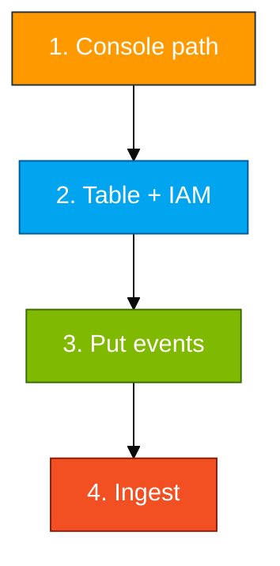

# Module 03 — Lab

Build log group → Firehose → S3 in the console, create the ADX table, put a few live events, wait for an object, ingest the envelope.

Scripts and KQL: `assets/module_03/`.

**Names** (use your login from the access card: `u01` … `u06`. Do not invent initials.)

- Database: `ADXTrainingDB_u01` (example for login `u01`)
- Log group: `/adx-training/app-logs-u01`
- Stream: `Instance_01_u01`
- Bucket: `adx-cw-firehose-u01`
- Firehose: `cw-to-adx-stream-u01`
- Subscription filter: `ADX-Export-Filter-u01`
- IAM reader: `adx-cw-s3-reader-u01`

Before you start:

- Git Bash: `export MSYS_NO_PATHCONV=1` before any `aws logs` command
- Do not put events until the subscription filter exists
- On Windows the put script uses `python` if `python3` is the Store stub

**Two key pairs:**

| Keys | Where they go |
|------|----------------|
| Access card (`u01` … `u06`) | Console + `aws configure` + Firehose / CloudWatch setup |
| `adx-cw-s3-reader-*` created in Step 2 | `.ingest` URI only. Never `aws configure` |



## Step 1 — AWS console (order matters)

ADX only pulls S3. Everything before that is AWS export.

**Correct order:** log group + stream → S3 bucket → Firehose (Active) → subscription filter → put events.

1. **CloudWatch → Log groups → Create**
   - Name: `/adx-training/app-logs-<your-login>` (leading `/` is required)
   - Retention: **1 day**
   - Create log stream: `Instance_01_<your-login>`

2. **S3 → Create bucket**
   - Name: `adx-cw-firehose-<your-login>`
   - Region: **us-east-1**
   - Block all public access: **On**

3. **Kinesis → Data Firehose → Create**
   - Source: **Direct PUT**
   - Destination: **Amazon S3** → bucket `adx-cw-firehose-<your-login>`
   - Buffer: **1 MiB** / **60 seconds**
   - S3 compression: **UNCOMPRESSED**
   - Under **Advanced settings → Data transformation**: enable **Decompress source records from Amazon CloudWatch Logs**
   - Create a new IAM role when prompted (Firehose → S3 write). Wait until status is **Active**

4. **CloudWatch → your log group → Subscription filters → Create**
   - Destination: your Firehose `cw-to-adx-stream-<your-login>`
   - Filter pattern: leave blank (match all) for the lab
   - Create a new IAM role (CloudWatch Logs → Firehose). Name example: `ADX-Export-Filter-<your-login>`

Events written **before** the subscription filter exists are **not** shipped retroactively.

## Step 2 — ADX table and IAM

The mapping must match the **CloudWatch envelope** (`messageType`, `logEvents`, …), not the inner JSON in `message`.

- Run `assets/module_03/create_tables.kql` in `ADXTrainingDB_<your-login>`
- IAM user **`adx-cw-s3-reader-<your-login>`** with `assets/iam/s3-reader-policy.json` where `BUCKET_NAME` is **`adx-cw-firehose-<your-login>`** (your Firehose bucket, not Module 01 or the trail bucket)
- Create access keys → notepad for ingest URI only

## Step 3 — Put events

The helper writes three messages that include your live account id and ARN so you can see they are yours.

```bash
export MSYS_NO_PATHCONV=1
bash assets/module_03/put_log_events.sh us-east-1 <your-login>
```

**Example:** `bash assets/module_03/put_log_events.sh us-east-1 u01`

Wait **60–90 seconds**, then:

```bash
aws s3 ls s3://adx-cw-firehose-<your-login>/ --recursive
```

If the bucket is empty, check the filter exists and Firehose **decompress for CloudWatch Logs** is on first.

## Step 4 — Ingest and check

- Open `assets/module_03/ingest.kql`; fill login, region, object key, and **reader** keys
- Run it, then `assets/module_03/validate.kql`
- Filter to `messageType == "DATA_MESSAGE"` so control records do not confuse you
- Leave `CloudWatchLogs` for Module 04

**You're done when**

- An object showed up in `adx-cw-firehose-<your-login>`
- `CloudWatchLogs` has a `DATA_MESSAGE` row
- `logEvents` is not empty

**If S3 is empty**

- Filter created after you already put events — put again
- Firehose decompress for CloudWatch Logs is off
- Git Bash ate the `/` in the log group name (`MSYS_NO_PATHCONV=1`)
- Firehose not **Active** yet
