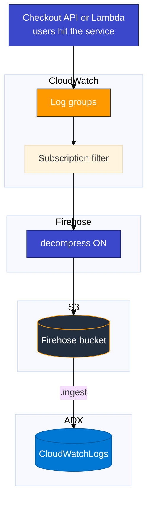
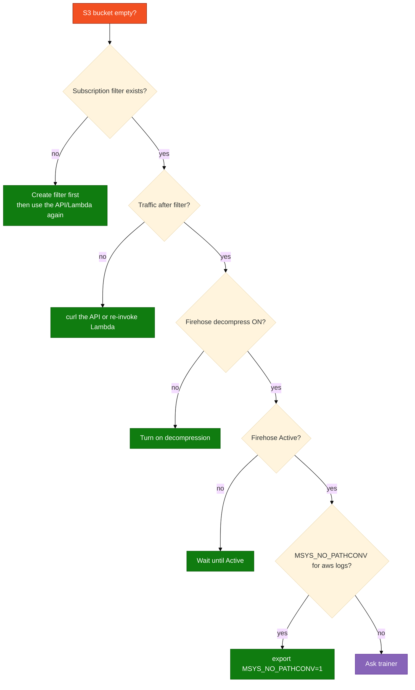

# Module 03 — Lab

Build log group → Firehose → S3, create the ADX table, then **run a real service and use it** so CloudWatch fills the way it does in production. Wait for an S3 object, ingest the envelope.

Scripts and KQL: `assets/module_03/`. Checkout API: `assets/module_03/checkout_api/`.

**Rule (this module and later ones):** Logs appear because **work happened** (HTTP request, Lambda invoke, SSH, nginx hit). Do **not** run a script whose only job is to invent log lines. Optional smoke scripts are labeled as such and are not the class goal.

**Names** (use your login from the access card: `u01` … `u06`. Do not invent initials.)

| Resource | Example for `u01` |
|----------|-------------------|
| Database | `ADXTrainingDB_u01` |
| Log group | `/adx-training/app-logs-u01` |
| Stream | `Instance_01_u01` |
| Bucket | `adx-cw-firehose-u01` |
| Firehose | `cw-to-adx-stream-u01` |
| Subscription filter | `ADX-Export-Filter-u01` |
| IAM reader | `adx-cw-s3-reader-u01` |

Before you start:

- Git Bash: `export MSYS_NO_PATHCONV=1` before any `aws logs` command
- Do **not** send traffic until the subscription filter exists

**Two key pairs:**

| Keys | Where they go |
|------|----------------|
| Access card (`u01` … `u06`) | Console + `aws configure` + running the API / AWS services |
| `adx-cw-s3-reader-*` from Step 2 | `.ingest` URI only — never `aws configure` |

## AWS console path



## Step 1 — AWS console (order matters)

**Goal:** CloudWatch log events flow to S3 through Firehose so ADX can pull one object.

**Correct order:** log group + stream → S3 bucket → Firehose (Active) → subscription filter → **then** run a service and use it.

Events written **before** the subscription filter exists are **not** shipped retroactively.

### 1a — Log group and stream

1. **CloudWatch** → **Log groups** → **Create log group**
2. Name: `/adx-training/app-logs-<your-login>` (leading `/` is required)
3. Retention: **1 day** → **Create**
4. Open the log group → **Create log stream** → name `Instance_01_<your-login>` → **Create**

**Checkpoint:** Log group and stream appear in the console.

### 1b — S3 bucket

1. **S3** → **Create bucket**
2. Name: `adx-cw-firehose-<your-login>`
3. Region: **us-east-1**
4. **Block all public access** = on → **Create bucket**

### 1c — Firehose delivery stream

1. Search **Firehose** (or **Amazon Data Firehose** / **Kinesis**)
2. **Create Firehose stream**
3. **Source:** **Direct PUT**
4. **Destination:** **Amazon S3** → bucket `adx-cw-firehose-<your-login>`
5. **Buffer hints:** **1 MiB** and **60 seconds**
6. **S3 compression:** **UNCOMPRESSED**
7. **Transform records:**
   - Do **not** enable Lambda transform
   - Under **Decompress source records from Amazon CloudWatch Logs**, choose **Turn on decompression**
8. Create a new IAM role when prompted → **Create** → wait until **Active**

### 1d — Subscription filter

1. **CloudWatch** → your log group `/adx-training/app-logs-<your-login>`
2. **Actions** → **Subscription filters** → **Create Amazon Data Firehose subscription filter**
3. Select `cw-to-adx-stream-<your-login>`
4. Filter pattern: leave blank → create IAM role → name e.g. `ADX-Export-Filter-<your-login>` → **Create**

**Checkpoint:** Subscription filter listed; Firehose **Active**.

## Step 2 — ADX table and IAM reader

**Goal:** Table and mapping match the **CloudWatch envelope** (`messageType`, `logEvents`, …).

1. In `ADXTrainingDB_<your-login>`, run `assets/module_03/create_tables.kql`
2. IAM user **`adx-cw-s3-reader-<your-login>`** with `assets/iam/s3-reader-policy.json` where `BUCKET_NAME` is **`adx-cw-firehose-<your-login>`**
3. Create access keys → notepad for ingest URI only

**Checkpoint:** `.show tables` includes `CloudWatchLogs`.

## Step 3 — Produce logs by using a real service

**Goal:** CloudWatch fills because you **used an application**, the same way production does.

Do this **only after** Step 1d.

### Path A — Preferred: run a checkout API, then call it

This is a small HTTP service (not a log-generator). It logs only when it handles a request.

**Terminal 1 — start the service** (leave it running):

```bash
export MSYS_NO_PATHCONV=1
export ADX_LOGIN=<your-login>
export AWS_DEFAULT_REGION=us-east-1
pip install boto3
python assets/module_03/checkout_api/server.py
```

**Terminal 2 — use the product** (repeat several times):

```bash
curl -s http://127.0.0.1:8080/health

curl -s -X POST http://127.0.0.1:8080/v1/orders \
  -H "Content-Type: application/json" \
  -d '{"sku":"WIDGET","qty":2}'

curl -s -X POST http://127.0.0.1:8080/v1/orders \
  -H "Content-Type: application/json" \
  -d '{"sku":"WIDGET","qty":99}'

curl -s -X POST http://127.0.0.1:8080/v1/login \
  -H "Content-Type: application/json" \
  -d '{"user":"alice","password":"wrong"}'

curl -s -X POST http://127.0.0.1:8080/v1/login \
  -H "Content-Type: application/json" \
  -d '{"user":"alice","password":"secret"}'
```

More detail: `assets/module_03/checkout_api/README.md`.

**Verify in CloudWatch (before S3):** Log groups → `/adx-training/app-logs-<your-login>` → stream → see `order.created`, `auth.login.failed`, `http.request`, etc.

### Path B — Preferred alternate: Lambda (console only)

Same production idea: AWS runs your function; CloudWatch gets stdout automatically.

1. **Lambda** → **Create function** → Author from scratch  
   Name: `checkout-api-<your-login>` · Runtime **Python 3.12** · Create
2. Paste this handler → **Deploy**:

```python
import json

def lambda_handler(event, context):
    order_id = event.get("orderId", "ord-demo-1")
    print(json.dumps({
        "level": "INFO",
        "service": "checkout-api",
        "event": "order.created",
        "orderId": order_id,
    }))
    if event.get("fail"):
        print(json.dumps({
            "level": "ERROR",
            "service": "checkout-api",
            "event": "payment.declined",
            "orderId": order_id,
        }))
    return {"ok": True, "orderId": order_id}
```

3. **Test** tab → invoke 4–5 times with payloads such as `{"orderId":"ord-1"}` and `{"orderId":"ord-2","fail":true}`
4. Confirm logs under **CloudWatch** → log group `/aws/lambda/checkout-api-<your-login>`
5. Add a **subscription filter** on **that** Lambda log group to the **same** Firehose `cw-to-adx-stream-<your-login>` (decompress already on). Events before this filter are not exported — invoke again after the filter exists.

### Path C — One-off ops marker (optional)

Console → your stream → **Create log event** with a single JSON line for an “incident” marker. Not the main class path.

### Confirm S3

Wait **60–90 seconds**, then:

```bash
aws s3 ls s3://adx-cw-firehose-<your-login>/ --recursive
```

**If empty:** subscription filter exists? Firehose decompress ON? Did you use the service **after** the filter was created?

### Optional smoke only (not the learning path)

If the trainer asks you to prove plumbing only:

```bash
export MSYS_NO_PATHCONV=1
bash assets/module_03/put_log_events.sh us-east-1 <your-login>
```

Then still complete Path A or B so ADX queries look like application data.

## Step 4 — Ingest and check

1. Run `assets/module_03/create_tables.kql` if needed
2. Ingest:

```bash
bash assets/ingest_s3_to_adx.sh --module m03 --login <your-login> --region us-east-1 --max 10 --run
```

Or paste `~/adx-lab-s3/m03/ingest_generated.kql` in the ADX Web UI.
3. `assets/module_03/validate.kql` → filter `messageType == "DATA_MESSAGE"` → expand `logEvents` → parse JSON for `order.created` / `ERROR`
4. Leave `CloudWatchLogs` for Module 04

**You're done when**

- You used Path A (curl the API) or Path B (invoke Lambda) — not only a smoke script
- CloudWatch shows application events
- S3 has a Firehose object and ADX has `DATA_MESSAGE` rows

**If S3 is empty**


