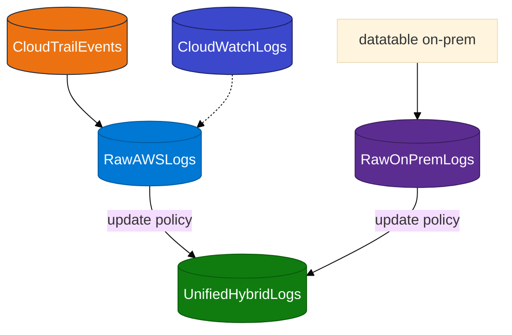

# Module 04 — Hybrid logs

> **Reading order:** `04_Hybrid_Primer.md` → Concepts (this file) → Lab → Exercises.

Keep **raw** tables per source shape. Project five shared columns into **`UnifiedHybridLogs`** via ADX **update policies**.

| Column | Purpose |
|--------|---------|
| `LogTime` | Event timestamp |
| `Environment` | `AWS` or `On-Premises` |
| `SourceService` | e.g. `eventSource`, log group, `firewall` |
| `LogLevel` | e.g. `ERROR`, `INFO` |
| `Message` | Human-readable summary |

**Policy before load** — attach update policy before `.set-or-append` to raw tables, or unified stays empty for that batch. Details: **`04_Hybrid_Primer.md`**.

## Data flow

Prerequisite: rows in `CloudTrailEvents` or `CloudWatchLogs` from Module 02 or 03.
