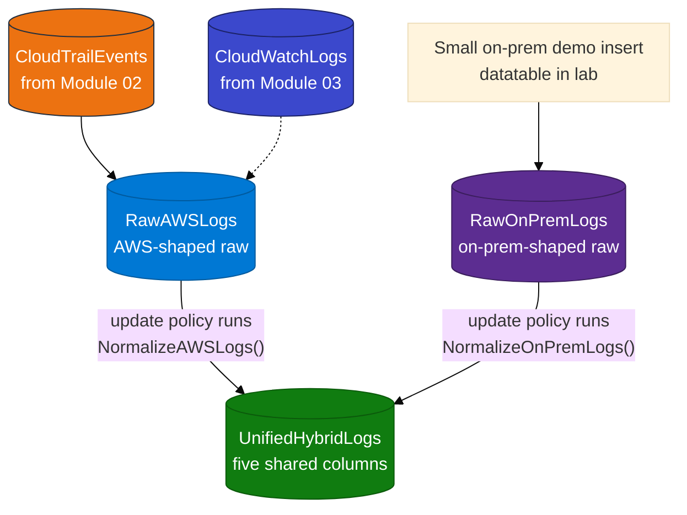

# Module 04 — Hybrid logs

> **Reading order:** `04_Hybrid_Primer.md` → Concepts (this file) → Lab → Exercises.

## What this module is trying to solve

In Modules 02 and 03 you already put AWS logs into ADX (`CloudTrailEvents` and/or `CloudWatchLogs`). Those tables do **not** look the same:

- CloudTrail rows look like API-call records (`EventTime`, `EventName`, `EventSource`, …).
- CloudWatch rows look like application log envelopes (`Message`, `messageType`, …).

A real company also has **on-premises** logs (firewalls, app servers). Those look different again.

Security and ops teams still want **one** place to ask questions like:

> “Show me ERROR-level events from AWS and on-prem in the last hour, on one timeline.”

That is the hybrid problem: **many source shapes → one queryable table**.

---

## The idea in one plain sentence

**Do not force every source into one table immediately.**  
Keep a **raw** table for each source shape. Then, every time a row is written to a raw table, ADX **automatically copies a simplified version** of that row into a shared table named `UnifiedHybridLogs`.

That automatic copy is called an **update policy**.

---

## What “keep raw tables per source shape” means

A **raw table** stores data in a shape that is close to the original source.

| Raw table | What it holds | Why keep it |
|-----------|---------------|-------------|
| `RawAWSLogs` | Rows copied from your Module 02/03 AWS tables | You can still investigate AWS-specific fields later |
| `RawOnPremLogs` | On-prem style rows (in this lab: a small demo insert) | Same idea for non-AWS sources |

“Per source shape” means: AWS rows stay in an AWS-friendly structure; on-prem rows stay in an on-prem-friendly structure. You do **not** throw away the original shape on day one.

---

## What “project five shared columns” means

**Project** means: pick (or calculate) only the fields you need for shared analytics, and ignore the rest for the unified view.

`UnifiedHybridLogs` uses **five** columns that every source can fill somehow:

| Column | Meaning in plain English | Example from AWS | Example from on-prem |
|--------|--------------------------|------------------|----------------------|
| `LogTime` | When the event happened | CloudTrail `EventTime` | A syslog-style timestamp |
| `Environment` | Where it came from | Always the text `AWS` | Always the text `On-Premises` |
| `SourceService` | Which system produced it | e.g. `s3.amazonaws.com`, a log group name | e.g. `firewall`, `AppServer01` |
| `LogLevel` | How serious it is | e.g. `ERROR` / `INFO` (sometimes derived) | e.g. `ERROR` / `INFO` |
| `Message` | Short human-readable text | Often based on `EventName` | Free-text log line |

So when you query `UnifiedHybridLogs`, you are not fighting two different schemas. You always see the same five columns.

---

## What an ADX “update policy” is

An **update policy** is a rule attached to a table that says:

> “When new rows are inserted into table X, run this KQL function, and append the function’s output into table Y.”

In this module:

1. Rows are inserted into `RawAWSLogs` or `RawOnPremLogs`.
2. ADX runs `NormalizeAWSLogs()` or `NormalizeOnPremLogs()`.
3. Those functions **project** the five shared columns.
4. The results are appended into `UnifiedHybridLogs`.

You do **not** manually insert into `UnifiedHybridLogs` for the happy path. The policy does that for you.

Important properties for class:

- The policy runs on **new** inserts after it is attached.
- If you load raw data **before** the policy exists, those old rows are **not** automatically copied later. Attach the policy first, then load.
- If the normalize function’s columns do not match `UnifiedHybridLogs`, the insert can fail (especially when transactional mode is on).

---

## Data flow (picture)

---

## Policy before load (critical)

Correct order:

1. Run `setup.kql` (creates raw tables, normalize functions, **and** the update policy).
2. Load AWS rows into `RawAWSLogs`.
3. Load on-prem demo rows into `RawOnPremLogs`.
4. Query `UnifiedHybridLogs` — it should already have rows for both environments.

Wrong order:

1. Load raw rows first.
2. Create the update policy later.
3. `UnifiedHybridLogs` stays empty for that earlier batch.

More detail and diagrams: **`04_Hybrid_Primer.md`**.

---

## What is real vs demo in this lab

| Side | Real or demo? | Meaning |
|------|----------------|---------|
| AWS rows | **Real** | Copied from your Module 02/03 tables (from real CloudTrail / CloudWatch activity) |
| On-prem rows | **Demo only** | Two sample rows so you can see a second `Environment` value. Production on-prem usually arrives later via Logstash/Filebeat (Modules 05–06) |
| VPN / ExpressRoute / Direct Connect | **Not built** | Discuss only. This lab is about unify-in-ADX, not network connectivity |

---

## Prerequisite

You need rows in `CloudTrailEvents` (Module 02) **or** `CloudWatchLogs` (Module 03). If both are empty, finish an earlier module with real activity first, then return here.
