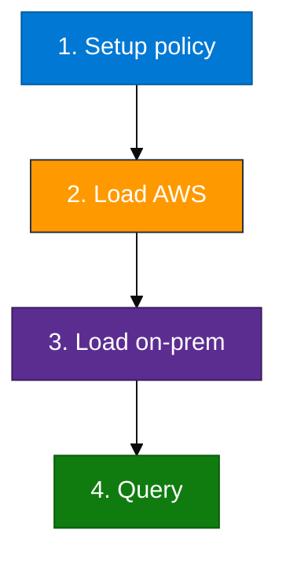

# Module 04 — Lab

Confirm source tables have rows, create unified + raw tables + functions + policy, load AWS, load on-prem, query by `Environment`.

**Rule:** AWS side of hybrid uses **real** Module 02/03 tables (CloudTrail activity or CloudWatch from a live API/Lambda). Do not invent AWS rows with a generator script.

KQL: `assets/module_04/`.

**Before Step 2 (recommended):** If `CloudWatchLogs` is thin, **use the Module 03 checkout API or Lambda again** (curl / Test invoke), wait for Firehose, ingest with `ingest_s3_to_adx.sh --module m03`. Or do normal console/CLI work and re-ingest CloudTrail (`--module m02`).

**Names:** Database `ADXTrainingDB_<your-login>` (example `ADXTrainingDB_u01`).



Run the `.show tables` query at the top of `assets/module_04/setup.kql` first. You need rows in `CloudTrailEvents` or `CloudWatchLogs`.

## Step 1 — Tables, functions, and policy

**Goal:** Unified table plus update policy so AWS and on-prem raw rows normalize into one schema.

1. Open `assets/module_04/setup.kql` in `ADXTrainingDB_<your-login>`
2. Run `.show tables` — confirm `CloudTrailEvents` or `CloudWatchLogs` has rows
3. Run the rest of `setup.kql`

**Checkpoint:**

```kusto
.show table UnifiedHybridLogs policy update
```

## Step 2 — AWS rows

**Goal:** `RawAWSLogs` from **real** Module 02 or 03 tables.

- Prefer `assets/module_04/load_from_cloudtrail.kql`
- If `CloudTrailEvents` is empty, use `assets/module_04/load_from_cloudwatch.kql`

**Checkpoint:** `RawAWSLogs | count` &gt; 0.

**If empty:** complete Module 02 or 03 with **real activity** first (API/CLI/Lambda — not a log-only script).

## Step 3 — On-premises rows

**Goal:** Second `Environment` (`On-Premises`).

**Production:** DC/host logs usually arrive via agents (Modules 05–06). This short lab uses `load_onprem.kql` (two dated rows) only to teach **unify-in-ADX**. That insert is a schema demo — not how AWS CloudWatch was filled in Step 2.

**Do this:** Run `assets/module_04/load_onprem.kql`.

**Later:** After Modules 05–06, project real `LogstashHostLogs` / `WebServerLogs` into the same unified shape.

**Checkpoint:** `RawOnPremLogs | count` = 2.

## Step 4 — Query unified data

Run `assets/module_04/validate.kql`, then `explore.kql` and `04_Exercises.md`.

**You're done when** `UnifiedHybridLogs` shows both `AWS` and `On-Premises`.
