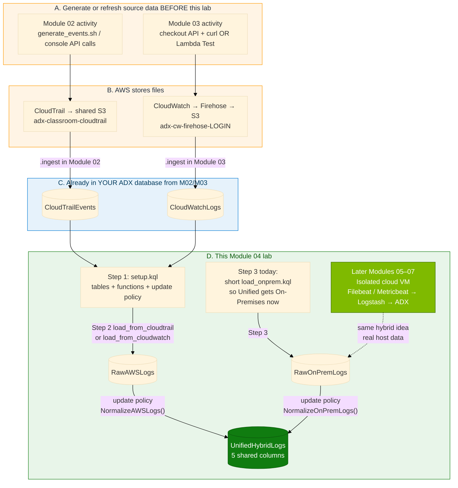
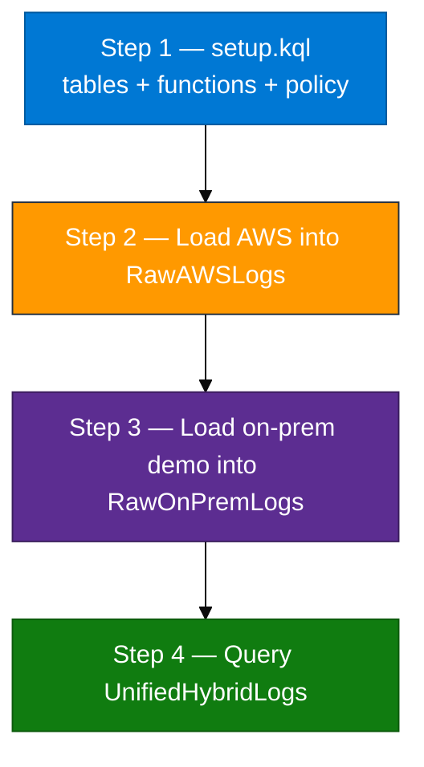

# Module 04 — Lab (Hybrid logs in ADX)

**Reading order:** `04_Hybrid_Primer.md` → `04_Hybrid_Log_Ingestion_Concepts.md` → **this Lab** → `04_Exercises.md`.

**Database:** `ADXTrainingDB_<your-login>` (example: `ADXTrainingDB_u01`).

**KQL files:** `assets/module_04/`.

---

## 1. What this lab is about (plain English)

You already have AWS log data in ADX from earlier modules:

| Earlier module | ADX table you should already have | What that table contains |
|----------------|-----------------------------------|---------------------------|
| Module 02 | `CloudTrailEvents` | One row per AWS API call (after expand) |
| Module 03 | `CloudWatchLogs` | CloudWatch log events from a real API/Lambda |

Those two tables do **not** look the same. A company also has **on-premises** logs (servers, firewalls) that look different again.

This lab builds a **hybrid** analytics table named `UnifiedHybridLogs` so you can ask one question across environments, for example:

> Show ERROR / CRITICAL events from AWS and on-prem on one timeline.

You do **not** build a site-to-site VPN or ExpressRoute in this module. Hybrid unification happens **inside ADX**.

**On-prem / host path (coming next in the course):** you will use a **cloud isolated lab VM**. On that VM you install **Filebeat**, **Metricbeat**, and **Logstash**. Beats capture host/web/metrics data; Logstash processes it and ingests into ADX. Module 04 prepares the unified ADX shape first; Modules 05–07 bring that real host pipeline online.

---

## 2. How data travels (source → destination)

Read this section fully before you run any KQL. Module 04 has **two paths** into the same destination table.

### 2.1 Picture of the full journey



### 2.2 AWS path — what already happened in Modules 02 / 03

Module 04 does **not** pull new files from S3 by itself for the AWS side. It **reuses tables you already filled**.

**CloudTrail path (Module 02):**

1. You ran API activity (`assets/module_02/generate_events.sh` or console/CLI work).
2. Shared trail `adx-classroom-trail` wrote a `.json.gz` into `adx-classroom-cloudtrail`.
3. You `.ingest`ed that object into ADX and expanded into `CloudTrailEvents`.

**CloudWatch path (Module 03):**

1. You built log group → Firehose → S3.
2. You **used** the checkout API (`curl`) or invoked Lambda (not a fake log-only script as the main path).
3. Firehose wrote an object to `adx-cw-firehose-<login>`.
4. You `.ingest`ed into `CloudWatchLogs`.

**Module 04 AWS step:** copy from `CloudTrailEvents` or `CloudWatchLogs` → `RawAWSLogs` → (automatic) → `UnifiedHybridLogs` with `Environment = "AWS"`.

### 2.3 On-premises / host path — today vs next modules

**Today in Module 04 (so Unified can show two environments immediately):**

1. Run `load_onprem.kql`.
2. It inserts a short set of on-premises-shaped rows into `RawOnPremLogs`.
3. The update policy copies simplified rows into `UnifiedHybridLogs` with `Environment = "On-Premises"`.

That lets you finish the hybrid pattern in ADX now (raw tables + policy + unified query).

**Next in the course (real host data through Logstash):**

You will work on a **cloud isolated VM** (shared lab host). On that VM:

1. **Filebeat** / **Metricbeat** capture logs and metrics from the host (auth logs, web access, CPU/memory, and so on).
2. **Logstash** receives those events, parses/enriches them, and **ingests into ADX** (your `ADXTrainingDB_<login>` tables such as `LogstashHostLogs`, `WebServerLogs`, `SystemMetrics`).
3. Those ADX tables are the real host-side feed. You can then project them into the same hybrid / unified idea you build in this module.

So: Module 04 teaches **unify-in-ADX**. Modules 05–07 teach **how real host data arrives** (Beats → Logstash → ADX) from the isolated cloud VM.

### 2.4 What “update policy” means on this path

After Step 1 succeeds:

- Every **new** insert into `RawAWSLogs` runs `NormalizeAWSLogs()` and appends into `UnifiedHybridLogs`.
- Every **new** insert into `RawOnPremLogs` runs `NormalizeOnPremLogs()` and appends into `UnifiedHybridLogs`.

You usually do **not** insert into `UnifiedHybridLogs` by hand.

**Critical:** Create the policy **before** you load raw data. Policies do not rewrite old rows.

---

## 3. Rule for this lab

| Side | What you use in Module 04 | Notes |
|------|---------------------------|-------|
| AWS | Real `CloudTrailEvents` and/or `CloudWatchLogs` from Modules 02/03 | Do not invent AWS rows with a generator script inside Module 04 |
| On-prem / host | `load_onprem.kql` today so Unified shows `On-Premises` now | Real host capture comes next: isolated cloud VM → Filebeat / Metricbeat → Logstash → ADX (Modules 05–07) |

---

## 4. Before Step 1 — make sure source data exists (and how to generate it)

### 4.1 Open the correct database

1. Azure portal → subscription **Pay-As-You-Go** → resource group `rg-adx-training-aug26` → cluster `adxtrainaug26` → **Query**.
2. Database dropdown → `ADXTrainingDB_<your-login>`.
3. Run:

```kusto
print Database = current_database()
```

It must match your login database. If not, stop and fix the dropdown.

### 4.2 Check whether you already have AWS rows

```kusto
CloudTrailEvents | count
CloudWatchLogs | count
```

**Pass for Module 04:** at least one count is **greater than 0**.

### 4.3 If both counts are 0 — generate data first (do not skip)

Module 04 cannot invent AWS history. Go back and produce real activity, then return.

#### Option A — Refresh CloudTrail (Module 02 path)

1. In VS Code bash (card keys configured):

```bash
cd ~/adx-aws-training
export MSYS_NO_PATHCONV=1
bash assets/module_02/generate_events.sh us-east-1 <your-login>
```

2. Wait **5–15 minutes** for a new object under `s3://adx-classroom-cloudtrail/...`.
3. Ingest and expand again using Module 02 lab / `assets/ingest_s3_to_adx.sh --module m02 --login <your-login> ...`.
4. Re-check `CloudTrailEvents | count`.

#### Option B — Refresh CloudWatch (Module 03 path) — preferred if M03 is fresh

1. Confirm Module 03 subscription filter already exists (do not send traffic before the filter).
2. Start the checkout API and call it (real service use):

```bash
cd ~/adx-aws-training
export MSYS_NO_PATHCONV=1
export ADX_LOGIN=<your-login>
export AWS_DEFAULT_REGION=us-east-1
python3 assets/module_03/checkout_api/server.py
```

In another terminal:

```bash
curl -s http://127.0.0.1:8080/health
curl -s -X POST http://127.0.0.1:8080/v1/orders -H "Content-Type: application/json" -d '{"sku":"WIDGET","qty":2}'
curl -s -X POST http://127.0.0.1:8080/v1/login -H "Content-Type: application/json" -d '{"user":"alice","password":"wrong"}'
curl -s -X POST http://127.0.0.1:8080/v1/login -H "Content-Type: application/json" -d '{"user":"alice","password":"secret"}'
```

3. Confirm events in CloudWatch log group `/adx-training/app-logs-<your-login>`.
4. Wait **60–90 seconds**, list `s3://adx-cw-firehose-<your-login>/`, ingest with Module 03 method / `ingest_s3_to_adx.sh --module m03`.
5. Re-check `CloudWatchLogs | count`.

#### Option C — Lambda instead of checkout API

Follow Module 03 Lab Path B: function `checkout-api-<your-login>`, subscription on `/aws/lambda/checkout-api-<your-login>`, **Test** invoke several times **after** the filter exists, then wait / ingest.

### 4.4 If CloudWatch exists but is “thin” (recommended refresh)

If `CloudWatchLogs` has only a few rows, run Option B again so the hybrid AWS side looks meaningful, then continue.

---

## 5. Lab steps overview



---

## Step 1 — Tables, functions, and update policy

### Goal

Prepare ADX so raw inserts can automatically become shared hybrid rows.

### Why this step comes first

If you load raw data **before** the update policy exists, `UnifiedHybridLogs` stays empty for that batch. Policies do not go back in time.

### What `setup.kql` creates (concept)

| Piece | Name | Plain meaning |
|-------|------|----------------|
| Shared table | `UnifiedHybridLogs` | Five columns for one timeline: `LogTime`, `Environment`, `SourceService`, `LogLevel`, `Message` |
| Raw table | `RawAWSLogs` | AWS-shaped holding table (`Timestamp`, `Service`, `Level`, `Details`) |
| Raw table | `RawOnPremLogs` | On-prem-shaped holding table (`EventTime`, `Node`, `Severity`, `LogData`) |
| Function | `NormalizeAWSLogs()` | Maps AWS raw columns → five shared columns; sets `Environment="AWS"` |
| Function | `NormalizeOnPremLogs()` | Maps on-prem raw columns → same five columns; sets `Environment="On-Premises"` |
| Update policy | on `UnifiedHybridLogs` | “On new raw insert, run the matching function and append into Unified” |

“**Normalize**” here means “make different shapes look the same for analytics,” not “ magically clean bad data.”

### Do this exactly

1. Confirm database (`print Database = current_database()`).
2. Open `assets/module_04/setup.kql`.
3. Run the source check at the top:

```kusto
.show tables
| where TableName in ("CloudTrailEvents", "CloudWatchLogs")
```

4. Run counts again (must have data — Section 4):

```kusto
CloudTrailEvents | count
CloudWatchLogs | count
```

5. Run the **rest** of `setup.kql` (all `.create table`, `.create function`, `.alter ... policy update`, and the final `.show ... policy update`).

### Checkpoint

```kusto
.show table UnifiedHybridLogs policy update
```

You must see **both** sources enabled:

- `RawAWSLogs` → `NormalizeAWSLogs()`
- `RawOnPremLogs` → `NormalizeOnPremLogs()`

Also:

```kusto
.show tables
| where TableName in ("UnifiedHybridLogs", "RawAWSLogs", "RawOnPremLogs")
```

### If something is wrong

| Symptom | Fix |
|---------|-----|
| Both M02/M03 counts are 0 | Section 4 — generate/ingest first |
| Policy show empty | Re-run the `.alter table UnifiedHybridLogs policy update` part from `setup.kql` |
| Table already exists | Earlier attempt — ask trainer before dropping; or continue if policy looks correct |
| Wrong database | Fix dropdown; never continue in a classmate DB |

**Do not load data yet.**

---

## Step 2 — Load AWS rows into `RawAWSLogs`

### Goal

Copy **real** Module 02/03 rows into `RawAWSLogs`. The update policy should automatically create `Environment="AWS"` rows in `UnifiedHybridLogs`.

### What happens to the data in this step

```text
CloudTrailEvents  (or CloudWatchLogs)
        │
        │  load_from_cloudtrail.kql  OR  load_from_cloudwatch.kql
        │  (.set-or-append + project into RawAWS shape)
        ▼
   RawAWSLogs
        │
        │  update policy runs NormalizeAWSLogs()
        ▼
 UnifiedHybridLogs   (Environment = "AWS")
```

### Which file to run

| If this is true | Run this file |
|-----------------|---------------|
| `CloudTrailEvents` has rows (preferred) | `assets/module_04/load_from_cloudtrail.kql` |
| `CloudTrailEvents` empty, `CloudWatchLogs` has rows | `assets/module_04/load_from_cloudwatch.kql` |

The CloudTrail load takes up to 100 events and maps fields such as:

- `EventTime` → `Timestamp`
- `EventSource` → `Service`
- error/read-only hints → `Level`
- event name + region → `Details`

### Do this exactly

1. Open the chosen load file.
2. Paste all of it into ADX Query in **your** database.
3. Run.
4. Verify:

```kusto
RawAWSLogs | count
UnifiedHybridLogs
| where Environment == "AWS"
| count
```

### Checkpoint

- `RawAWSLogs | count` > 0  
- Unified shows AWS rows (policy worked)

### If something is wrong

| Symptom | Fix |
|---------|-----|
| Raw is 0 | Wrong file or empty source — fix Section 4 / choose the other load file |
| Raw > 0 but Unified AWS is 0 | Policy was missing — complete Step 1 checkpoint, then **re-run** the load |
| Urge to invent AWS rows | Stop — refresh real M02/M03 data instead |

---

## Step 3 — Load on-premises-shaped rows (and what comes next)

### Goal

Create a second environment value (`On-Premises`) in `UnifiedHybridLogs` so your hybrid query works end-to-end today.

### What happens to the data in this step (today)

```text
load_onprem.kql
  (short on-premises-shaped insert into ADX)
        │
        ▼
  RawOnPremLogs
        │
        │  update policy runs NormalizeOnPremLogs()
        ▼
 UnifiedHybridLogs   (Environment = "On-Premises")
```

### How real host data will arrive later (Modules 05–07)

You will use a **cloud isolated lab VM**. On that VM:

1. **Filebeat** and **Metricbeat** capture host logs and metrics (for example auth logs, web access, CPU/memory).
2. **Logstash** receives those events, processes them (parse / enrich), and **ingests into ADX**.
3. Those ADX tables become your real host-side source. You can project them into the same hybrid / unified pattern you build here.

Module 04 focuses on the **ADX unify pattern**. Modules 05–07 focus on the **Beats → Logstash → ADX** collection path from the isolated VM.

### Do this exactly (today)

1. Open `assets/module_04/load_onprem.kql`.
2. Run all of it.
3. Verify:

```kusto
RawOnPremLogs | count
UnifiedHybridLogs
| where Environment == "On-Premises"
| take 10
```

### Checkpoint

- `RawOnPremLogs` has rows  
- Unified shows `On-Premises` rows  
- You understand the next course path is: isolated cloud VM → Filebeat / Metricbeat → Logstash → ADX  

---

## Step 4 — Query the unified timeline

### Goal

Prove one table answers hybrid questions.

### Do this exactly

1. Run `assets/module_04/validate.kql`.
2. Optionally run `assets/module_04/explore.kql`.
3. Continue with `04_Exercises.md`.

Key check:

```kusto
UnifiedHybridLogs
| summarize n = count() by Environment
```

You want **both** `AWS` and `On-Premises`.

Sample inspection:

```kusto
UnifiedHybridLogs
| take 20
```

### You're done when

- You can explain the AWS journey: activity → S3 (earlier modules) → M02/M03 tables → RawAWSLogs → Unified  
- You can explain today’s on-premises-shaped load into RawOnPremLogs → Unified  
- You can explain the **next** host path: isolated cloud VM → Filebeat / Metricbeat → Logstash → ADX  
- `UnifiedHybridLogs` shows both environments  
- You did **not** invent AWS rows inside Module 04  

### Keep for later

Do not drop `CloudTrailEvents` / `CloudWatchLogs` just because Hybrid worked.  
After Modules 05–07, you will have real host tables from Logstash to connect to this hybrid idea.

---

## Quick failure guide

| Problem | Likely cause | Fix |
|---------|--------------|-----|
| Cannot start Hybrid | No M02/M03 rows | Section 4 generate + ingest |
| Unified empty after loads | Policy after load / policy missing | Step 1 checkpoint, then reload raw |
| Only AWS in Unified | Skipped Step 3 | Run `load_onprem.kql` |
| Only On-Premises in Unified | Skipped Step 2 or empty AWS sources | Section 4 + Step 2 |
| Wrong DB | Dropdown | `print Database` |
| Student building VPN | Misunderstood lab | Stop — unify-in-ADX only today |
