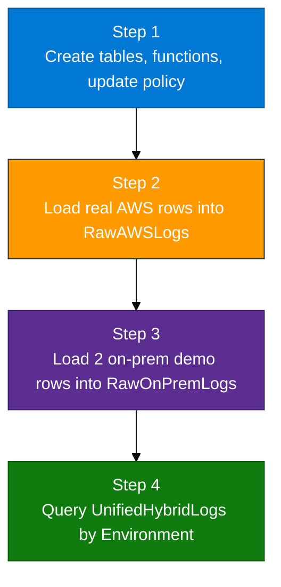

# Module 04 — Lab

This lab builds a **hybrid** view in ADX: AWS logs and on-premises-style logs side by side in one table you can query.

**Reading first (important):**  
`04_Hybrid_Primer.md` → `04_Hybrid_Log_Ingestion_Concepts.md` → this Lab.

KQL files live in `assets/module_04/`.

**Database name:** `ADXTrainingDB_<your-login>`  
Example: if your login is `u01`, use `ADXTrainingDB_u01`.

---

## What you will build (big picture)



After Step 1, ADX is ready but almost empty of hybrid data.  
After Steps 2–3, new rows into the **raw** tables are **automatically copied** (in simplified form) into `UnifiedHybridLogs`. That automatic copy is the **update policy**.

---

## Rule for this lab

| Side | What you must use | What you must not do |
|------|-------------------|----------------------|
| AWS | Real rows already in `CloudTrailEvents` (Module 02) and/or `CloudWatchLogs` (Module 03) | Invent AWS rows with a fake generator script |
| On-prem | The small demo insert in `load_onprem.kql` (two sample rows) | Expect a real VPN / live DC feed in this module |

**If CloudWatch is thin before Step 2:** use the Module 03 checkout API or Lambda again, wait for Firehose, re-ingest (`ingest_s3_to_adx.sh --module m03`). Or do normal console/CLI work and re-ingest CloudTrail (`--module m02`).

---

## Before you click anything

1. Open Azure portal → Pay-As-You-Go → resource group `rg-adx-training-aug26` → cluster `adxtrainaug26` → **Query**.
2. In the database dropdown, select **`ADXTrainingDB_<your-login>`**.
3. Run this check first:

```kusto
print Database = current_database()
```

The result must be exactly your database name. If it is a classmate’s database, **stop** and change the dropdown.

---

## Step 1 — Tables, functions, and policy

### Goal (plain English)

Prepare ADX so that:

1. There is a **shared analytics table** (`UnifiedHybridLogs`) with five columns everyone can query.
2. There are two **raw tables** that keep source-shaped data (`RawAWSLogs`, `RawOnPremLogs`).
3. There are two **normalize functions** that map raw columns → the five shared columns.
4. There is an **update policy** that says: “when a new row is inserted into a raw table, run the matching function and append into `UnifiedHybridLogs`.”

Until this step is done **in this order**, later loads will not fill Unified correctly.

### Why this step exists

Without Step 1:

- You have nowhere clean to put hybrid results.
- Even if you copy AWS rows somewhere, nothing automatically creates the shared five-column view.
- If you load data **before** the update policy exists, those rows will **not** appear in `UnifiedHybridLogs` later (policies do not rewrite history).

### What each piece in `setup.kql` means

Open `assets/module_04/setup.kql` in VS Code and keep it next to this page.

| Part of `setup.kql` | What it creates | Why you need it |
|---------------------|-----------------|-----------------|
| `.show tables` filter | Check only | Confirms Module 02/03 source tables exist before you continue |
| `.create table UnifiedHybridLogs (...)` | Shared table with `LogTime`, `Environment`, `SourceService`, `LogLevel`, `Message` | This is what you query for one timeline across environments |
| `.create table RawAWSLogs (...)` | AWS-shaped raw table (`Timestamp`, `Service`, `Level`, `Details`) | Holding area for AWS rows before/while they are normalized |
| `.create table RawOnPremLogs (...)` | On-prem-shaped raw table (`EventTime`, `Node`, `Severity`, `LogData`) | Holding area for on-prem-style rows |
| `.create function NormalizeAWSLogs()` | KQL function | Renames/maps AWS raw columns into the five unified columns and sets `Environment = "AWS"` |
| `.create function NormalizeOnPremLogs()` | KQL function | Maps on-prem raw columns into the same five columns and sets `Environment = "On-Premises"` |
| `.alter table UnifiedHybridLogs policy update ...` | Update policy | Wires raw inserts → normalize functions → Unified append |
| Final `.show table ... policy update` | Check only | Proves the policy is attached and enabled |

**About the normalize functions:**  
“Normalize” here does **not** mean “clean dirty data.” It means “make different source shapes look the same for analytics.” Example: AWS uses `Timestamp` / `Details`; on-prem uses `EventTime` / `LogData`; Unified always wants `LogTime` / `Message`.

**About the update policy JSON:**  
It lists two sources (`RawAWSLogs` and `RawOnPremLogs`), each with a query (`NormalizeAWSLogs()` / `NormalizeOnPremLogs()`), `IsEnabled=True`, and `IsTransactional=true` (if normalize fails, the raw insert can roll back too).

### Do this exactly

1. Confirm database with `print Database = current_database()` (above).
2. In the ADX Query pane, paste **only** the first two lines from `setup.kql` (the `.show tables` check) and run:

```kusto
.show tables
| where TableName in ("CloudTrailEvents", "CloudWatchLogs")
```

3. Confirm at least one of those tables exists. Then check counts:

```kusto
CloudTrailEvents | count
CloudWatchLogs | count
```

At least one count must be **greater than 0**.  
If both are 0: stop this lab. Finish Module 02 or 03 with **real** activity, ingest again, then return.

4. Paste and run the **rest** of `setup.kql` (all `.create table`, `.create function`, `.alter ... policy update`, and the final `.show ... policy update`).

**If a `.create table` says it already exists** (from an earlier attempt): that is OK for a first retry. If results look wrong later, ask the trainer before dropping tables. Do not invent a new database name.

### Checkpoint — what “good” looks like

Run:

```kusto
.show table UnifiedHybridLogs policy update
```

You should see policy entries for **both**:

- Source `RawAWSLogs` → query `NormalizeAWSLogs()` → enabled  
- Source `RawOnPremLogs` → query `NormalizeOnPremLogs()` → enabled  

Also useful:

```kusto
.show tables
| where TableName in ("UnifiedHybridLogs", "RawAWSLogs", "RawOnPremLogs")
```

All three table names should appear.

### If something is wrong

| What you see | What it means | What to do |
|--------------|---------------|------------|
| Both source counts are 0 | No Module 02/03 data | Go back to M02/M03; do not continue |
| Policy show is empty | `.alter ... policy update` did not run or failed | Re-run the policy section of `setup.kql`; read the error text |
| Only one source in the policy | Partial paste | Run the full `.alter table UnifiedHybridLogs policy update` block again |
| Wrong database name | Dropdown error | Change DB; re-check with `print Database` |

**Do not load AWS/on-prem data yet.** Policy must exist first.

---

## Step 2 — Load AWS rows into `RawAWSLogs`

### Goal (plain English)

Copy **real** Module 02/03 rows into `RawAWSLogs`.  
Because the update policy already exists, ADX should automatically create matching rows in `UnifiedHybridLogs` with `Environment = "AWS"`.

### Why this step exists

The hybrid demo is not useful if the AWS side is fake. Your AWS rows prove: “this unified timeline includes real cloud activity we already captured.”

### Which file to run

| Situation | File to open and run |
|-----------|----------------------|
| `CloudTrailEvents` has rows (preferred) | `assets/module_04/load_from_cloudtrail.kql` |
| `CloudTrailEvents` is empty, but `CloudWatchLogs` has rows | `assets/module_04/load_from_cloudwatch.kql` |

What the CloudTrail load does (conceptually):

- Takes up to 100 rows from `CloudTrailEvents`
- Maps them into `RawAWSLogs` columns (`Timestamp`, `Service`, `Level`, `Details`)
- Uses `.set-or-append` so it adds into `RawAWSLogs`

You do **not** insert into `UnifiedHybridLogs` yourself in this step. The policy should do that.

### Do this exactly

1. Open the chosen load file in VS Code.
2. Copy all of it into ADX Query (still in **your** database).
3. Run it.
4. Check raw and unified:

```kusto
RawAWSLogs | count
UnifiedHybridLogs
| where Environment == "AWS"
| count
```

### Checkpoint

- `RawAWSLogs | count` > 0  
- You should also see AWS rows in `UnifiedHybridLogs` (same count or close, depending on prior runs)

### If something is wrong

| What you see | What it means | What to do |
|--------------|---------------|------------|
| RawAWSLogs is 0 | Wrong load file, or source table empty | Confirm source count; use the other load file if needed |
| Raw has rows, Unified AWS is 0 | Policy missing when you loaded, or policy broken | Run Step 1 checkpoint again; then **re-run** the load after policy is confirmed |
| You feel tempted to type fake AWS rows | That breaks the teaching rule | Stop; refresh real M02/M03 data instead |

---

## Step 3 — Load on-premises demo rows into `RawOnPremLogs`

### Goal (plain English)

Insert **two sample on-prem-style rows** so Unified also shows `Environment = "On-Premises"`.

### Why this step is a demo (say this to yourself)

In production, on-prem logs usually arrive through agents (Logstash / Filebeat — Modules 05–06).  
This classroom has no VPN and no live datacenter feed in Module 04.

So `load_onprem.kql` intentionally inserts two dated sample rows (for example an app-server memory error and a firewall rule update).  
That is enough to prove:

- the second raw table works  
- the second normalize function works  
- Unified can hold more than one environment  

This is **not** how you filled AWS CloudWatch in Module 03.

### Do this exactly

1. Open `assets/module_04/load_onprem.kql`.
2. Run all of it in your database.
3. Check:

```kusto
RawOnPremLogs | count
UnifiedHybridLogs
| where Environment == "On-Premises"
| take 10
```

### Checkpoint

- `RawOnPremLogs | count` = **2** (on a clean first run)  
- Unified shows rows with `Environment == "On-Premises"`

### If something is wrong

| What you see | What to do |
|--------------|------------|
| Raw on-prem is 0 | Re-run `load_onprem.kql`; confirm database |
| Raw is 2, Unified on-prem is 0 | Policy not attached — return to Step 1 checkpoint, then load again |
| Count is 4, 6, … | You ran the load more than once (`.set-or-append` accumulates). That is OK for class; focus on Environment values |

---

## Step 4 — Query the unified timeline

### Goal (plain English)

Prove you can answer hybrid questions from **one** table.

### Do this exactly

1. Run `assets/module_04/validate.kql` (counts + summarize by Environment + sample rows).
2. Optionally run `assets/module_04/explore.kql`.
3. Continue with `04_Exercises.md` if time remains.

Key validation idea:

```kusto
UnifiedHybridLogs
| summarize n = count() by Environment
```

### You're done when

`UnifiedHybridLogs` shows **both**:

- `AWS`
- `On-Premises`

and you understand:

- raw tables keep source shape  
- unified table holds the five shared columns  
- update policy copied rows automatically after Step 1  

### Keep for later

Do **not** drop `CloudTrailEvents` / `CloudWatchLogs` just because Hybrid worked. You may need them again.  
After Modules 05–06, you can later project real host/web logs into the same unified idea.
