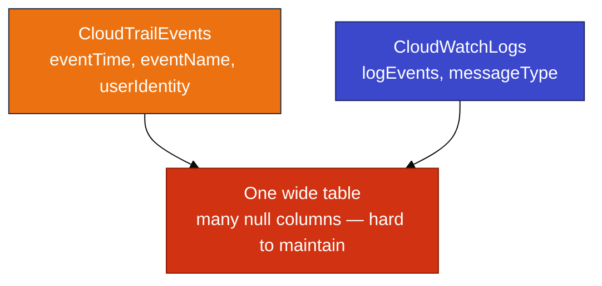
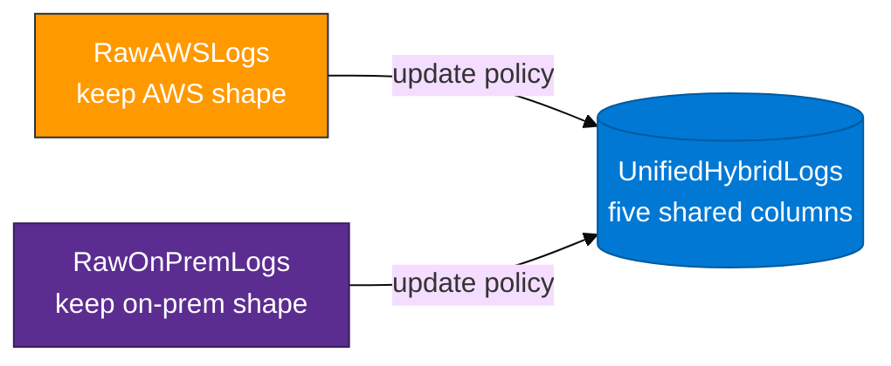
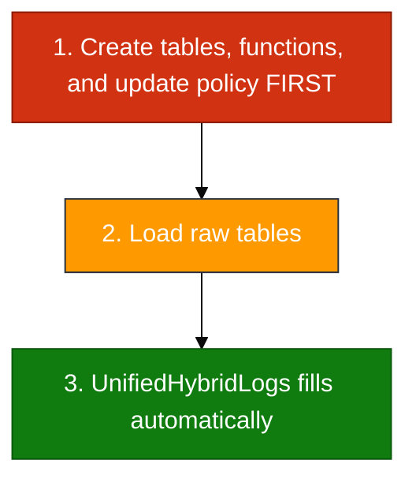

# Module 04 — Hybrid analytics primer

Read this **before** `04_Hybrid_Log_Ingestion_Concepts.md`.

## The problem (plain English)

You already have AWS logs in ADX from earlier modules. Those logs do not all look alike:

- **CloudTrail** rows describe API calls (who called what, when).
- **CloudWatch** rows describe application / service log messages.

If your company also has **on-premises** systems, those logs look different again.

If you try to stuff every field from every source into **one wide table**, you get many empty columns and a schema that breaks whenever one source adds a field.

---

## The pattern (keep raw + unify)

Think of two layers:

### Layer 1 — Raw tables (keep the original shape)

- `RawAWSLogs` stores AWS-side rows in an AWS-friendly shape.
- `RawOnPremLogs` stores on-prem-side rows in an on-prem-friendly shape.

You keep these so you can still investigate source-specific details later.

### Layer 2 — Unified table (shared analytics shape)

- `UnifiedHybridLogs` stores only a **small shared schema** (five columns) so one KQL query can compare AWS and on-prem on one timeline.

### The glue — update policies

An ADX **update policy** means:

> When a new row is inserted into a raw table, ADX automatically runs a normalize function and appends the simplified row into `UnifiedHybridLogs`.

You usually do **not** insert into `UnifiedHybridLogs` by hand for the main path.

---

## The five shared columns

| Column | Question it answers | Example AWS | Example on-prem |
|--------|---------------------|-------------|-----------------|
| `LogTime` | When did it happen? | CloudTrail `EventTime` | Simulated syslog time |
| `Environment` | Which world? | `AWS` | `On-Premises` |
| `SourceService` | Which system? | `eventSource` / log group | `firewall` / `app-server` |
| `LogLevel` | How serious? | derived from errors / info | `ERROR` / `INFO` |
| `Message` | What happened, briefly? | event name + context | free text |

“**Project**” means: calculate or copy these five fields from the richer raw row.

---

## On-prem in this lab

There is **no VPN**, **no ExpressRoute**, and **no live syslog shipper** in the classroom for Module 04.

On-prem rows come from a small **`datatable`** insert (`load_onprem.kql`). That is only a stand-in so you can:

1. See a second `Environment` value (`On-Premises`).
2. Prove the normalize function + update policy work for more than one source.

In production, the same raw table might be fed by Logstash, Filebeat, Event Hub, or batch files (you build agent paths in Modules 05–06).

---

## Policy order (critical)

Update policies run on **new** inserts after the policy is attached. They do not magically rewrite history.

If you load raw data **before** the policy exists, those rows never appear in unified until you load again **after** the policy is in place.

---

## Prerequisites

You need rows in **`CloudTrailEvents`** (Module 02) or **`CloudWatchLogs`** (Module 03) from real earlier activity. If both are empty, complete an earlier module first.
