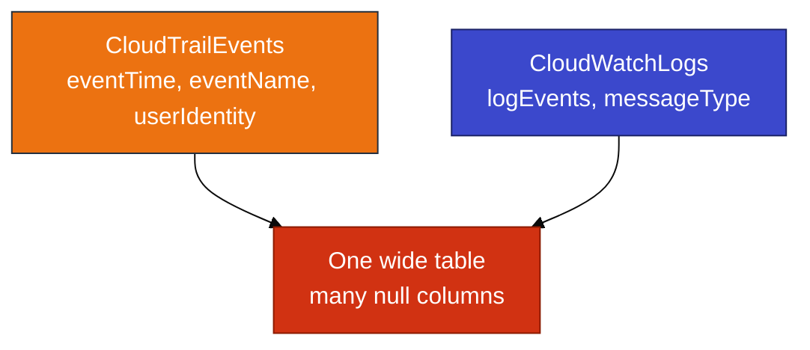
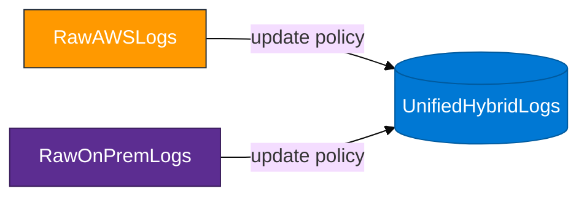
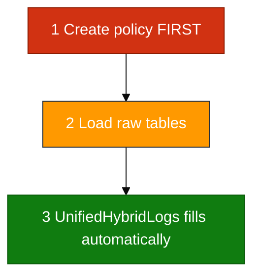

# Module 04 — Hybrid analytics primer

Read this **before** `04_Hybrid_Log_Ingestion_Concepts.md`.

## The problem

CloudTrail and CloudWatch store **different shapes**. A single flat ingest mapping cannot represent both without breaking when either source changes.

## The pattern (keep raw + unify)

1. Keep **source-shaped** raw tables (`RawAWSLogs`, `RawOnPremLogs`).
2. Project a **small shared schema** into `UnifiedHybridLogs`.
3. Use ADX **update policies** to append on each raw insert.

## Unified columns

| Column | Example AWS | Example on-prem |
|--------|-------------|-----------------|
| `LogTime` | CloudTrail `EventTime` | Simulated syslog time |
| `Environment` | `AWS` | `On-Premises` |
| `SourceService` | `eventSource` | `firewall` / `app-server` |
| `LogLevel` | derived from `ErrorCode` | `ERROR` / `INFO` |
| `Message` | `EventName` + context | free text |

## On-prem in this lab

There is **no VPN or syslog shipper** in the classroom. On-prem rows come from a **`datatable`** — a stand-in so you can query one timeline. In production, the same raw table might be fed by Logstash, Event Hub, or batch files.

## Policy order (critical)

If you load raw data **before** the policy exists, those rows never project to unified — load again after fixing.

## Prerequisites

You need rows in **`CloudTrailEvents`** (Module 02) or **`CloudWatchLogs`** (Module 03). If both are empty, complete an earlier module first.
