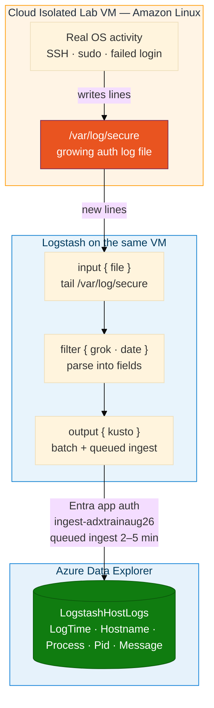
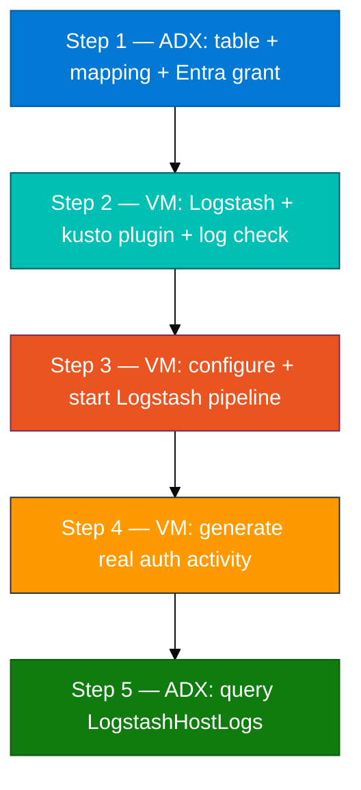

# Module 05 — Lab (Logstash → ADX from the cloud lab VM)

**Reading order:** `05_Logstash_Primer.md` → `05_Logstash_ADX_Integration_Concepts.md` → **this Lab** → `05_Exercises.md`.

**Database:** `ADXTrainingDB_<your-login>` (example: `ADXTrainingDB_u01`).

**KQL files:** `assets/module_05/`.

**Setup:** read `00_Day5_How_We_Work.md` first. Logstash runs on the **shared Linux lab VM**, not on the VS Code host alone.

---

## 1. What this lab is about

In Modules 01–04 you ingested AWS logs (batch, S3-based) and built a hybrid ADX table. Those methods work great when a file already exists in a bucket.

The host on which you work here is a **cloud isolated lab VM** — an Amazon Linux EC2 instance running in the same AWS environment as the rest of this training. It is not physically on-premises, but for this exercise it represents the host tier: an infrastructure component that writes to files like `/var/log/secure` in real time, exactly as a production server would.

**Module 05 connects that VM's live auth log directly into ADX:**

> `/var/log/secure` on the lab VM → Logstash → ADX table `LogstashHostLogs`

You do **not** batch-copy files to S3 first. Logstash tails the file continuously. You produce log lines by doing real OS activity (SSH, sudo, failed login). Those lines appear in `/var/log/secure` → Logstash parses them → events arrive in ADX within 2–5 minutes.

---

## 2. How data travels (source → destination)



**Key facts about this path:**

| Piece | Detail |
|-------|--------|
| Auth log | `/var/log/secure` (Amazon Linux) or `/var/log/auth.log` (Debian/Ubuntu) |
| Logstash binary | `/usr/share/logstash/bin/logstash` |
| Kusto plugin | `logstash-output-kusto` (install via plugin manager) |
| Entra app | `logstash-adx-ingestor` (App ID `afed2047-fb94-41bd-bee5-e8c5b84fa1b8`, Tenant `05f46730-30d9-47bc-b103-d316ee58a3f5`) |
| Ingest endpoint | `https://ingest-adxtrainaug26.centralindia.kusto.windows.net` |
| ADX table | `LogstashHostLogs` in `ADXTrainingDB_<your-login>` |
| Delay | Queued ingest: **2–5 minutes** after a line is written |

---

## 3. Turn-taking on the shared VM

The lab VM is **shared**. Before you start Logstash:

1. Ask the group: "Is anyone running Logstash right now?"
2. If yes, wait or coordinate so two instances do not use the same `--path.data` directory.
3. If the previous student left Logstash running: `sudo pkill -f logstash` (confirm with the instructor first).
4. Use a **unique** `--path.data` for your run, for example `/tmp/logstash-lab/data-u01` for login `u01`.

This prevents sincedb conflicts and ensures each student's Logstash reads from its own file-position state.

---

## 4. How to generate auth log data (do NOT invent a fake file)

Logstash tails `/var/log/secure`. That file fills when **real OS actions** happen:

| Action to take | What appears in `/var/log/secure` |
|----------------|-----------------------------------|
| `sudo true` or `sudo ls /root` | `sudo: <user> : TTY=pts/0 …` |
| `ssh baduser@127.0.0.1` (expect fail) | `Invalid user baduser` / `Connection closed` |
| Open a second SSH session to the VM | `Accepted publickey for <user>` |
| `su - otheruser` then exit | `su: …` authentication lines |
| `sudo -l` (list sudo perms) | `sudo: list` lines |

**Do not** create a fake log file under `/tmp` and point Logstash at it as the main pipeline. The purpose of this lab is a live tail of a real auth log: the log file grows because real things happen on the system, and Logstash picks them up.

Check that lines exist **before** starting Logstash:

```bash
sudo tail -n 10 /var/log/secure 2>/dev/null || sudo tail -n 10 /var/log/auth.log
```

You must see recent syslog-formatted lines. If the file is completely empty, run `sudo true` a few times to seed it.

---

## 5. Lab steps overview



---

## Step 1 — ADX setup: table, mapping, and Entra grant

### Goal

Create `LogstashHostLogs` and its JSON ingestion mapping in **your** ADX database, then grant the Entra app `logstash-adx-ingestor` the Ingestor role on that database.

### Why this step comes first

The Logstash kusto plugin sends JSON blobs to ADX. ADX needs three things in place before any data can land:

1. A **table** with named columns (`LogTime`, `Hostname`, `Process`, `Pid`, `Message`).
2. A **JSON mapping** that tells ADX which JSON key maps to which column (e.g. `$.LogTime` → `LogTime`).
3. The **Entra app** listed as a Database Ingestor — without this, the plugin authenticates successfully but all ingest calls are rejected silently.

### What `create_tables.kql` does

| Command | Purpose |
|---------|---------|
| `.create table LogstashHostLogs (...)` | Defines 5 typed columns |
| `.create table LogstashHostLogs ingestion json mapping 'LogstashHostLogsMapping' [...]` | Maps `$.LogTime` → `LogTime`, `$.Hostname` → `Hostname`, etc. |
| `.add database [...] ingestors (...)` | Grants `logstash-adx-ingestor` the Ingestor role on your database |
| `.show database [...] principals` | Confirms the grant took effect |

### Do this exactly

1. In lab VS Code, open `assets/module_05/create_tables.kql` (run `git pull` first if Module 05 is missing — see `00_Day5_How_We_Work.md`).
2. In Azure Data Explorer Web UI, select database `ADXTrainingDB_<your-login>`.
3. Confirm you are in the right database:

```kusto
print Database = current_database()
```

4. Replace the two placeholders in the `.add database` line:
   - `[CLIENT_ID]` → `afed2047-fb94-41bd-bee5-e8c5b84fa1b8`
   - `[TENANT_ID]` → `05f46730-30d9-47bc-b103-d316ee58a3f5`
   - Database name → `ADXTrainingDB_<your-login>` (both occurrences)
5. Run the entire file.

### Checkpoint

```kusto
.show tables
| where TableName == "LogstashHostLogs"
```

```kusto
.show database ['ADXTrainingDB_<your-login>'] principals
| where PrincipalType == "App" and Role == "Ingestor"
```

You must see:
- `LogstashHostLogs` in the table list.
- At least one row in principals showing the Entra app (App ID starting with `afed2047`) as Ingestor.

### If something is wrong

| Symptom | Fix |
|---------|-----|
| `.show tables` does not list `LogstashHostLogs` | Re-run `create_tables.kql` from the correct database |
| Principals output is empty / app not listed | Re-run the `.add database` line after fixing `[CLIENT_ID]` and `[TENANT_ID]` placeholders |
| "Access denied" when running KQL | You are in the wrong database — fix the dropdown and re-confirm with `print Database` |
| Table already exists from a previous attempt | Check the mapping also exists; if the structure matches, continue |

---

## Step 2 — Install Logstash (if needed), kusto plugin, prep directories

On the **Linux lab VM** (see `00_Day5_How_We_Work.md`).

### Goal

Confirm Logstash is present (install it if the VM is fresh), install the `logstash-output-kusto` plugin, confirm `/var/log/secure` is readable, and create the staging directories the plugin needs.

The shared lab VM may not have Logstash pre-installed. The first student on a new VM runs the **Install Logstash** block below; everyone else checks the binary and moves on.

### Why a staging directory?

The kusto plugin v2.x does not stream events directly to ADX. It buffers parsed events into local text files in a staging path (e.g. `/tmp/kusto/`), then uploads each staging file as a batch. The staging `path` must include a **time token** (`%{+YYYY-MM-dd-HH-mm}`) so the plugin rotates files by minute. If you remove `@timestamp` from the event, the path token resolves to a literal string and file rotation breaks silently — nothing reaches ADX.

### Do this exactly

**A — Confirm host and Logstash**

```bash
which logstash 2>/dev/null || ls /usr/share/logstash/bin/logstash 2>/dev/null
```

If you get a path (for example `/usr/share/logstash/bin/logstash`), skip to **B**.

If both commands fail, install Logstash on **Amazon Linux** (lab VM):

```bash
sudo rpm --import https://artifacts.elastic.co/GPG-KEY-elasticsearch

sudo tee /etc/yum.repos.d/logstash.repo <<'EOF'
[logstash-8.x]
name=Elastic repository for 8.x packages
baseurl=https://artifacts.elastic.co/packages/8.x/yum
gpgcheck=1
gpgkey=https://artifacts.elastic.co/GPG-KEY-elasticsearch
enabled=1
autorefresh=1
type=rpm-md
EOF

sudo yum install -y logstash

/usr/share/logstash/bin/logstash --version
```

Install takes a few minutes and needs outbound HTTPS from the VM. Tell the trainer if `yum install` fails.

**B — Auth log**

```bash
sudo tail -n 10 /var/log/secure 2>/dev/null || sudo tail -n 10 /var/log/auth.log
```

You should see syslog lines (timestamp, hostname, process, message). If the file is empty, run `sudo true` a few times and tail again.

**C — Kusto output plugin**

```bash
cd /usr/share/logstash
sudo bin/logstash-plugin install logstash-output-kusto
bin/logstash-plugin list --verbose | grep kusto
```

If the plugin is already listed, skip the install line.

**D — Staging directories**

```bash
sudo mkdir -p /tmp/kusto /tmp/logstash-lab
sudo chmod 777 /tmp/kusto
```

**E — AWS CLI (only if Step 3 needs the secret on this VM)**

If you will run `aws ssm get-parameter` on the lab VM:

```bash
aws --version
```

If `aws` is missing:

```bash
sudo dnf install -y awscli
aws --version
```

Configure with your **card** keys (`aws configure`, region `us-east-1`) — same as Day 1. If you prefer, run the SSM command from **VS Code** instead and paste the secret into the pipeline config on the lab VM.

### Checkpoint

- `/usr/share/logstash/bin/logstash --version` prints a version (8.x).
- `bin/logstash-plugin list | grep kusto` shows `logstash-output-kusto`.
- `sudo tail` on `/var/log/secure` (or `auth.log`) returns recent lines.
- `/tmp/kusto` and `/tmp/logstash-lab` exist.

### If something is wrong

| Symptom | Fix |
|---------|-----|
| `logstash` not found after install | Use full path `/usr/share/logstash/bin/logstash`; confirm you are on the Linux lab VM, not VS Code |
| `yum install logstash` fails (GPG / repo) | Re-run the `rpm --import` and repo file block; check VM has internet |
| Plugin install fails (timeout) | Retry once; confirm HTTPS to `artifacts.elastic.co` and RubyGems is allowed |
| `/var/log/secure` permission denied | Use `sudo tail …` |
| Auth log completely empty | `sudo true` several times, then re-check |
| `aws: command not found` on lab VM | Install with `sudo dnf install -y awscli`, or fetch the secret from VS Code |
| `AccessDenied` on SSM | Use your card IAM user (`u01`…`u06`), not a reader user |
| `u01 is not in the sudoers file` | Tell the trainer — run `grant_sudo_lab_users.sh` on this VM |

---

## Step 3 — Pipeline configuration and start

On the **Linux lab VM**.

### Goal

Copy the example pipeline config, fill in the five connection values, and start Logstash tailing `/var/log/secure`.

### What the pipeline config contains

| Section | Key setting | Your value |
|---------|------------|------------|
| `input { file }` | `path` | `/var/log/secure` (or `/var/log/auth.log` on Debian/Ubuntu) |
| `filter { grok }` | `ecs_compatibility => disabled` | Required — without this, Logstash 8 renames fields and ADX mapping fails |
| `filter { date }` | `target => "LogTime"` | Writes the parsed timestamp into the `LogTime` column |
| `output { kusto }` | `ingest_url` | `https://ingest-adxtrainaug26.centralindia.kusto.windows.net` |
| `output { kusto }` | `app_id` | `afed2047-fb94-41bd-bee5-e8c5b84fa1b8` |
| `output { kusto }` | `app_tenant` | `05f46730-30d9-47bc-b103-d316ee58a3f5` |
| `output { kusto }` | `app_key` | from SSM `/adx/lab/entra-secret` (see Day 5 setup doc) |
| `output { kusto }` | `database` | `ADXTrainingDB_<your-login>` |
| `output { kusto }` | `path` | `/tmp/kusto/%{+YYYY-MM-dd-HH-mm}.txt` |

### Do this exactly

1. Get the client secret (paste into the conf only — do not commit). On the lab VM if `aws` works; otherwise from VS Code:

```bash
aws ssm get-parameter --name /adx/lab/entra-secret --with-decryption \
  --query Parameter.Value --output text
```

If `aws` is not set up on the lab VM, see Step 2E or run this from VS Code and copy the value across.

2. Copy the example on the lab VM:

```bash
cp /opt/adx-aws-training/assets/module_05/adx-pipeline.conf.example /tmp/logstash-lab/adx-pipeline.conf
```

If `/opt/adx-aws-training` is not on the lab VM, copy the file from VS Code or ask the trainer.

3. Edit the config:

```bash
nano /tmp/logstash-lab/adx-pipeline.conf
```

Fill in these five values:

```text
ingest_url => "https://ingest-adxtrainaug26.centralindia.kusto.windows.net"
app_id     => "afed2047-fb94-41bd-bee5-e8c5b84fa1b8"
app_key    => "<value-from-ssm>"
app_tenant => "05f46730-30d9-47bc-b103-d316ee58a3f5"
database   => "ADXTrainingDB_<your-login>"
```

4. Validate the config syntax before starting:

```bash
cd /usr/share/logstash
sudo bin/logstash \
  --path.settings /etc/logstash \
  -f /tmp/logstash-lab/adx-pipeline.conf \
  --config.test_and_exit
```

You should see `Configuration OK`.

5. Start Logstash using a **unique** `--path.data` for your login:

```bash
sudo bin/logstash \
  --path.settings /etc/logstash \
  --path.data /tmp/logstash-lab/data-<your-login> \
  -f /tmp/logstash-lab/adx-pipeline.conf
```

6. Watch the startup messages for 30–60 seconds. You should see lines like:

```
[INFO ][logstash.inputs.file] Registering file input ...
[INFO ][logstash.outputs.kusto] ...
```

Leave Logstash running in this terminal. Open a **second terminal** for Step 4.

### Checkpoint

- Config validation returns `Configuration OK`.
- Logstash startup log does **not** show `ERROR` or `FATAL` in the first 30 seconds.
- After 30–60 seconds you see Logstash processing events (lines mentioning `kusto` in the output).

### If something is wrong

| Symptom | Fix |
|---------|-----|
| `Configuration OK` but Logstash exits immediately | Finished reading the file from `start_position => "beginning"` — set `sincedb_path => "/dev/null"` and restart, or generate new activity and it will tail again |
| `ERROR … field … not found` or fields showing as `%{fieldname}` | `ecs_compatibility` is not `disabled` — edit the conf and add it to the grok block |
| `ERROR … access denied` on `/tmp/kusto` | `sudo chmod 777 /tmp/kusto` then restart Logstash |
| `FATAL … address already in use` | Another Logstash is running — `sudo pkill -f logstash`, wait, retry |
| Logstash starts but ADX table stays empty after 5+ minutes | Check that ingest URL starts with `https://ingest-` not the query URL; also check Step 1 Entra grant |

---

## Step 4 — Generate real auth activity (while Logstash runs)

In a **second terminal on the same Linux lab VM** (Logstash still running in the first).

### Goal

Produce lines in `/var/log/secure` that Logstash will parse and send to ADX.

### Why real activity (not a fake file)

A fake `/tmp/fake.log` you edit by hand teaches nothing about production log collection. The whole point of this module is: **the log file grows because real things happen on the system**, and Logstash picks them up in real time. The actions below are exactly what you would take on a real production server to test your auth pipeline.

### Do this exactly

In a **second terminal** (Logstash running in the first):

```bash
# Seed a few sudo events
sudo true
sudo ls /root
sudo -l

# Trigger a failed SSH attempt (will fail — that is the point)
ssh baduser@127.0.0.1

# su attempt with wrong password
su - root
# enter a wrong password intentionally, then Ctrl+D to exit
```

Watch the auth log live in a third terminal or pane:

```bash
sudo tail -f /var/log/secure
```

You should see new timestamped lines appearing as you perform each action. Each line Logstash picks up will be visible in the Logstash terminal as an event being processed.

Leave Logstash running for **at least 2–3 minutes** after generating activity. Queued ingest has a latency of 2–5 minutes before events appear in ADX.

### Checkpoint

- `sudo tail -f /var/log/secure` shows new timestamped lines for your actions.
- Logstash terminal shows events being processed with no sustained errors.
- After 2–5 minutes, proceed to Step 5 to verify in ADX.

---

## Step 5 — Query `LogstashHostLogs`

### Goal

Confirm that events you caused on the VM now appear in your ADX table.

### Do this exactly

1. Run `assets/module_05/validate.kql` in `ADXTrainingDB_<your-login>`.
2. Run spot queries:

```kusto
LogstashHostLogs | count
```

```kusto
LogstashHostLogs
| order by LogTime desc
| take 20
```

```kusto
// Which processes logged events?
LogstashHostLogs
| summarize n = count() by Process
| order by n desc
```

```kusto
// Look for sudo and sshd specifically
LogstashHostLogs
| where Process in ("sudo", "sshd", "su")
| order by LogTime desc
| take 30
```

3. Then run `assets/module_05/explore.kql` and continue to `05_Exercises.md`.

### You are done when

- `LogstashHostLogs | count` is greater than 0.
- At least some rows have `Process` values matching things you actually did (e.g. `sudo`, `sshd`).
- You can explain the journey: OS action → `/var/log/secure` → Logstash grok/date → kusto plugin queued ingest → ADX.
- You understand the 2–5 minute queued ingest delay is normal, not a bug.

---

## Quick failure guide

| Problem | Likely cause | Fix |
|---------|--------------|-----|
| `logstash: command not found` | Not installed on fresh lab VM | Lab Step 2A — Elastic yum repo + `sudo yum install -y logstash` |
| `Plugin not found: logstash-output-kusto` | Plugin not installed | Step 2C — `sudo bin/logstash-plugin install logstash-output-kusto` |
| `LogstashHostLogs` does not exist | Step 1 not run | Run `create_tables.kql` in the correct database |
| Table exists but count stays 0 after 5+ min | Entra grant missing OR wrong ingest URL | Check principals; confirm URL starts with `https://ingest-` |
| Count stays 0 with correct URL + grant | ECS compatibility on → field names differ from mapping | Add `ecs_compatibility => disabled` inside the `grok { }` block |
| Count stays 0, everything else looks correct | `@timestamp` removed → staging path broken | Remove `@timestamp` from the `remove_field` list |
| Logstash exits immediately after start | sincedb reached end of file with no new lines | Generate auth activity, or set `sincedb_path => "/dev/null"` and restart |
| Two students' events mixing | Shared `--path.data` directory | Use unique path per login: `/tmp/logstash-lab/data-<your-login>` |
| ADX shows rows but `Pid` is always 0 | Process had no `[pid]` bracket — mutate default sets 0 | Expected behavior — not a bug |
| Wrong database in ADX | Dropdown not set correctly | `print Database = current_database()` and fix |
