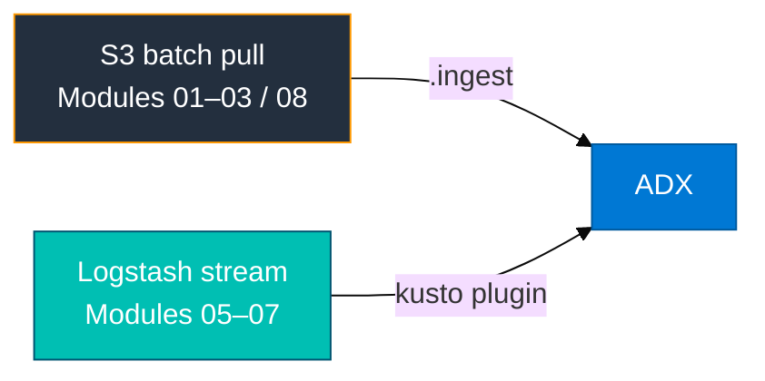
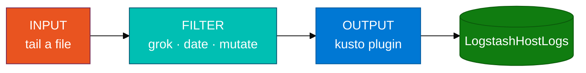

# Module 05 — Logstash primer

Read this **before** `05_Logstash_ADX_Integration_Concepts.md`.

## Why not S3?

Modules 01–03 and 08 ingest data using **batch pull from S3**: a file exists in a bucket, you run `.ingest`, and ADX downloads it. That works well for CloudTrail and CloudWatch Firehose output.

A live host log like `/var/log/secure` grows line by line as events happen. There is no S3 file to poll. You need a **shipper** — a process that tails the file and pushes new lines as they arrive. **Logstash** is that shipper.



---

## The lab VM

Modules 05–07 use a **cloud isolated lab VM** — an Amazon Linux EC2 instance in the same AWS environment as this training. From a pipeline perspective it represents the **host tier**: a server that writes logs like `/var/log/secure` in real time, exactly as a production host would.

You SSH into this VM, run Logstash there, generate activity (SSH, sudo), and the logs flow from the VM directly into your ADX database. No S3 in the middle.

---

## Logstash pipeline — three stages

Every Logstash pipeline has three sections:



| Stage | What it does | In this lab |
|-------|-------------|-------------|
| **input** | Reads new lines from a file | Tails `/var/log/secure` (Amazon Linux) |
| **filter** | Splits a raw line into named fields | `grok` → `Hostname`, `Process`, `Pid`, `Message`; `date` → `LogTime` |
| **output** | Sends parsed events to a destination | `logstash-output-kusto` → Entra app → ADX ingest endpoint |

---

## Auth: Entra app, not IAM

There is no S3 URI or IAM key in this module. The kusto output plugin authenticates with Azure Entra (formerly AAD):

| Field in config | Value for this training |
|----------------|------------------------|
| `app_id` | `afed2047-fb94-41bd-bee5-e8c5b84fa1b8` |
| `app_tenant` | `05f46730-30d9-47bc-b103-d316ee58a3f5` |
| `app_key` | *(instructor provides at lab time — sensitive)* |
| `ingest_url` | `https://ingest-adxtrainaug26.centralindia.kusto.windows.net` |

The `app_id` and `app_tenant` are class-shared non-secret identifiers. The `app_key` is sensitive — do not write it into a file tracked by git.

**Critical:** Use the **ingest** URL (starts with `https://ingest-`). The query URL (`https://adxtrainaug26…`) accepts the authentication but silently rejects all ingest calls. The table stays empty with no clear error message.

---

## Vocabulary

| Term | Meaning |
|------|---------|
| **grok** | A Logstash filter that matches a raw string against a named pattern and extracts fields from it |
| **ECS** | Elastic Common Schema — Logstash 8 enables v8 by default and renames grok output fields; the lab disables it |
| **Queued ingest** | ADX's normal ingestion mode: events are batched internally and typically appear after 2–5 minutes |
| **sincedb** | Logstash's file that records the read offset in each tailed file; determines where tailing resumes after a restart |
| **@timestamp** | Logstash's internal event timestamp; required for the kusto plugin's staging path time token |
| **staging path** | Local temp directory where the kusto plugin buffers events before uploading them to ADX as a batch |

---

## Before the lab — check these on the VM

Run these before Step 1 of the lab to avoid surprises:

```bash
# Logstash binary
which logstash 2>/dev/null || ls /usr/share/logstash/bin/logstash

# Auth log readable and non-empty?
sudo tail -n 5 /var/log/secure 2>/dev/null || sudo tail -n 5 /var/log/auth.log

# kusto plugin installed?
/usr/share/logstash/bin/logstash-plugin list --verbose 2>/dev/null | grep kusto
```

**Checkpoint:** You see a Logstash binary path, recent syslog-formatted lines, and the kusto plugin name and version.

---

## Common mistakes

| Mistake | Symptom |
|---------|---------|
| Query URL instead of ingest URL | Plugin starts; table stays empty with no clear error |
| ECS grok not disabled | Table empty — field names are renamed by ECS and do not match the ADX mapping |
| `@timestamp` in `remove_field` | Staging path token breaks; no data reaches ADX |
| Querying ADX within the first 2 minutes | Queued ingest still in flight — wait and retry |
| Shared `--path.data` with another student | sincedb conflict; events skipped or replayed incorrectly |
| Pointing Logstash at a fake `/tmp` file | Pipeline works mechanically but teaches the wrong habit — use `/var/log/secure` |
