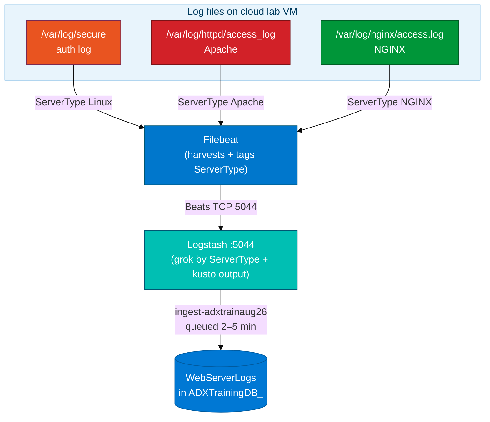

# Module 06 — Filebeat to ADX: Concepts

> **Reading order:** `06_Filebeat_Primer.md` → Concepts (this file) → Lab → Exercises.

## Why add Filebeat on top of Logstash?

Module 05 had Logstash **read the file directly** using `input { file }`. That works for one or two files on one host. At real scale:

- You have many hosts, each with many log files.
- Running full Logstash on every host is memory-intensive — Logstash runs on the JVM and consumes hundreds of MB per instance.
- Different files on the same host have different formats that need different grok patterns.

**Filebeat** is a lightweight Go binary — it consumes far less RAM than Logstash. It harvests files, remembers read offsets, and ships events over the **Beats protocol** to a central Logstash for parsing. In production, you deploy a small Filebeat on each server and one shared Logstash per region or cluster.

In this lab everything is on the **same cloud isolated lab VM** for simplicity. Filebeat ships to `localhost:5044`. Logstash listens on `localhost:5044`. The architecture is identical to a multi-host deployment.

---

## The `ServerType` tag: how one table holds three log formats

`WebServerLogs` holds three completely different line formats:

| Source | Format |
|--------|--------|
| `/var/log/secure` | Syslog (auth events) |
| `/var/log/httpd/access_log` | Apache Combined Log Format |
| `/var/log/nginx/access.log` | NGINX Combined Log Format |

Filebeat makes them distinguishable by adding a **tag** to every event before shipping it:

```yaml
fields:
  ServerType: "Linux"    # or "Apache" or "NGINX"
fields_under_root: true
```

`fields_under_root: true` places `ServerType` at the top level of the JSON event — not nested under a `fields` key. This means:

- Logstash can read `[ServerType]` directly in its `if` branch.
- ADX JSON mapping sees `$.ServerType` at the event root.

**Critical:** Do not include `ServerType` in Logstash's `remove_field` mutate. If you do, every row in `WebServerLogs` gets a `null` ServerType and you cannot tell nginx access from Apache access from auth logs in KQL.

---

## Branched grok: different parsers for different line shapes

The Logstash pipeline branches on `ServerType`:

```
if [ServerType] == "Linux"   →  syslog grok
else                          →  Combined Log Format grok  (Apache + NGINX share this format)
```

**Linux syslog example:**

```
Aug 31 09:14:23 ip-10-0-1-42 sudo: student : TTY=pts/0 ; COMMAND=/usr/bin/ls
```

**NGINX / Apache Combined Log Format example:**

```
192.168.1.5 - - [31/Aug/2026:09:15:02 +0000] "GET /index.html HTTP/1.1" 200 612 "-" "curl/7.61.1"
```

The syslog pattern has no HTTP status code. Logstash sets `StatusCode = 0` (integer) for Linux rows so the column type is consistent across all rows. In KQL, `where StatusCode > 0` filters to web hits only.

---

## Port 5044 and process start order

Filebeat connects **outbound** to Logstash on port 5044. You must start Logstash first:

```
Required start order:   Logstash :5044  →  Filebeat
```

If you start Filebeat first, it tries to connect, fails, backs off, and retries. Once Logstash opens 5044, Filebeat will eventually connect — but you waste time and get confusing connection-refused errors. Always confirm 5044 is open before launching Filebeat:

```bash
ss -lntp | grep 5044
```

---

## Data flow — full path from file to ADX



---

## Same kusto rules as Module 05

| Trap | Symptom | Fix |
|------|---------|-----|
| ECS grok enabled | Fields renamed → ADX mapping fails → empty table | `ecs_compatibility => disabled` in both grok blocks |
| Wrong ingest URL (query URL used) | Authenticates but rows never appear | Use `https://ingest-adxtrainaug26.centralindia.kusto.windows.net` |
| `@timestamp` in `remove_field` | Staging file path token breaks | Remove `@timestamp` from the remove_field list |
| Queried ADX too early | Count shows 0 while data is in flight | Wait 2–5 minutes |

---

## generate_log_lines.sh — what it actually does

This script:

1. Installs `nginx` and `httpd` if not present (`yum install -y`).
2. Starts both services.
3. Makes a small number of test curl requests to seed the access logs.

It is a **bootstrap** — run it **once** to ensure the services exist. After the services are running, you generate traffic yourself with `curl`. If you only run the script and then immediately query ADX, `WebServerLogs` will have very few rows (or none, depending on timing).

---

## What `StatusCode = 0` means for Linux rows

Syslog lines from `/var/log/secure` carry no HTTP status code. Logstash adds:

```
mutate { add_field => { "StatusCode" => "0" }
         convert  => { "StatusCode" => "integer" } }
```

This keeps the `StatusCode` column as `int` consistently across all three row types. In KQL:

- `where StatusCode > 0` → web hits only (Apache + NGINX rows)
- `where ServerType == "Linux"` → auth events
- `where StatusCode == 404` → not-found errors from web traffic

---

## Port discipline before Module 07

Module 07 uses Metricbeat on port **5045** and needs its own Logstash instance. If the Module 06 Logstash is still holding port 5044 when Module 07 starts:

- Module 07 Logstash may fail to bind to 5045 if the process is misconfigured.
- Or Metricbeat may end up shipping to the Module 06 Logstash on 5044, pointing at the wrong table.

Always stop Filebeat and the 5044 Logstash cleanly, confirm `ss -lntp | grep 5044` returns empty, and only then proceed to Module 07.

---

## Debian/Ubuntu path substitutions

All paths above are Amazon Linux defaults. On Debian/Ubuntu:

| Amazon Linux | Debian/Ubuntu |
|--------------|---------------|
| `/var/log/secure` | `/var/log/auth.log` |
| `/var/log/httpd/access_log` | `/var/log/apache2/access.log` |
| `/var/log/nginx/access.log` | `/var/log/nginx/access.log` (same) |

Update the `filebeat.yml` paths accordingly if the lab VM runs a different distro.
