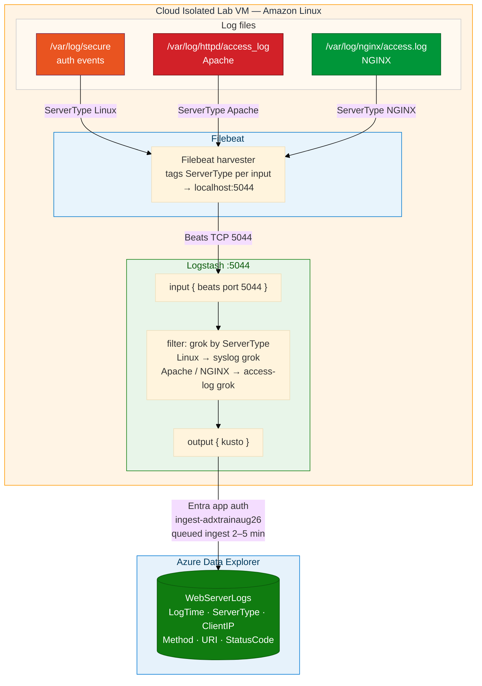
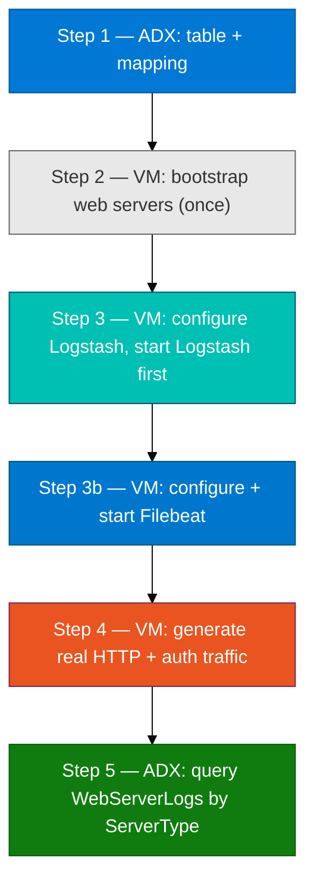

# Module 06 — Lab (Filebeat → Logstash → ADX from the cloud lab VM)

**Reading order:** `06_Filebeat_Primer.md` → `06_Filebeat_ADX_Integration_Concepts.md` → **this Lab** → `06_Exercises.md`.

**Database:** `ADXTrainingDB_<your-login>` (example: `ADXTrainingDB_u06`).

**KQL files:** `assets/module_06/`.

**VM:** Same shared cloud isolated lab VM as Module 05 — coordinate turn-taking.

**Stop reminder:** Stop Filebeat and the 5044 Logstash process **before Module 07**. Module 07 uses port 5045 for Metricbeat; leaving 5044 open causes a port conflict.

---

## 1. What this lab is about (plain English)

In Module 05, Logstash read `/var/log/secure` by itself using `input { file }`. That approach works for a single file on one machine. In production you have **many hosts, each with many log files** — auth logs, web server access logs, application logs. Running Logstash directly on every host to read every file is memory-intensive and hard to manage.

**Filebeat** solves this. It is a lightweight agent that:

- Harvests multiple files simultaneously and remembers its read position in each.
- Tags each event with metadata (which file, which server type).
- Ships events over the **Beats protocol** (TCP port 5044) to a central Logstash for parsing.

In this lab, Filebeat and Logstash are both on the **same cloud isolated lab VM** — `localhost` is the Beats target. The architecture is identical to a real multi-host deployment; the classroom just uses one node for everything.

**This module ingests three kinds of log line into one ADX table `WebServerLogs`:**

| Source file | Tag applied by Filebeat | What the data looks like |
|-------------|------------------------|--------------------------|
| `/var/log/secure` | `ServerType: "Linux"` | Syslog-format auth events |
| `/var/log/httpd/access_log` | `ServerType: "Apache"` | Apache Combined Log Format |
| `/var/log/nginx/access.log` | `ServerType: "NGINX"` | NGINX access log format |

You generate traffic by making **real HTTP requests** with `curl`. `generate_log_lines.sh` is a bootstrap that installs/starts nginx and httpd. It does **not** produce the ongoing traffic you need for the lab — you do that yourself.

---

## 2. How data travels (source → destination)



**Key facts about this path:**

| Piece | Detail |
|-------|--------|
| Filebeat inputs | `/var/log/secure`, `/var/log/httpd/access_log`, `/var/log/nginx/access.log` (Amazon Linux) |
| Beats port | `5044` — local, Filebeat to Logstash on same VM |
| Logstash grok | Branched: syslog pattern for `ServerType = Linux`; Combined Log Format for Apache/NGINX |
| Linux `StatusCode` | Set to `0` by Logstash (syslog lines have no HTTP status) |
| Ingest endpoint | `https://ingest-adxtrainaug26.centralindia.kusto.windows.net` |
| Entra app | `logstash-adx-ingestor` — same as Module 05 |
| ADX table | `WebServerLogs` in `ADXTrainingDB_<your-login>` |
| Delay | Queued ingest: **2–5 minutes** after a line is written |

---

## 3. How to generate web traffic data (your job, not the script's)

`generate_log_lines.sh` installs and starts nginx/httpd. It is a **bootstrap** — run it once. After that, generate traffic by **acting like a client**:

| Command | What it does | Log file affected |
|---------|-------------|-------------------|
| `curl -s -o /dev/null -w "%{http_code}\n" http://127.0.0.1/` | 200 GET request | nginx or httpd access log |
| `curl -s -o /dev/null -w "%{http_code}\n" http://127.0.0.1/missing-page` | 404 GET request | access log |
| `curl -s -o /dev/null -A "Mozilla/5.0 LabBrowser" http://127.0.0.1/` | Custom user-agent | access log |
| `sudo true` | Auth event | `/var/log/secure` |

Repeat every 30–60 seconds while Filebeat is running. The more requests you make, the richer your `WebServerLogs` data.

---

## 4. Before Step 1 — coordinate on the shared VM

Before starting anything:

1. Check if another student's Logstash is running on port 5044:

```bash
ss -lntp | grep 5044
```

If output is non-empty, coordinate with the group. Wait for the current student to finish, or ask the instructor to confirm the VM is free.

2. Check for a leftover Module 05 Logstash:

```bash
ps aux | grep logstash
```

If Logstash is still running from Module 05, stop it first:

```bash
sudo pkill -f logstash
```

Then confirm port 5044 is free before continuing.

3. Confirm web servers are installed:

```bash
curl -s -o /dev/null -w "%{http_code}\n" http://127.0.0.1/
```

If this returns `000` or "connection refused", the web server is not running — run the bootstrap script (Step 2).

---

## 5. Lab steps overview



---

## Step 1 — ADX setup: table and mapping

### Goal

Create `WebServerLogs` and its JSON ingestion mapping in your ADX database.

### What `create_tables.kql` creates

| Command | Purpose |
|---------|---------|
| `.create table WebServerLogs (LogTime, ServerType, ClientIP, Method, URI, StatusCode)` | Defines 6 typed columns covering all three log types |
| `.create table WebServerLogs ingestion json mapping 'WebServerLogsMapping' [...]` | Maps JSON keys from Logstash events to ADX columns |

There is no `.add database ingestors` command here because the Entra app `logstash-adx-ingestor` was already granted at the database level in Module 05. If you skipped Module 05 entirely, ask the instructor to confirm the grant exists before proceeding to Step 3.

### Do this exactly

1. Open ADX Web UI → database dropdown → select `ADXTrainingDB_<your-login>`.
2. Confirm database:

```kusto
print Database = current_database()
```

3. Open `assets/module_06/create_tables.kql`. Run it.

### Checkpoint

```kusto
.show tables
| where TableName == "WebServerLogs"
```

Also confirm the mapping exists:

```kusto
.show table WebServerLogs ingestion mappings
| where Kind == "Json"
```

### If something is wrong

| Symptom | Fix |
|---------|-----|
| Table not listed | Re-run `create_tables.kql` from the correct database |
| Mapping absent | Re-run the `.create table WebServerLogs ingestion json mapping` line from `create_tables.kql` |
| "Already exists" error | From a previous attempt — check mapping presence and continue |
| Wrong database | `print Database = current_database()` — fix dropdown first |

---

## Step 2 — Bootstrap web servers (once)

### Goal

Install and start nginx and httpd on the lab VM so their access log files exist and the servers are listening on port 80.

### Why this is bootstrap only

`generate_log_lines.sh` installs packages and starts services. It may write a handful of test curl requests. Once the services are running, **you** produce the real traffic in Step 4. The script is not a traffic generator — it just ensures nginx and httpd are present before you start Filebeat.

### Do this exactly

```bash
bash assets/module_06/generate_log_lines.sh
```

If it errors on an already-running service, that is fine — both services may already be installed.

### Checkpoint

```bash
curl -s -o /dev/null -w "%{http_code}\n" http://127.0.0.1/
```

Must return `200`. If you get `000` or "Failed to connect":

```bash
sudo systemctl start nginx
sudo systemctl start httpd
curl -s -o /dev/null -w "%{http_code}\n" http://127.0.0.1/
```

Check which server is listening on port 80:

```bash
ss -lntp | grep :80
```

### If something is wrong

| Symptom | Fix |
|---------|-----|
| `curl` returns `000` | Neither web server is running — `sudo systemctl start nginx` or `httpd` |
| Script errors on package install | `sudo yum install -y nginx httpd` manually, then `sudo systemctl start nginx httpd` |
| Script runs but curl still fails | Check `ss -lntp | grep :80` — confirm something is listening |

---

## Step 3 — Configure and start Logstash, then Filebeat

### Goal

Configure both tools with the correct paths, credentials, and port, then **start Logstash first** so port 5044 is open before Filebeat tries to connect.

### 3a — Logstash configuration

1. Create the working directory and copy the config:

```bash
mkdir -p /tmp/filebeat-lab
cp assets/module_06/beats-to-adx.conf.example /tmp/filebeat-lab/beats-to-adx.conf
```

2. Edit the config:

```bash
nano /tmp/filebeat-lab/beats-to-adx.conf
```

Fill in these five values:

```text
ingest_url => "https://ingest-adxtrainaug26.centralindia.kusto.windows.net"
app_id     => "afed2047-fb94-41bd-bee5-e8c5b84fa1b8"
app_key    => "<client-secret-from-instructor>"
app_tenant => "05f46730-30d9-47bc-b103-d316ee58a3f5"
database   => "ADXTrainingDB_<your-login>"
```

3. Validate:

```bash
cd /usr/share/logstash
sudo bin/logstash \
  --path.settings /etc/logstash \
  -f /tmp/filebeat-lab/beats-to-adx.conf \
  --config.test_and_exit
```

You should see `Configuration OK`.

4. Start Logstash in **terminal 1** (unique `--path.data` for your login):

```bash
sudo bin/logstash \
  --path.settings /etc/logstash \
  --path.data /tmp/filebeat-lab/data-<your-login> \
  -f /tmp/filebeat-lab/beats-to-adx.conf
```

5. Confirm port 5044 is open before touching Filebeat:

```bash
ss -lntp | grep 5044
```

Output should show a Java process (Logstash) on port 5044.

### 3b — Filebeat configuration

1. Copy the config:

```bash
sudo cp assets/module_06/filebeat.yml.example /etc/filebeat/filebeat.yml
```

2. Open `/etc/filebeat/filebeat.yml` and confirm:
   - Input paths match the OS: `/var/log/secure`, `/var/log/httpd/access_log`, `/var/log/nginx/access.log` for Amazon Linux
   - `output.logstash.hosts: ["localhost:5044"]`
   - `output.elasticsearch` is completely commented out or removed — Filebeat **cannot** have two outputs active

3. Test Filebeat config:

```bash
sudo filebeat test config -c /etc/filebeat/filebeat.yml
```

You should see `Config OK`.

4. Start Filebeat in **terminal 2**:

```bash
sudo filebeat -e -c /etc/filebeat/filebeat.yml
```

Watch for: `Connecting to backoff(...)localhost:5044` → `Connection established`.

### Why `ServerType` must survive the full pipeline

Filebeat stamps each input with `fields_under_root: true` and a `fields.ServerType` value. This places `ServerType` at the event root in the JSON that Logstash receives. The Logstash config branches on `if [ServerType] == "Linux"`. If you include `ServerType` in Logstash's `remove_field` mutate, every row in `WebServerLogs` gets a `null` ServerType and you cannot distinguish nginx from Apache from auth logs.

### Checkpoint

- `ss -lntp | grep 5044` shows Logstash listening.
- Filebeat terminal shows `Connection established to localhost:5044`.
- No `ERROR` lines in either terminal after 30 seconds.

### If something is wrong

| Symptom | Fix |
|---------|-----|
| Filebeat: `Connection refused on localhost:5044` | Logstash not yet started — start Logstash first and wait for `ss` to confirm 5044 is open |
| Filebeat: `Config check failed` | YAML indentation error — re-copy from example and re-edit |
| Logstash: `Address already in use :5044` | Another Logstash is already listening — `sudo pkill -f logstash`, wait, restart |
| `output.elasticsearch` conflict | Comment out or remove the elasticsearch output block in `filebeat.yml` |
| Filebeat connects but ADX stays empty | Likely `ServerType` in `remove_field` or ECS not disabled — see Concepts file |

---

## Step 4 — Generate real HTTP and auth traffic

### Goal

Produce log entries in all three watched files so Filebeat harvests them and Logstash sends them to ADX.

### Why real requests (not editing log files by hand)

This lab demonstrates a **live pipeline**: a request hits the web server → access log is written → Filebeat sees the new line → Logstash parses it → ADX receives it. Editing a log file by hand skips the actual request-response cycle and does not test whether your web server, Filebeat, and Logstash are working end-to-end.

### Do this exactly

In a **third terminal** (Logstash in terminal 1, Filebeat in terminal 2):

```bash
# HTTP 200 requests
curl -s -o /dev/null -w "%{http_code}\n" http://127.0.0.1/
curl -s -o /dev/null -w "%{http_code}\n" http://127.0.0.1/index.html

# HTTP 404 request
curl -s -o /dev/null -w "%{http_code}\n" http://127.0.0.1/missing-page

# Custom user-agent (common SOC filter criterion)
curl -s -o /dev/null -A "Mozilla/5.0 LabBrowser/1.0" http://127.0.0.1/

# Auth events (Linux ServerType rows)
sudo true
sudo -l
```

Repeat this block every 30–60 seconds for at least 2–3 minutes.

### Verify the access logs are actually filling

```bash
sudo tail -n 5 /var/log/nginx/access.log 2>/dev/null || true
sudo tail -n 5 /var/log/httpd/access_log 2>/dev/null || true
sudo tail -n 5 /var/log/secure
```

Each file should show new timestamped lines matching your curl calls and sudo events.

### Checkpoint

- Access logs show recent lines with timestamps matching your curl calls.
- `sudo tail -f /var/log/secure` shows auth events from `sudo true`.
- Logstash terminal shows events being processed with no sustained errors.
- After 2–5 minutes: proceed to Step 5.

---

## Step 5 — Query `WebServerLogs`

### Goal

Confirm that events from all three log sources appear in ADX, tagged by `ServerType`.

### Do this exactly

1. Run `assets/module_06/validate.kql` in `ADXTrainingDB_<your-login>`.
2. Spot queries:

```kusto
WebServerLogs | count
```

```kusto
// Distribution by server type
WebServerLogs
| summarize n = count() by ServerType
| order by n desc
```

```kusto
// Recent web hits (HTTP only — StatusCode > 0 excludes Linux syslog rows)
WebServerLogs
| where StatusCode > 0
| order by LogTime desc
| take 20
```

```kusto
// 404s from the curl missing-page request
WebServerLogs
| where StatusCode == 404
| project LogTime, ServerType, ClientIP, Method, URI, StatusCode
```

```kusto
// Auth events (Linux rows) on the same timeline
WebServerLogs
| where ServerType == "Linux"
| order by LogTime desc
| take 10
```

3. Run `assets/module_06/explore.kql` and continue to `06_Exercises.md`.

### Stop Filebeat and Logstash before Module 07

Module 07 uses Metricbeat on port **5045**. Before continuing:

```bash
# In the Filebeat terminal: Ctrl+C
# In the Logstash terminal: Ctrl+C, or:
sudo pkill -f "beats-to-adx.conf"
```

Confirm port 5044 is free:

```bash
ss -lntp | grep 5044
# No output = free to proceed to Module 07
```

### You are done when

- `WebServerLogs | count` is greater than 0.
- `summarize by ServerType` shows at least two distinct values (Linux + NGINX or Apache).
- You can trace the journey: `curl` request → web server access log → Filebeat harvest → Logstash parse → kusto plugin → ADX.
- Filebeat and the 5044 Logstash process are stopped.

---

## Quick failure guide

| Problem | Likely cause | Fix |
|---------|--------------|-----|
| `WebServerLogs` does not exist | Step 1 not run | Run `create_tables.kql` in the correct database |
| All rows have `ServerType = null` | `ServerType` in Logstash `remove_field` | Edit `beats-to-adx.conf`; remove `ServerType` from the `remove_field` list |
| Count is 0 after 5+ minutes | Wrong ingest URL OR Entra grant missing | Confirm URL starts with `https://ingest-`; check database principals |
| Only Linux rows, no web rows | Web servers not logging OR Filebeat paths wrong | Confirm nginx/httpd running; verify Filebeat YAML paths match your OS |
| Filebeat cannot connect to 5044 | Logstash not started first | Start Logstash, wait for `ss -lntp \| grep 5044`, then start Filebeat |
| `output.elasticsearch` error in Filebeat | Conflicting output still active | Comment out or remove the elasticsearch output block |
| ADX count stays 0, Logstash appears healthy | ECS grok not disabled | Add `ecs_compatibility => disabled` to both grok blocks in `beats-to-adx.conf` |
| Port 5044 still in use when starting Module 07 | Forgot to stop M06 Logstash | `sudo pkill -f "beats-to-adx.conf"` or `sudo pkill -f logstash` |
| Very few rows (only 0–3) | Only ran bootstrap script, no curl traffic | Run the curl block from Step 4 every 30 s for several minutes |
| Wrong database | Dropdown not set correctly | `print Database = current_database()` and fix |
