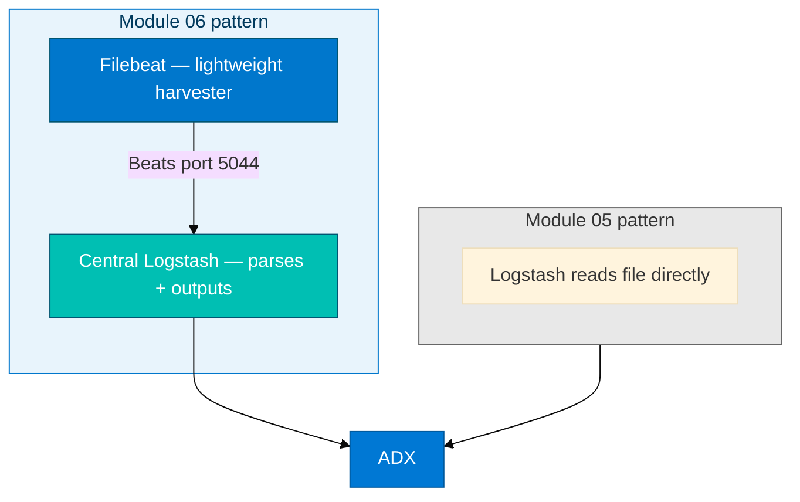
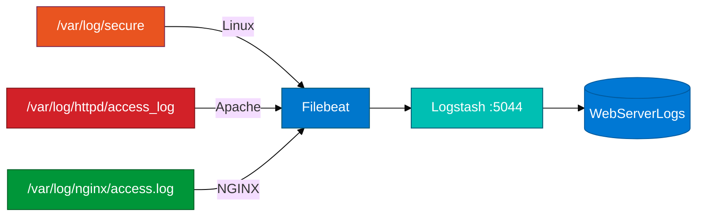

# Module 06 — Filebeat primer

Read this **before** `06_Filebeat_ADX_Integration_Concepts.md`.

## Why Filebeat?

Module 05 had Logstash **read the file directly** with `input { file }`. At scale — many hosts, many log files — running Logstash on every host is expensive. **Filebeat** is a lightweight log harvester (Go binary, low RAM) that ships lines to a central Logstash over the Beats protocol.



---

## The lab VM

Modules 05–07 all use the same **cloud isolated lab VM**. Filebeat and Logstash are both installed on it. In this lab, "central Logstash" and "Filebeat host" are the same Amazon Linux EC2 instance — `localhost:5044` is the Beats target. That is fine for the classroom; the architecture is identical to a production setup where Filebeat runs on many servers and ships to one Logstash.

---

## One Beat, three inputs, one tag each

Filebeat tails multiple files and stamps each event with a `ServerType` tag:

```yaml
filebeat.inputs:
- type: filestream
  paths:
    - /var/log/secure
  fields:
    ServerType: "Linux"
  fields_under_root: true

- type: filestream
  paths:
    - /var/log/httpd/access_log
  fields:
    ServerType: "Apache"
  fields_under_root: true

- type: filestream
  paths:
    - /var/log/nginx/access.log
  fields:
    ServerType: "NGINX"
  fields_under_root: true
```

`fields_under_root: true` promotes `ServerType` to the event root so Logstash and ADX can access it as a top-level field, not a nested one.



---

## Port discipline

| Module | Beats port | Rule |
|--------|------------|------|
| 06 Filebeat | **5044** | Stop Filebeat + Logstash on 5044 **before Module 07** |
| 07 Metricbeat | **5045** | Separate Logstash instance on a different port |

Leaving port 5044 open when Module 07 starts causes Metricbeat to connect to the wrong Logstash instance (or fail to connect its own). Always free port 5044 first.

---

## Grok by line type

Logstash branches on the `ServerType` tag Filebeat attached:

| ServerType | Log shape | StatusCode in ADX |
|------------|-----------|-------------------|
| Linux | Syslog-style: `Aug 31 09:14 host process: message` | `0` (no HTTP status on auth lines) |
| Apache | Combined Log Format: `IP - - [date] "METHOD URI HTTP/1.1" STATUS BYTES` | Actual HTTP status |
| NGINX | Same Combined Log Format as Apache | Actual HTTP status |

In KQL: `where StatusCode > 0` gives web hits only. `where ServerType == "Linux"` gives auth events.

---

## generate_log_lines.sh — bootstrap only

This script installs and starts nginx and httpd. Run it **once** at the start of the lab. After that, generate ongoing traffic yourself:

```bash
curl -s -o /dev/null -w "%{http_code}\n" http://127.0.0.1/
curl -s -o /dev/null -w "%{http_code}\n" http://127.0.0.1/missing-page
sudo true
```

The script is not a traffic generator. If you run it and do nothing else, `WebServerLogs` will have very few rows and no 404s.

---

## Before the lab — check these on the VM

```bash
# Is port 5044 free? (no leftover Logstash from Module 05)
ss -lntp | grep 5044

# Are web servers running?
curl -s -o /dev/null -w "%{http_code}\n" http://127.0.0.1/

# Filebeat installed?
which filebeat 2>/dev/null || sudo filebeat version
```

**Checkpoint:** Port 5044 shows no output (free), curl returns `200`, Filebeat binary is found.

---

## Common mistakes

| Mistake | Symptom |
|---------|---------|
| `ServerType` stripped in Logstash `remove_field` | All ADX rows have `null` ServerType — cannot distinguish log sources |
| Wrong file paths in Filebeat YAML | Empty harvest — check `/var/log/secure` vs `/var/log/auth.log` for your OS |
| Starting Filebeat before Logstash | `Connection refused on localhost:5044` — start Logstash first |
| Port 5044 held by Module 05 Logstash | Filebeat connects to wrong pipeline | `sudo pkill -f logstash`, then restart Module 06 Logstash |
| Not running curl after bootstrap | Only 0–3 rows in ADX from script seed | Run curl requests every 30 s for several minutes |
| `output.elasticsearch` left active in filebeat.yml | Filebeat sends to Elasticsearch instead of Logstash — table stays empty | Comment out or remove the elasticsearch output block |
