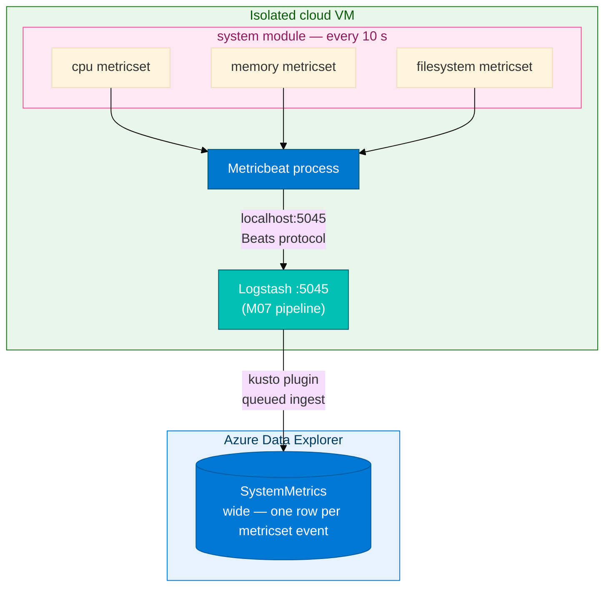

# Module 07 — Metricbeat to ADX

> **Reading order:** `07_Metricbeat_Primer.md` → Concepts (this file) → Lab → Exercises.

## What this module is trying to solve

Modules 05 and 06 captured **log lines** — text events from auth logs and web access logs. Those tables tell you *what happened* and *when*. They do not tell you how loaded the host was when it happened.

Metricbeat fills that gap. It collects OS-level numeric samples — CPU, memory, disk — on a timer and sends them to Logstash. The result is a `SystemMetrics` table in ADX that you can correlate with log events in time.

---

## Data flow in one picture



---

## The wide table shape

`SystemMetrics` is a **wide** table: it has columns for every metric type, but any given row only fills the columns relevant to its metricset.

| Row type | `CPU_User_Pct` | `Mem_Used_Pct` | `Disk_Used_Pct` |
|----------|----------------|----------------|-----------------|
| cpu event | 0.18 | **null** | **null** |
| memory event | **null** | 0.72 | **null** |
| filesystem event | **null** | **null** | 0.45 |

This is intentional. A single row for a cpu event should not have to carry a disk value.

---

## Why `isnotnull()` matters for averages

If you run `avg(CPU_User_Pct)` over all rows, the null values from memory and filesystem rows are treated as 0 by some aggregation paths. The result is an artificially low average that does not reflect actual CPU behaviour.

The correct pattern is: **filter to the relevant metricset first**, then aggregate.

```kusto
SystemMetrics
| where isnotnull(CPU_User_Pct)
| extend UserPct = CPU_User_Pct * 100
| summarize avg(UserPct), max(UserPct) by bin(Timestamp, 1m)
| order by Timestamp asc
```

Always apply `isnotnull(ColumnName)` as the first filter on any metric column before using `avg`, `max`, `percentile`, or `summarize`.

---

## Metricset lifecycle — how events become ADX rows

1. Metricbeat polls the host OS every 10 seconds.
2. It emits a separate JSON document for each metricset: one `cpu` event, one `memory` event, one `filesystem` event (one per mount point).
3. Those documents are forwarded to Logstash on port **5045** using the Beats protocol.
4. The Logstash `output { kusto { ... } }` plugin writes a local temp file, then flushes it to ADX queued ingestion.
5. ADX ingests the file and appends rows to `SystemMetrics` within **2–5 minutes**.

There is no direct network connection from Metricbeat to ADX. Logstash is the intermediary, just as in Modules 05–06.

---

## Port and process plan

Modules 05–06 used Logstash on port **5044**. Module 07 uses port **5045**. These must not overlap.

| Port | Module | State when M07 starts |
|------|--------|----------------------|
| 5044 | M05/M06 Logstash | **Stopped** — `pkill -f logstash` before this lab |
| — | M06 Filebeat | **Stopped** — `pkill -f filebeat` before this lab |
| **5045** | **M07 Logstash** | Started fresh with Metricbeat pipeline |

Why does the port change? The Logstash pipeline for Module 07 has a different `input { beats { port => 5045 } }` stanza and writes to a different ADX table. Running it on a new port also makes it easy to confirm which pipeline received an event.

---

## Entra app — same credentials as M05

Logstash authenticates to ADX using the same Azure Entra application you used in Module 05: `logstash-adx-ingestor`. You do not register a new app.

In the pipeline conf you will fill:
- `ingest_url` — your cluster ingest endpoint
- `database` — `ADXTrainingDB_<your-login>`
- `app_id` — client ID from your card
- `app_key` — client secret from your card
- `app_tenant` — tenant ID from your card
- `table` — `SystemMetrics`

---

## Optional load commands — what they do and why

After Metricbeat is running, you can run:

```bash
yes > /dev/null &  YPID=$!; sleep 30; kill $YPID 2>/dev/null || true
dd if=/dev/zero of=/tmp/adx-metric-load bs=1M count=64 2>/dev/null; rm -f /tmp/adx-metric-load
```

- `yes > /dev/null` — spins a CPU core at 100% for 30 seconds. You will see `CPU_User_Pct` rise in `SystemMetrics`.
- `dd` — reads from `/dev/zero` and writes to disk. You may see disk throughput reflected if your Logstash pipeline captures I/O metrics.

These are optional. Their only purpose is to make the CPU chart visibly move so you can confirm your `SystemMetrics` data reflects real host behaviour — the same way a batch job or a deploy spike would show up in production.

---

## Relationship to earlier modules

| Earlier module | Shares with M07 |
|---|---|
| M05 Logstash | Entra app, kusto plugin, `--path.data`, pipeline conf pattern |
| M06 Filebeat | Same VM; stop its Logstash 5044 before starting M07 Logstash 5045 |
| M04 Hybrid | `SystemMetrics` rows can be projected into a hybrid unified view alongside AWS data |

---

## Prerequisites

| Prerequisite | Why |
|---|---|
| M05 finished | Entra app credentials; kusto Logstash plugin installed on VM |
| M06 stopped | Filebeat and Logstash on 5044 must be killed before this lab |
| `SystemMetrics` table | Created in Lab Step 1 using `assets/module_07/create_tables.kql` |
