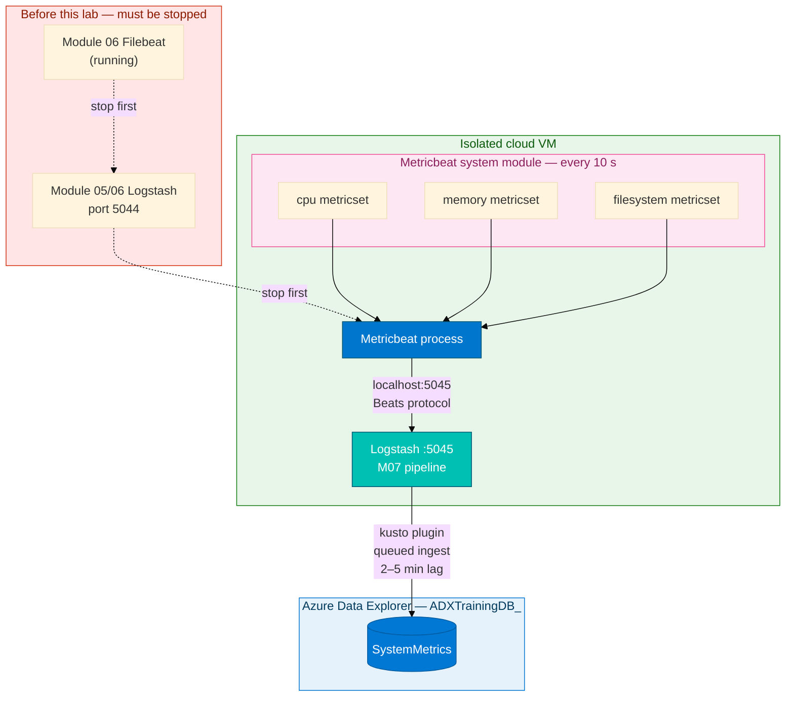
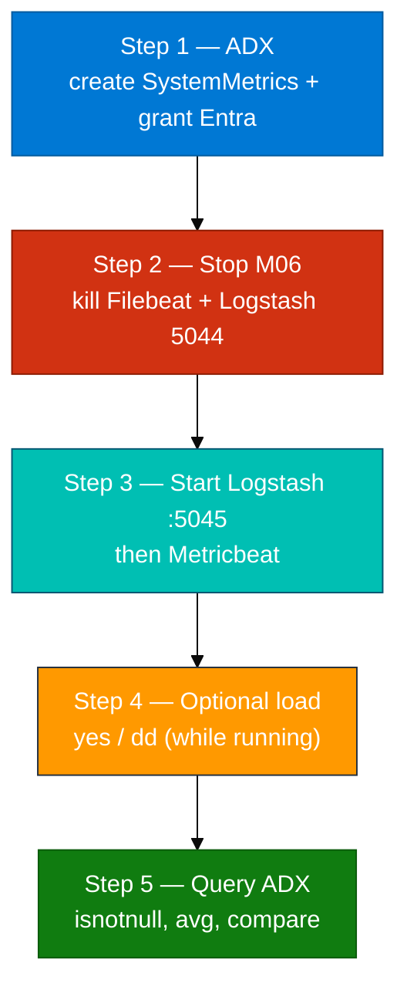

# Module 07 — Lab (Metricbeat → Logstash → ADX SystemMetrics)

**Reading order:** `07_Metricbeat_Primer.md` → `07_Metricbeat_ADX_Integration_Concepts.md` → **this Lab** → `07_Exercises.md`.

**Database:** `ADXTrainingDB_<your-login>` (example: `ADXTrainingDB_u01`).

**KQL files:** `assets/module_07/`.

---

## 1. What this lab is about (plain English)

You have two log tables from Modules 05 and 06:

| Module | ADX table | What it contains |
|--------|-----------|-----------------|
| M05 | `LogstashHostLogs` | SSH / sudo / auth events from `/var/log/secure` |
| M06 | `WebServerLogs` | HTTP access log rows from nginx / httpd |

Those tables tell you *what happened*, but not *how loaded the host was* when it happened. A 200 ms web response means something different at 5% CPU versus 95% CPU.

This lab adds a third table, `SystemMetrics`, fed by **Metricbeat** — Elastic's metric collection agent. Metricbeat polls the host OS every 10 seconds and sends separate JSON events for CPU, memory, and disk utilisation. Logstash receives those events on **port 5045** and writes them into `SystemMetrics` in ADX.

**Rule:** Metricbeat reports **live** numbers from the actual VM. `CPU_User_Pct` is the real CPU usage at sample time — not a value a script invented. The optional `yes` and `dd` load commands in Step 4 only make the CPU chart move visibly, the same way a batch job would in production.

---

## 2. How data travels (source → destination)

### 2.1 The full journey



### 2.2 Why stop the M06 stack first

Logstash binds a port on startup. If the M06 Logstash process still owns port 5044, that is fine — but you need port **5045** free for the M07 Logstash. More importantly, if you leave Filebeat running, it may flood Logstash with web access lines that should not be in this session's flow. Stop both cleanly so only Metricbeat events arrive at the new 5045 pipeline.

### 2.3 What "2–5 minute lag" means here

The kusto Logstash plugin writes events to a local staging file, then uploads that file to ADX's queued ingestion endpoint. ADX then processes the file in the background. The total time from "Metricbeat emits event" to "row visible in KQL" is normally **2–5 minutes**. Do not start debugging if rows are missing after 30 seconds.

### 2.4 Wide table and `isnotnull`

`SystemMetrics` stores all three metricset types in one table. CPU, memory, and filesystem events have different columns filled — other columns are `null`. Always filter:

```kusto
SystemMetrics | where isnotnull(CPU_User_Pct)
```

before computing averages so null rows from other metricsets do not distort the result.

---

## 3. Lab steps overview



---

## Before Step 1 — verify prerequisites

### Open the correct database

1. Azure portal → subscription **Pay-As-You-Go** → resource group `rg-adx-training-aug26` → cluster `adxtrainaug26` → **Query**.
2. Database dropdown → `ADXTrainingDB_<your-login>`.
3. Run:

```kusto
print Database = current_database()
```

It must match your login database. If not, fix the dropdown before continuing.

### Confirm earlier module tables exist

```kusto
.show tables
| where TableName in ("LogstashHostLogs", "WebServerLogs")
```

At least one should exist. If neither exists, check that you completed Module 05 (and optionally 06) before this lab.

### Check VM access

Confirm you can SSH into the lab VM with your key card credentials. Metricbeat and Logstash run on the VM.

---

## Step 1 — Create `SystemMetrics` table and grant Entra app

### Goal

Prepare ADX to receive Metricbeat-shaped rows. This includes the table definition and permissions for the Logstash kusto plugin.

### Why this step comes first

Logstash needs a target table to write to. If the table does not exist, ingestion fails silently in the kusto plugin. Grant the Entra app ingestor rights before any events arrive.

### What `create_tables.kql` creates

| Object | Name | Purpose |
|--------|------|---------|
| Table | `SystemMetrics` | One row per metricset event: timestamp + hostname + metric columns |
| Mapping | `SM_Mapping` | Maps Logstash JSON field names → table column names |
| Permission | Entra app as ingestor | `logstash-adx-ingestor` can write to this database |

### Do this exactly

1. Confirm database (`print Database = current_database()`).
2. Open `assets/module_07/create_tables.kql`.
3. Replace `<CLIENT_ID>` and `<TENANT_ID>` with the values from your card.
4. Run the entire file in your database.

### Checkpoint

```kusto
.show tables
| where TableName == "SystemMetrics"
```

```kusto
.show database ADXTrainingDB_<your-login> principals
| where Role == "Ingestor"
```

The Entra app should appear as an Ingestor principal.

### If something is wrong

| Symptom | Fix |
|---------|-----|
| Table not appearing | Re-run `create_tables.kql`; confirm you are in your own database |
| Entra app not in principals | Re-run the `.add database ... ingestors` line from `create_tables.kql` |
| Wrong database | Fix dropdown; never run in a classmate's database |

---

## Step 2 — Stop the Module 06 stack

### Goal

Release port 5044 and stop Filebeat so the new Logstash process can start cleanly on port 5045.

### Why stopping M06 matters

If Filebeat is still running and Logstash 5044 is still alive, the VM will have two Logstash processes competing for system resources. More importantly, if you accidentally start the M07 Logstash on 5044 (wrong config), events will go to the wrong pipeline. Stopping M06 cleanly makes the port situation unambiguous.

### Do this exactly

On the lab VM:

```bash
pkill -f filebeat || true
pkill -f logstash || true
```

Wait 5–10 seconds, then confirm both ports are free:

```bash
ss -lntp | grep -E '5044|5045'
```

Both should return no output (no process listening on either port).

### Checkpoint

- `ss -lntp | grep -E '5044|5045'` returns empty
- No Filebeat or Logstash processes in `ps aux | grep -E 'filebeat|logstash'`

### If something is wrong

| Symptom | Fix |
|---------|-----|
| Port 5044 still listening | `kill $(lsof -ti:5044)` or `kill $(ss -lntp | grep 5044 | awk '{print $6}' | cut -d, -f2 | cut -d= -f2)` |
| Port 5045 already in use | A previous M07 attempt left a zombie; kill it the same way |
| `pkill` returns non-zero | Processes were already stopped; the `|| true` suppresses the error — this is fine |

---

## Step 3 — Configure and start Logstash :5045, then Metricbeat

### Goal

Start a Logstash pipeline that listens for Beats events on port 5045 and writes them to `SystemMetrics`. Then start Metricbeat pointing at that port. Within 10–30 seconds you should see Logstash log that events are arriving.

### Config files you need

| File | Purpose | Where to put it |
|------|---------|-----------------|
| `assets/module_07/metricbeat-to-adx.conf.example` | Logstash pipeline: input 5045 → filter → kusto output | Copy to `/tmp/metricbeat-lab/metricbeat-to-adx.conf` |
| `assets/module_07/metricbeat.yml.example` | Metricbeat: enable system module, output to localhost:5045 | Copy to `/etc/metricbeat/metricbeat.yml` |
| `assets/module_07/system.yml.example` | Metricbeat system module config: period 10s, enabled metricsets | Copy to `/etc/metricbeat/modules.d/system.yml` |

### What to fill in the Logstash conf

Open `metricbeat-to-adx.conf` and replace:

| Placeholder | Value |
|-------------|-------|
| `INGEST_URL` | Your cluster ingest endpoint (from card, e.g. `https://adxtrainaug26.eastus.kusto.windows.net`) |
| `DATABASE` | `ADXTrainingDB_<your-login>` |
| `CLIENT_ID` | Entra app client ID from card |
| `CLIENT_SECRET` | Entra app client secret from card |
| `TENANT_ID` | Entra tenant ID from card |

The `table` field is already set to `SystemMetrics`. The `mapping_ref` is already `SM_Mapping`. Do not change those.

### Do this exactly

1. Create the lab working directory and copy configs:

```bash
mkdir -p /tmp/metricbeat-lab/data
cp assets/module_07/metricbeat-to-adx.conf.example /tmp/metricbeat-lab/metricbeat-to-adx.conf
```

2. Fill in the Logstash conf values (editor of your choice):

```bash
nano /tmp/metricbeat-lab/metricbeat-to-adx.conf
```

3. Copy the Metricbeat configs:

```bash
sudo cp assets/module_07/metricbeat.yml.example /etc/metricbeat/metricbeat.yml
sudo cp assets/module_07/system.yml.example /etc/metricbeat/modules.d/system.yml
```

4. Enable the system module:

```bash
metricbeat modules enable system
```

5. Start Logstash **first** — it must be listening before Metricbeat tries to connect:

```bash
cd /usr/share/logstash
bin/logstash \
  --path.settings /etc/logstash \
  --path.data /tmp/metricbeat-lab/data \
  -f /tmp/metricbeat-lab/metricbeat-to-adx.conf
```

6. In a **new terminal**, confirm Logstash is listening on 5045 (wait ~20–30 s for Logstash to start up):

```bash
ss -lntp | grep 5045
```

You should see one entry with `LISTEN` on port 5045.

7. Start Metricbeat **after** Logstash is ready:

```bash
metricbeat -e -c /etc/metricbeat/metricbeat.yml
```

8. Watch Metricbeat output for lines like:
   - `Successfully published N events`
   - `Connection to backoff(beats://.../5045) established`

9. Watch the Logstash terminal for incoming events (you will see JSON lines flowing in within 10–20 seconds of Metricbeat starting).

### Checkpoint

- `ss -lntp | grep 5045` shows Logstash listening
- Metricbeat terminal shows published events
- Logstash terminal shows received events
- **Wait 2–5 minutes** before querying ADX (queued ingest lag)

### If something is wrong

| Symptom | Fix |
|---------|-----|
| Port 5045 not listening after 30 s | Logstash failed to start; check Logstash terminal for config syntax errors — usually a missing quote or wrong YAML indent in the conf |
| Metricbeat shows connection refused | Logstash not yet ready; wait another 15 s and watch Logstash terminal |
| Metricbeat shows authentication error | Module 05 system module was disabled — re-run `metricbeat modules enable system` |
| Logstash conf missing values | Re-open the conf and fill all four placeholders (INGEST_URL, DATABASE, CLIENT_ID, etc.) |
| `ecs_compatibility` warning | Add `ecs_compatibility => disabled` in the `input { beats {} }` block |

---

## Step 4 — Optional: produce visible load (while Metricbeat runs)

### Goal

Generate a measurable CPU or disk spike on the VM while Metricbeat is collecting, so you can see real load effects in `SystemMetrics` — not just idle baseline values.

### Why this is optional

Metricbeat captures real OS numbers at all times. Even at idle you will see CPU around 1–5%, memory usage, and disk utilisation. The optional load commands are only for making the chart **visibly move** so you can confirm the data reflects true host behaviour and practice the before/after comparison query.

### Do this exactly (both commands in the same terminal — while Metricbeat + Logstash are running in other terminals)

**CPU spike — 30 seconds at near 100% on one core:**

```bash
yes > /dev/null &  YPID=$!; sleep 30; kill $YPID 2>/dev/null || true
```

This runs `yes` (which prints "y" as fast as possible) into `/dev/null`. It pegs one CPU core for 30 seconds, then kills itself.

**Disk I/O:**

```bash
dd if=/dev/zero of=/tmp/adx-metric-load bs=1M count=64 2>/dev/null; rm -f /tmp/adx-metric-load
```

This writes 64 MB of zeros to disk and removes the file.

### What to look for in ADX after the lag

After **2–5 minutes** from starting load, run in ADX:

```kusto
SystemMetrics
| where isnotnull(CPU_User_Pct)
| extend UserPct = CPU_User_Pct * 100
| summarize avg(UserPct), max(UserPct) by bin(Timestamp, 1m)
| order by Timestamp asc
```

During the `yes` window you should see `max(UserPct)` reach 80–100%. Before and after it should be low.

---

## Step 5 — Query `SystemMetrics`

### Goal

Verify that all three metricset types arrived, practice the `isnotnull` filter pattern, and confirm you are seeing real host data.

### Do this exactly

1. Run `assets/module_07/validate.kql` in your database.

**Row count check — must be > 0 for all three types:**

```kusto
SystemMetrics
| summarize
    CPU_rows    = countif(isnotnull(CPU_User_Pct)),
    Memory_rows = countif(isnotnull(Mem_Used_Pct)),
    Disk_rows   = countif(isnotnull(Disk_Used_Pct))
```

**Average CPU (correct `isnotnull` pattern):**

```kusto
SystemMetrics
| where isnotnull(CPU_User_Pct)
| extend UserPct = CPU_User_Pct * 100
| summarize avg(UserPct), max(UserPct)
```

**Average memory utilisation:**

```kusto
SystemMetrics
| where isnotnull(Mem_Used_Pct)
| extend MemPct = Mem_Used_Pct * 100
| summarize avg(MemPct), max(MemPct)
```

**Disk usage by mount point:**

```kusto
SystemMetrics
| where isnotnull(Disk_Used_Pct)
| summarize avg(Disk_Used_Pct * 100) by Mountpoint
```

**Timeline — CPU per minute:**

```kusto
SystemMetrics
| where isnotnull(CPU_User_Pct)
| extend UserPct = CPU_User_Pct * 100
| summarize avg(UserPct) by bin(Timestamp, 1m)
| order by Timestamp asc
```

2. Continue with `assets/module_07/explore.kql` then `07_Exercises.md`.

### Checkpoint

- CPU, memory, and disk row counts are all **> 0**
- `avg(UserPct)` returns a sensible value (not 0, not 100 constantly)
- `Hostname` in `SystemMetrics` is the actual VM hostname — not a script placeholder
- You used `isnotnull()` before every `avg()` call

### You are done when

- You can explain why `isnotnull` is required before `avg()` on a wide-table metric column
- You can name the three Metricbeat metricsets and what each measures
- You understand that the values come from the VM OS, not a data-generation script
- You can trace the event path: Metricbeat → Logstash:5045 → kusto plugin → ADX queued ingest → `SystemMetrics`
- If you ran load commands, you can show the CPU spike in the per-minute timeline

---

## Quick failure guide

| Problem | Likely cause | Fix |
|---------|--------------|-----|
| Port 5045 not listening | Logstash config syntax error | Check Logstash terminal; fix missing quotes or wrong placeholders in conf |
| Metricbeat events not arriving | Logstash not yet up | Wait 30 s; watch Logstash terminal |
| `SystemMetrics` count = 0 after 5 min | Ingest URL wrong or Entra creds wrong | Check Logstash terminal for kusto output errors; re-check conf values |
| CPU rows = 0 but memory/disk rows exist | cpu metricset not enabled | Re-run `metricbeat modules enable system`; check `system.yml` for `metricsets` list |
| `avg(CPU_User_Pct)` returns unexpectedly low | Running avg over all rows including nulls | Always add `| where isnotnull(CPU_User_Pct)` first |
| `UserPct` values between 0 and 1 | Forgot `* 100` | Apply `| extend UserPct = CPU_User_Pct * 100` before display |
| Wrong database | Dropdown | `print Database = current_database()` and fix |
| Port 5044 error when starting M07 Logstash | Wrong conf file still has port 5044 | Open the conf; confirm `port => 5045` in the beats input stanza |
