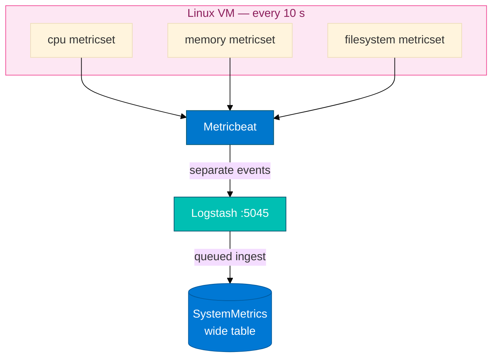

# Module 07 — Metricbeat primer

Read this **before** `07_Metricbeat_ADX_Integration_Concepts.md`.

## The problem (plain English)

Modules 05 and 06 give you **log lines**: text events that say what happened — "accepted login", "GET /index.html 200". That is great for forensics and error investigation.

But log lines do not answer capacity questions like "what was CPU utilization during the deployment?" or "is this VM about to run out of disk?". For those questions you need **metric samples**: numbers captured at regular intervals from the operating system itself.

**Metricbeat** is Elastic's dedicated metric collection agent. It polls the host OS every 10 seconds (configurable) and forwards structured JSON documents to Logstash — the same Logstash pipeline used in Modules 05–06, now listening on a different port.

---

## Logs vs metrics

| | Logs (M05–06) | Metrics (M07) |
|---|---------------|---------------|
| **Data** | Text lines | Numeric samples on an interval |
| **Question** | "What was said?" | "How full is CPU / disk right now?" |
| **Agent** | Filebeat | **Metricbeat** |
| **Source** | Files on disk (`/var/log/*`) | OS kernel stats, `/proc`, cgroups |
| **ADX table** | `LogstashHostLogs`, `WebServerLogs` | `SystemMetrics` |
| **Shape** | One row per log line | One row per metricset per poll |

Both agents forward events to Logstash. Logstash writes into ADX. The ingest path is the same; only the content changes.

---

## Metricsets — one event per type per poll

Metricbeat's `system` module collects several **metricsets**. Each poll creates **separate** events — not one merged JSON document:

| Metricset | What it measures |
|-----------|-----------------|
| `cpu` | User %, system %, idle %, iowait % |
| `memory` | Used, free, cached, swap (bytes and ratios) |
| `filesystem` | Total, used, free per mount point (e.g. `/`, `/boot`) |

All three types land in the **same** `SystemMetrics` table, but CPU columns are `null` on memory rows and vice versa. This is the **wide table** shape. You must filter with `isnotnull(...)` before aggregating a specific metric column.



---

## Ratios vs percent

Elastic's system module emits CPU percentages as **ratios between 0.0 and 1.0**, not 0–100. In KQL multiply by 100 for a human-readable display value.

**Wrong** — silently returns a fraction:
```kusto
SystemMetrics
| summarize avg(CPU_User_Pct)
```

**Right** — filter type, then convert:
```kusto
SystemMetrics
| where isnotnull(CPU_User_Pct)
| extend UserPct = CPU_User_Pct * 100
| summarize avg(UserPct)
```

The `isnotnull` guard removes memory and filesystem rows (which have a null `CPU_User_Pct`) before the average runs.

---

## Port plan for this module

Module 07 uses a **different Logstash port** than Module 06. Before starting M07 you must stop the M06 stack.

| Step | Module | Port | Action |
|------|--------|------|--------|
| Stop first | M06 Filebeat | — | `pkill -f filebeat` |
| Stop first | M06 Logstash | 5044 | `pkill -f logstash` |
| Then start | **M07 Logstash** | **5045** | Fresh pipeline for Metricbeat |
| Then start | **Metricbeat** | sends to 5045 | `metricbeat -e -c ...` |

If port 5044 or 5045 is still bound from a previous session, Logstash will fail to start or Metricbeat events will arrive at the wrong listener.

Check with:
```bash
ss -lntp | grep -E '5044|5045'
```

---

## Same Entra app as M05

You do **not** register a new Azure Entra application for Module 07. Use the **same** `logstash-adx-ingestor` app (client ID and tenant ID on your card) that you configured in Module 05. Copy those same values into the Metricbeat Logstash pipeline conf.

---

## Queued ingest lag

ADX uses **queued ingestion** for Logstash output. Events are buffered in the Logstash kusto plugin and flushed periodically. After Metricbeat starts forwarding, rows typically appear in ADX in **2–5 minutes** — not immediately.

A count of 0 after 30 seconds is normal — not a sign that the table is missing or Logstash is broken. Wait the full lag period before debugging.

---

## Prerequisites

| Prerequisite | Why it matters |
|---|---|
| Module 05 completed | Entra app credentials known; kusto Logstash plugin installed |
| Module 06 completed | Filebeat/5044 Logstash currently running — must be stopped |
| Lab VM access | Metricbeat runs on the isolated cloud VM |
| `SystemMetrics` table | Created in Step 1 of this lab |
