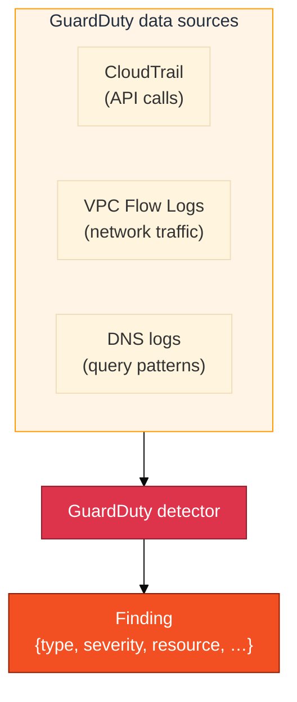
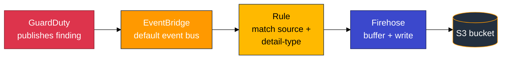
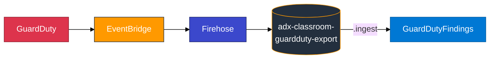
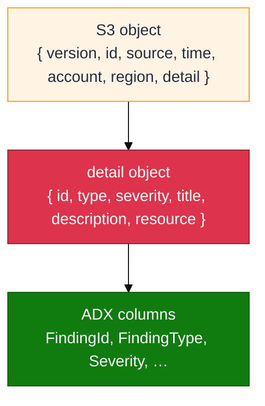

# Module 08 — GuardDuty primer

Read this **before** `08_GuardDuty_to_ADX_Concepts.md`.

## What GuardDuty is (plain English)

**Amazon GuardDuty** is a **threat detection** service. It continuously analyses your AWS environment’s data sources — CloudTrail, VPC Flow Logs, DNS logs — and produces **findings**: structured JSON documents that describe a detected security issue.

A GuardDuty finding is not a raw log line you tail. It is a rich JSON object with a type, severity score, affected resources, timestamps, and a description of why the activity looks suspicious.



---

## Finding vs log line

| | CloudTrail event (M02) | GuardDuty finding (M08) |
|---|---|---|
| **Shape** | One API call | One detected security pattern |
| **Format** | JSON — one action | JSON — aggregated signals |
| **Severity** | Not scored | Numerical (0–10 scale) |
| **Volume** | One row per API call | One row per distinct threat type |
| **Purpose** | Audit trail | Security alert |

You do not “turn on” CloudTrail just to get GuardDuty findings. GuardDuty reads CloudTrail (and other sources) internally. The finding that emerges is a **higher-level** object — not a copy of a single API call.

---

## What is Amazon EventBridge?

**EventBridge** is AWS’s **event bus / router**.

1. Services publish **events** onto a bus (here: the account’s default bus).  
2. You define a **rule** with an **event pattern** (filters).  
3. Matching events are delivered to one or more **targets** (Firehose, Lambda, SQS, …).

In this module:

| Piece | Role |
|-------|------|
| **Event** | A GuardDuty finding becomes an EventBridge event (`source = aws.guardduty`, `detail-type = GuardDuty Finding`) |
| **Rule** | Matches those events |
| **Target** | A **Kinesis Data Firehose** delivery stream |
| **Why EventBridge?** | GuardDuty does not write findings into your lab S3 bucket by itself. EventBridge connects “finding created” → “send a copy to Firehose” |



**Contrast with Module 03:** CloudWatch Logs used a **subscription filter** straight into Firehose. GuardDuty has no subscription filter — **EventBridge** is the equivalent “when this happens, send there” glue.

---

## The export path into ADX

```text
GuardDuty → EventBridge → Firehose → s3://adx-classroom-guardduty-export/guardduty/ → ADX .ingest → GuardDutyFindings
```



**Firehose buffering:** Firehose holds events until a size or time limit is reached, then writes an S3 object. In this class, plan on **60–90 seconds** after **Generate sample findings** before you expect a new object in S3. Same idea as Module 03.

---

## The EventBridge envelope

S3 objects are **not** bare GuardDuty finding JSON. They contain **EventBridge event envelopes**. Finding fields live one level deeper, inside **`detail`**.



| JSON path | ADX column | Common mistake |
|-----------|------------|----------------|
| `$.time` | `EventTime` | — |
| `$.account` | `AccountId` | — |
| `$.region` | `Region` | — |
| `$.detail.id` | `FindingId` | **Not** `$.id` (that is the envelope event ID) |
| `$.detail.type` | `FindingType` | — |
| `$.detail.severity` | `Severity` | — |
| `$.detail.title` | `Title` | — |
| `$.detail.description` | `Description` | — |
| `$.detail.resource` | `ResourceData` | — |

If you map `$.id` instead of `$.detail.id`, ingest can succeed but `FindingId` is empty for every row — a silent mistake.

See also: `assets/module_08/sample_eventbridge_envelope.json` (shape study).

---

## Generate sample findings

GuardDuty → **Settings** → **Generate sample findings** tells the service to emit one sample for many supported finding types. Samples travel the **same** EventBridge → Firehose → S3 path as live findings. Titles are often prefixed with `[SAMPLE]`.

This is an AWS product feature — not a custom script that writes fake JSON into S3.

---

## Hands-on orientation (console — before lab steps)

1. Open **GuardDuty** (`us-east-1`) → **Summary** / **Findings** — note Type, Severity, Resource.  
2. Open **Settings** — locate **Generate sample findings**.  
3. Open **S3** → `adx-classroom-guardduty-export` → browse `guardduty/`.

**Checkpoint:** You can explain the difference between a GuardDuty finding and a CloudTrail API event, and why ADX mappings use `$.detail.*`.

---

## Common mistakes

| Mistake | Result |
|---------|--------|
| Map `$.id` instead of `$.detail.id` | Ingest succeeds; `FindingId` empty |
| Query ADX immediately after Generate sample findings | Empty table — wait for Firehose (60–90 s) then ingest |
| Expect live threats in a short lab | Sample findings are the reliable classroom source |
| Confuse Module 01 / M03 buckets with this one | Wrong objects / Access Denied — use `adx-classroom-guardduty-export` |
